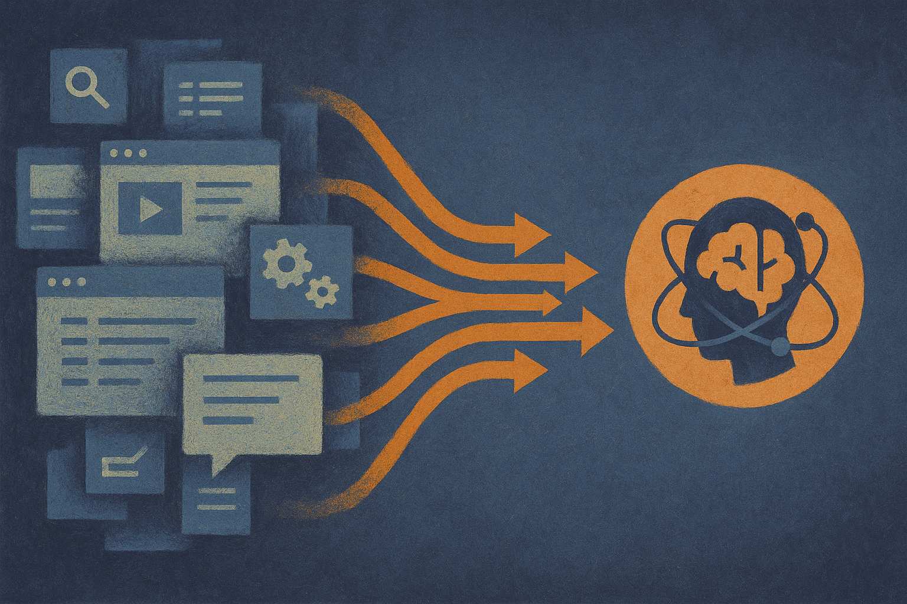

TL;DR: Computer-use agents will need task models, not just screen recordings, and “Inducing Task Models from Computer-Use Traces” shows a promising way to extract reusable workflow structure from messy human activity.

## What problem is Task Model Induction actually solving?

The primary source here is the arXiv paper “Inducing Task Models from Computer-Use Traces,” listed under cs.AI and cs.CL. Its core point is simple: passively recorded screenshots, mouse actions, and keyboard actions contain a lot of knowledge about how work gets done, but that knowledge is buried in low-level events.

That matters because real office work is not a clean demo script. A person checks a spreadsheet, replies to a message, returns to the spreadsheet, copies a value into a web form, gets interrupted, opens another tab, and then finishes the original task. Most workflow induction methods assume the task is already known, or that the trace is one clean workflow. That is not how work looks on a real desktop.

The paper proposes Task Model Induction, or TMI, for a harder setting: an unconstrained trace with latent tasks mixed together. TMI tries to separate those tasks, then build a structured model for each one. The model has two parts: a hierarchical objective model, which captures goals and subgoals, and a procedure model, which captures the control flow that organized the execution.

That distinction is important. A summary of steps is not a task model. “User opened app, clicked button, copied text” is useful for debugging, but weak for reuse. A task model says what the person was trying to accomplish, how the subgoals relate, and what order or branching pattern made the task work.

## Why does this matter for computer-use agents?

Most agent demos still rely on brittle instruction following. The model sees a screen, predicts an action, checks the result, and repeats. That can work. It can also drift, loop, or miss the quiet structure that an experienced operator uses without thinking.

TMI points toward a different layer: agents learning from traces of actual work, then turning those traces into symbolic, auditable, reusable skills. That is a better fit for organizations than a pile of recordings or a black-box policy. If an agent learns how invoice review, CRM cleanup, or report assembly is usually done, the company should be able to inspect that learned process.

The reported numbers are strong, with the usual caveat that they come from controlled human and agent trajectories, not broad production deployment. “Inducing Task Models from Computer-Use Traces” reports 0.974 agreement against ground-truth groupings when recovering interleaved tasks. It also reports reconstruction of 74.9% of observed execution steps, well above the strongest workflow induction baseline named in the abstract. When skills derived from TMI’s task models were used, held-out task accuracy improved by 30.0% over the strongest baseline.

Those are not magic-agent numbers. They are evidence that the representation matters. If you can disentangle concurrent work and recover enough structure, you can build skills that transfer better than step summaries.

## Where is the catch?

The catch is trace quality and governance.

Passive recording is powerful because it captures work as it happens. It is also sensitive. Screenshots and input traces can include customer data, credentials, private messages, medical details, financial records, and random personal context. Any serious version of this needs consent, redaction, access controls, retention limits, and audit trails before the agent-learning story gets exciting.

There is also a modeling catch. Reconstructing 74.9% of observed steps is impressive, but the missing quarter may include edge cases, judgment calls, or domain rules that matter more than their count suggests. A workflow can look repetitive until the exception arrives. Builders should treat induced task models as drafts to inspect, test, and refine, not as ground truth.

Practitioner’s take: if you are building internal agents, start by recording narrow, permissioned traces for one repeatable workflow with clear success criteria. Use those traces to produce a task model, then have the operator review the goals, branches, and exceptions before turning anything into an agent skill. The part most teams miss is the interleaving. Don’t ask people to perform clean demo runs only. Capture the messy version, because that is the version your agent will meet in the wild.
