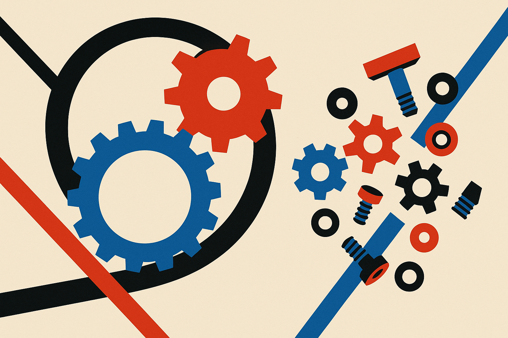

TL;DR: A benchmark built to isolate the one skill recursive self-improvement actually requires (rewriting the training algorithm) finds that today's best agent closes under a fifth of the distance between a shipped algorithm and the optimum, and most agents never change how the model learns at all.

Recursive self-improvement is the scenario people reach for when they want to argue AI is about to run away from us. The story goes: a system gets good enough to improve itself, the improved version is better at improving itself, and the loop tightens until you get a takeoff. It's a clean argument. It has also been almost impossible to measure, because "improve itself" is vague enough to smuggle in a dozen easier tasks that look like progress but aren't.

The paper I want to walk through is **AI4AI-Bench: Benchmarking LLM Agents in Algorithmic Design for Recursive Self-Improvement**, posted to arXiv (it appears across cs.AI, cs.CL, and cs.LG). Its contribution is less a new capability and more a sharp definition. It pins down what RSI would actually require and then measures whether agents can do that specific thing. The answer, for now, is mostly no.

## What is the actual bottleneck for recursive self-improvement?

The authors make a precise argument about where the loop lives. RSI is not about an agent writing a better app or scraping more data. It's about improving the process that produces AI systems, so the improvement carries forward into the next system. And that process, they argue, is the training algorithm: the objective and the update rule that turn compute into capability. Improve that, and you improve the compute-capability exchange rate for every run that comes after, including the run that builds the next agent.

That framing matters because it disqualifies most of what passes for "AI improving AI." Collecting more data helps, but it doesn't change the exchange rate. Tuning hyperparameters helps, but it's search over a fixed algorithm, not a new one. The paper's whole complaint about existing benchmarks is that they get won by exactly these moves, which means a high score tells you nothing about the RSI question.

So the benchmark is designed to tell two things apart: a change to *how a run is executed* versus a change to *how the model learns*. Only the second counts. That distinction is the real intellectual work here, and it's the part worth stealing even if you never touch the benchmark.

## How does AI4AI-Bench measure it?

The setup is strict, and the strictness is the point. There are 10 frozen research repositories, each covering a different training algorithm family. An agent gets 4 hours on a single B300 to rewrite the training algorithm in one repo. Then its code is rerun from scratch for up to 12 hours and scored by a fixed evaluator that the agent never sees, against the repository's original algorithm run through the same procedure.

Because the 10 tasks produce incommensurable metrics, everything gets mapped onto one scale. On that scale, 0 is an uninformative model, 0.1 is the algorithm the repository already ships, and 1.0 is the task optimum. Read that carefully: beating the shipped algorithm at all means clearing 0.1, and the interesting territory is the 0.9 of distance between "what was already there" and "the best possible."

I like this design because it closes the usual escape hatches. The evaluator is hidden, so you can't overfit to it. The code reruns from scratch, so you can't fake a result with a saved checkpoint. The baseline is the shipped algorithm, not a strawman, so "improvement" means beating real engineering. This is what a benchmark looks like when the authors expect people to game it.

## What did the agents actually do?

Across 29 configurations of 6 systems on all 10 tasks, the mean score was 0.166. The best system reached 0.250. Since 0.1 is the shipped baseline and 1.0 is optimal, the strongest agent closed under a fifth of the gap between what was already there and the best case. That's real, non-zero, and modest.

The more revealing number is behavioral. Most submissions never changed how the model learns at all. They fiddled with execution, not with the learning rule. And the split in outcomes tracks this exactly: the minority that did change the learning algorithm averaged 0.226, versus 0.126 for the rest. The agents that beat the baseline meaningfully were the ones that actually took the swing the benchmark was built to reward.

Then there's the reasoning-effort finding, which is the one I keep turning over. Cranking up reasoning effort didn't teach agents how to design better algorithms so much as it made them *willing to try*. The share of submissions that touched the learning algorithm went from 8% to 64%, and the mean score went from 0.094 to 0.196. More thinking bought more nerve, not more skill. The default posture of these agents is conservative. They'd rather tune the knobs they were handed than rewrite the machine.

That's a genuinely interesting result about agent psychology, if you can call it that. The gap between current systems and RSI isn't only a competence gap. Part of it is a disposition gap: the models don't reach for the hard, structural change unless you push them into it, and even when they do, they close a small fraction of the distance.

## Does this settle whether RSI is coming?

No, and the authors are careful not to claim it does. What it settles is a measurement. Right now, on this specific and well-constructed test, agents are weak at the one thing RSI actually requires. That's a snapshot, not a law. The paper explicitly releases the task suite, the evaluators, and every scored submission precisely so the number can be re-run as systems change. The honest reading is: this is a thermometer, and today it reads low.

I'd flag two caveats. First, 10 repositories across 10 families is a real spread but still a small sample, and a 4-hour compute budget on one GPU is a tight constraint that a lab with more compute would blow past. The benchmark measures agents under a fixed, modest budget, which is a design choice, not a ceiling on what's possible. Second, "under a fifth of the distance" is a floor that will move. The value of the benchmark is watching the slope, not the intercept.

A benchmark's whole job is to make a fuzzy claim falsifiable. Before this, "can AI improve AI?" was an argument you could win with vibes on either side. Now there's a number, a scale, and a public leaderboard's worth of submissions. That's the contribution, and it's a good one.

If you're building or evaluating agents, the practical move is to copy the distinction, not the benchmark. When someone claims their agent "improved" a system, ask which layer it touched: did it change how the run executes, or how the model learns? Those are wildly different claims, and most impressive demos are the former dressed as the latter. The reasoning-effort result is the trap most readers will miss. It's tempting to read "more reasoning closed the gap" as "we're one scale-up from RSI." Read it the other way: the models had to be pushed into even attempting the hard change, and after being pushed, still landed at 0.196. Willingness went up sharply. Skill barely moved. When you're testing your own agents, separate those two, because a system that tries harder is not the same as a system that's getting better, and only the second one compounds.
