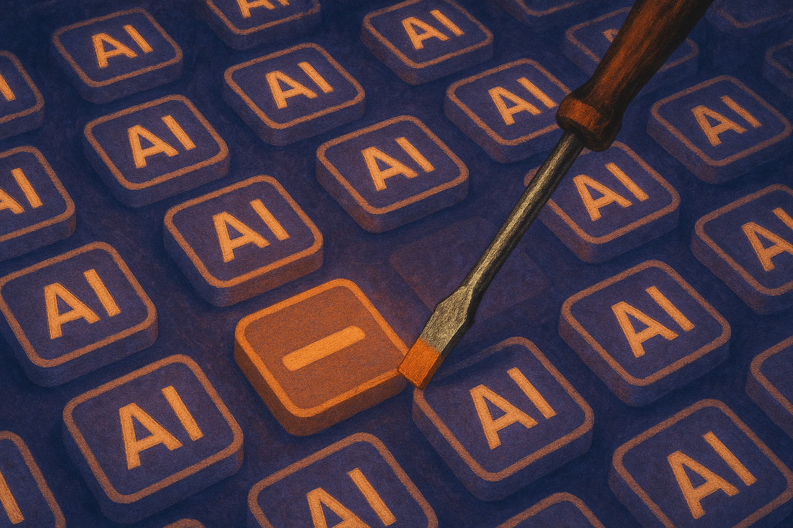

TL;DR: If users are becoming AI-blind, the winning AI products will stop selling “AI” and start proving specific work got faster, cheaper, or better.

## What does “AI-blind” mean in practice?

My primary source here is the Hacker News item titled “I'm becoming AI-blind.” The title alone is a useful phrase because it names something many builders can feel: AI has become such a common label that the label itself carries less information.

That is bad news for lazy positioning. “Powered by AI” used to signal novelty. Now it often signals homework for the buyer. What model? What task? What failure mode? What data leaves the system? What does this replace? What happens when it is wrong?

AI-blindness is not anti-AI. It is pattern fatigue.

People still care when a tool removes a real bottleneck. They care when support tickets get triaged before a human opens the queue. They care when a lawyer can compare two contract drafts without copying text into five separate windows. They care when an analyst can ask follow-up questions against messy internal data and get cited answers. They care when a designer can generate 20 decent layout directions in minutes.

They do not care that the settings page has a sparkle icon.

That distinction matters. A lot of AI product work still treats the model as the product. For most users, the model is plumbing. The product is the changed workflow.

## Why are generic AI claims losing force?

Because the market learned the trick.

The first wave of AI features got attention by association. If a product mentioned GPT, agents, copilots, or automation, people clicked. That was rational. The capability jump was real. But repeated exposure changes the filter. Buyers now assume every SaaS product has some version of summarize, draft, classify, search, or chat.

Once a feature becomes expected, the burden shifts from “we have AI” to “our AI works in this exact place.”

That is a much harder bar. It requires proof inside the product, not just in the launch post. Show the before and after. Show the citation trail. Show what the system refused to answer. Show the human handoff. Show latency, cost, and limits where they affect the job.

This is where hype hurts builders. Big claims train users to discount the whole category. If a product promises an autonomous teammate and ships a brittle form filler, the user does not become more educated. They become less patient.

There is also a language problem. The same words now describe very different things. “Agent” might mean a scheduled workflow, a tool-calling chatbot, a browser operator, or a multi-step system with memory and approvals. “AI search” might mean semantic retrieval, generated answers, or a wrapper around keyword results. Buyers cannot evaluate what the words mean without seeing the system behave.

So they ignore the words.

## What should builders do instead?

Start with the job title, not the model label. “Review renewal risks in customer accounts” is stronger than “AI account intelligence.” “Find policy conflicts across these documents” is stronger than “AI knowledge assistant.” Plain language is not less ambitious. It is easier to test.

Then make the proof visible. A useful AI product should expose its reasoning artifacts without pretending they are perfect reasoning. Citations, diffs, confidence cues, rejected inputs, source snippets, action logs, and approval checkpoints all help users decide when to trust it.

Also, stop hiding the boundary. If the system is good at first drafts but bad at final judgment, say that in the interface. If it needs clean data, say that before onboarding. If humans need to approve external actions, make that part of the design, not an apology.

The irony is that “AI-blind” users may be the best users. They are past the novelty phase. They ask sharper questions. They will not reward theater, but they will reward saved time and reduced pain.

Practitioner's Take: If you are building an AI feature this week, remove the phrase “AI-powered” from the top of the page and see what claim remains. If the value proposition collapses, the feature is not framed tightly enough. Pick one workflow, define the before and after, instrument the result, and show the user where the machine helped and where it might fail. The catch most teams miss: trust is not built by sounding smarter. It is built by making the system inspectable.
