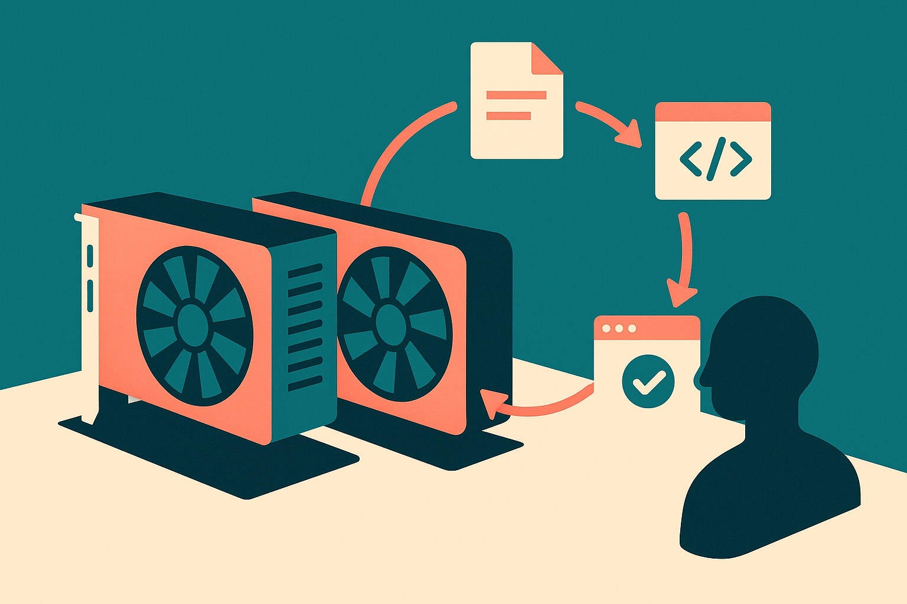

TL;DR: A fast local coding model is now plausible on consumer GPUs, but builders should judge the whole agent loop, not just tokens per second.

## What did the local run actually show?

The primary source here is the r/LocalLLaMA post “Qwen3.8-27B Q6 is a beast at agentic coding” by /u/Ok_Ninja7526. It is not a benchmark paper. It is one operator report. Still useful.

The setup: Qwen3.8-27B Q6 running through llama.cpp on two consumer GPUs, an RTX 3090 and an RTX 3060. After what /u/Ok_Ninja7526 described as nearly 20 hours of continuous and targeted work, the reported speed stayed around 60 to 63 tokens per second. The post specifically frames the workload as agentic coding, not a one-off prompt test, and says a practical optimization video is planned.

That number matters because local coding agents usually die from friction before they die from model quality. A 10 token per second local model can feel like punishment when it is reading files, planning edits, rewriting patches, calling tests, and recovering from mistakes. At 60 tokens per second, the interaction starts to feel closer to a usable tool, at least for the generation side of the loop.

But the post does not prove that this setup is “better” than cloud coding agents. It does not give task pass rates, repo sizes, context lengths, edit success rates, benchmark names, power draw, memory split, or failure examples. That is not a criticism. It is just the boundary of the claim.

## Why does tokens per second matter less for agents than people think?

Throughput is visible. Agent reliability is not.

A coding agent spends time in several buckets: model generation, retrieval or file search, tool calls, shell commands, test execution, patch application, and human review. Faster decoding helps only one of those. If the agent confidently edits the wrong file, 63 tokens per second just gets you to the bad patch faster.

The local angle still has real advantages. Running on your own hardware can reduce dependency on hosted APIs. It can make private repo work easier to reason about. It can also encourage long sessions, because the marginal cost feels different once the hardware is already on your desk.

The catch is that local stacks move complexity back to the operator. Quantization choice matters. llama.cpp build flags matter. GPU offload and split settings matter. So does cooling, driver behavior, and whether your agent framework wastes context on noisy logs. A nice tokens-per-second report is the starting line, not the finish line.

This is where the r/LocalLLaMA report is most interesting. The claimed nearly 20-hour run is more relevant than a five-minute speed screenshot. Sustained performance hints at a setup that may survive real work sessions. I would still want to see what happened during those 20 hours: number of tasks completed, types of bugs, whether tests passed, how often the human had to intervene, and how messy the final diffs were.

## How should a builder test a local coding agent setup?

Do not start with a leaderboard mindset. Start with a repo you know well and three repeatable tasks.

Pick one small bug fix, one refactor, and one test-writing job. Run each task with the same prompt, same repo state, and same agent harness. Track wall-clock time, number of tool calls, whether the patch applies cleanly, whether tests pass, and how much human cleanup is needed. Then compare against your current cloud model or manual workflow.

That gives you a useful answer: not “is Qwen3.8-27B Q6 a beast,” but “does this local setup save me time on my codebase?”

For builders, the practical move is to treat /u/Ok_Ninja7526’s report as a configuration lead worth testing, not as proof. If you have similar hardware, try to reproduce the sustained speed first, then measure complete coding loops. The catch most readers miss: local agentic coding is not one model running fast. It is a whole system staying boring for hours while it reads, edits, tests, and recovers without turning your repo into cleanup work.
