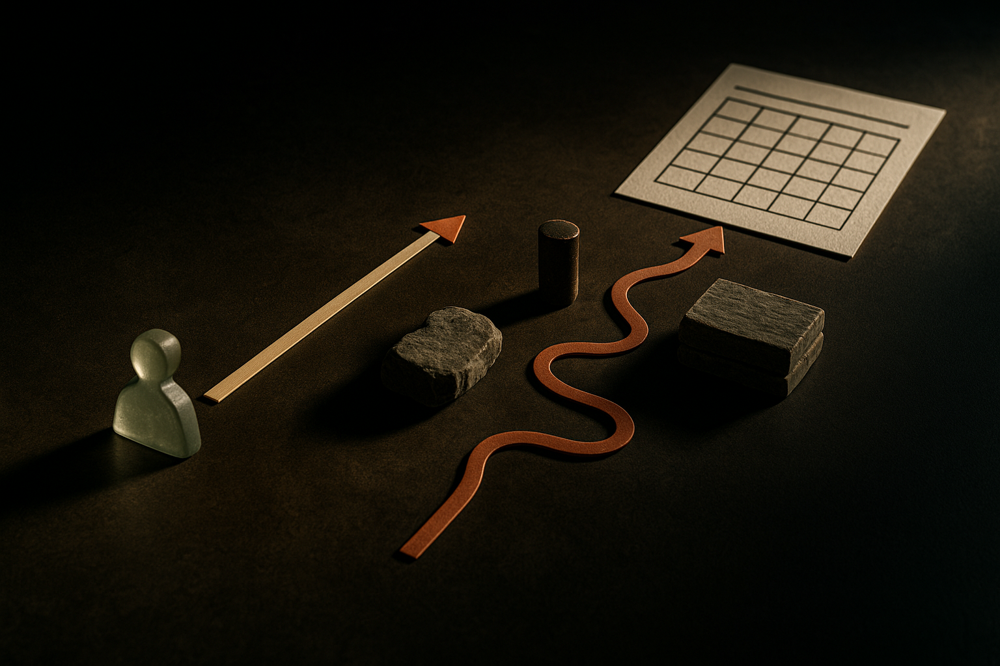

TL;DR: When AI lifts homework scores but drops exam scores, the tool is probably doing the work instead of teaching the student to do it, and that gap is a design problem you can measure and fix.

The headline making the rounds on Hacker News is blunt: "AI boosted homework scores, then exam scores dropped: Study." I want to take it seriously without pretending it settles anything. The pattern it describes is real, it is intuitive, and it is also exactly the kind of finding that gets flattened into a slogan before anyone reads the methods. So let me separate what the pattern tells us from what a single write-up can actually prove.

First, a sourcing caveat I am not going to skip. What is circulating is a headline and discussion thread, not a named paper with authors and a link I can point you to. The specific study, its sample size, its subject area, and how it defined "homework" versus "exam" performance are not in front of me. Treat the numbers as reported, not confirmed. That matters, because the mechanism this headline gestures at is well documented elsewhere, and it is easy to borrow that credibility for a study you have not verified.

## Why would homework scores rise while exam scores fall?

The mechanism is not mysterious. Homework is usually open-book, untimed, and unsupervised. An exam is usually none of those things. If a student uses an AI assistant to produce homework answers, the homework score measures the assistant, not the student. The exam then measures what the student actually retained, which is less than it would have been if they had struggled through the problems themselves.

Cognitive scientists have a name for the thing you lose here: desirable difficulty. The effort of retrieving an answer, getting it wrong, and correcting it is what builds durable memory. Remove the effort and you remove the learning, even though the artifact (a completed problem set) looks identical. AI is a near-perfect effort-remover. It hands you the artifact and skips the struggle.

So a homework-up, exam-down result is what you would predict if the tool is being used as an answer engine rather than a tutor. The interesting question is not whether this happens. It clearly can. The question is whether it is inevitable, and it is not.

## What this study does not prove

Here is where I push back on the slogan. "AI made students worse at exams" is a stronger claim than a single result can carry, and the honest reading is narrower.

One study, one context. We do not know if this holds across subjects, ages, or the specific AI tool used. A study on introductory math with a chatbot that gives full solutions tells you little about a Socratic tutor built to withhold answers.

Correlation and self-selection. If students who lean hardest on AI for homework were already weaker or less motivated, the exam drop is partly about who used the tool, not only the tool itself. Without random assignment, that confound is hard to rule out, and I cannot tell from a headline whether this study used a controlled design.

Short horizon. Exam performance measured weeks after homework is one outcome. It does not tell you whether AI-assisted students learned to use a tool they will actually have on the job. The exam is a proxy, and proxies drift.

None of this means the finding is wrong. It means the useful version is conditional: AI help degrades retention when it substitutes for the student's own effort, and homework-based grading rewards exactly that substitution. That is a claim about product design and assessment design, not a verdict on AI in learning.

## How do you build an AI learning tool that does not hollow out skill?

This is the part operators can act on. If the failure mode is substitution, the design goal is to keep the desirable difficulty while removing the pointless friction. Those are not the same friction.

Withhold the answer by default. The difference between a tutor and an answer engine is whether it gives you the solution or gets you to produce it. Prompt the model to ask a guiding question, check the student's next step, and only reveal the full answer after genuine attempts. This is a system-prompt and product decision, not a model-capability problem.

Separate practice from assessment, cleanly. If homework is where you learn and the exam is where you prove it, then AI belongs fully in the first and not the second. The mistake schools made was grading the practice as if it were the proof. Weight graded outcomes toward supervised or AI-free conditions and let the practice be low-stakes and AI-rich.

Measure the gap on purpose. The single most useful number here is the delta between assisted performance and unassisted performance on the same skill. If a student aces AI-assisted problems and fails the same problem cold, your tool is generating a false signal. Track that gap per student and per concept. It is the education equivalent of a train/test split, and it is the metric the headline is really about.

Design for the fade. The end state should be a student who needs the tool less over time, not more. Good tutoring software should watch its own usage decline for a given skill and treat that as success. If engagement only ever goes up, you may be building dependence, not competence.

## Is this an AI problem or an assessment problem?

Mostly the second, and that is the reframe I want to leave you with. Take-home, unsupervised, gradeable work was already a leaky proxy for learning. Students copied from each other and from solution manuals long before chatbots. AI did not create the gap between "can produce the answer" and "understands the material." It made that gap cheap, fast, and invisible.

Which means the fix is not to ban the tool. It is to stop pretending the artifact is the skill. The institutions that adapt will move grading weight toward conditions where the student has to perform without assistance, and they will use AI-rich practice to get more students to that bar, not fewer. The ones that do not will keep producing homework scores that look great and exam scores that quietly tell the truth.

Practitioner's Take: If you are building or buying an AI learning product, ask for one thing before anything else: the assisted-versus-unassisted gap on the same skill, tracked over time. Any vendor showing you engagement and completion rates is showing you the homework score, which the headline just told you is the number that lies. Build the withhold-the-answer behavior into your system prompt, treat declining tool use per skill as a win, and keep your high-stakes assessment in a condition the model cannot touch. The catch most readers miss is that this is not really about AI at all. It is about the fact that we were grading the practice instead of the learning, and the tool just made that mistake impossible to ignore.
