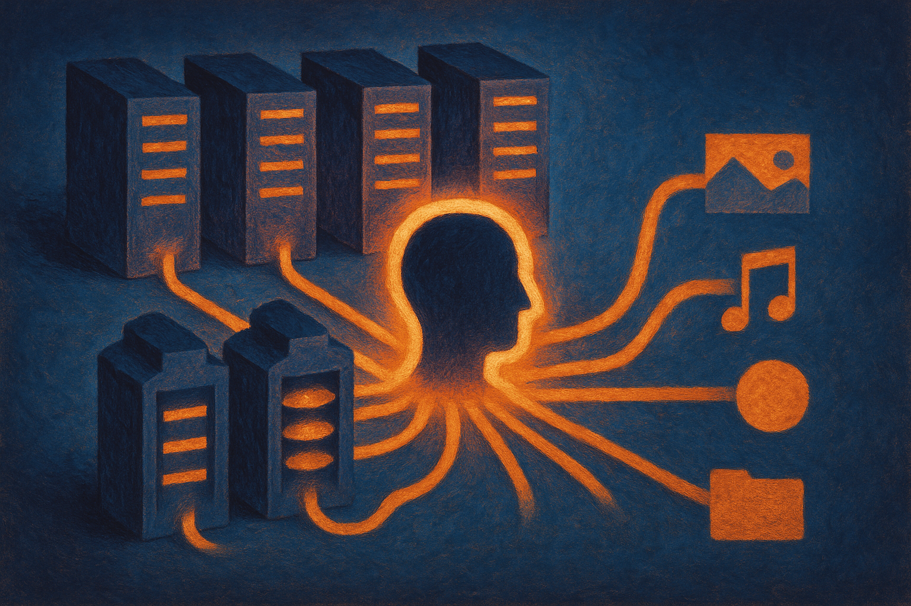

TL;DR: The interesting part of the 36-node DGX Spark homelab is not raw model serving, it is the move toward an agent capability cluster where models, memory, embeddings, media generation, and reranking run as separate persistent services.

## What is actually new here?

The primary source is /u/Kurcide’s r/LocalLLaMA post, “The All Spark” Cluster: Upgrading from 16 - 36 DGX Sparks. Kurcide says the build is moving from 16 to 36 DGX Sparks, with 4.6TB of unified memory, a 200Gbps FS switch, QSFP56 cabling, and breakout cables tying the rack together.

That is the headline. It is also the least reusable part.

Most builders are not buying 36 nodes for a homelab. Most companies should not start there either. What matters is the reason Kurcide gives for expanding: not to serve one giant endpoint, but to keep multiple inference modules alive at the same time.

Kurcide says the cluster has been used over the last four-plus months to run “nearly every notable model that’s landed.” But the more interesting shift is architectural. The rack is being split into modules managed into a single persistent agent using Hermes plus a custom memory sidecar system. In plain terms: the cluster is becoming a local AI operating environment, not just a GPU pile.

That matches where serious agent work seems to be going. Less “one model does everything.” More routing. More memory. More tools. More specialist models running beside the main reasoning model. More boring infrastructure around the model.

## Why split the cluster instead of serving one big model?

Kurcide’s plan is to dedicate 16 nodes to frontier-class models, naming Kimi K3 as an example, while keeping enough other nodes free for reranking, embeddings, video generation, image generation, audio processing, and related tasks.

That is a practical point people miss when they talk about “local AI” as if the only question is whether one machine can run one model. Real workflows are lumpy. A coding agent may need a strong planner, a fast autocomplete model, an embedding model, a reranker, a vision model for screenshots, a speech model for meetings, and a separate memory store. If all of that contends for the same machine, your “local” setup gets slow and brittle.

The cluster approach lets each capability stay warm. That matters for agents because latency compounds. Waiting on one model is annoying. Waiting on five serial model calls, tool calls, retrieval steps, and media transforms is where workflows die.

Still, the post leaves big questions open. There are no benchmarks. No cost breakdown. No power numbers. No failure modes. No details on the custom memory sidecar beyond the claim that it exists. The 200Gbps fabric sounds serious, but we do not get enough evidence to judge whether the cluster behaves like one coherent system or a set of nearby machines with good networking.

That distinction matters.

## Is this the future of local AI?

For a tiny group, yes. For most builders, no.

Kurcide says the point is complete sovereignty with no datacenter or third-party storage reliance. That is a real requirement in some cases: sensitive research, regulated data, private media archives, internal company knowledge, or just a builder who wants to own the whole stack.

But sovereignty has a bill. Cooling, power, procurement, noise, networking, driver issues, orchestration, monitoring, hardware churn. Kurcide explicitly says B200 or B300 class systems create cooling and energy problems for this kind of homelab, and that DGX Sparks plus 6000 Pro systems offer more flexibility for configuration, power optimization, and resale when upgrading. That is one operator’s judgment, not a universal rule.

The broader lesson is not “copy this rack.” It is “design for capabilities, not models.”

If you are building an agent system today, sketch the services before you pick the hardware. What needs to be always on? What can be batch? What needs private storage? Which models need high memory, and which just need fast response? Can your embedding and reranking path stay cheap while your reasoning model stays expensive? Can media generation run off the main lane so it does not block the agent?

A practitioner should try the small version first: one main local model, one embedding model, one reranker, one persistent memory store, and a router that decides which capability gets called. Measure latency per step, not just tokens per second. The catch most readers miss is that agents are not made reliable by adding a bigger model. They get useful when the surrounding system keeps the right capabilities warm, isolated, observable, and cheap enough to run all day.
