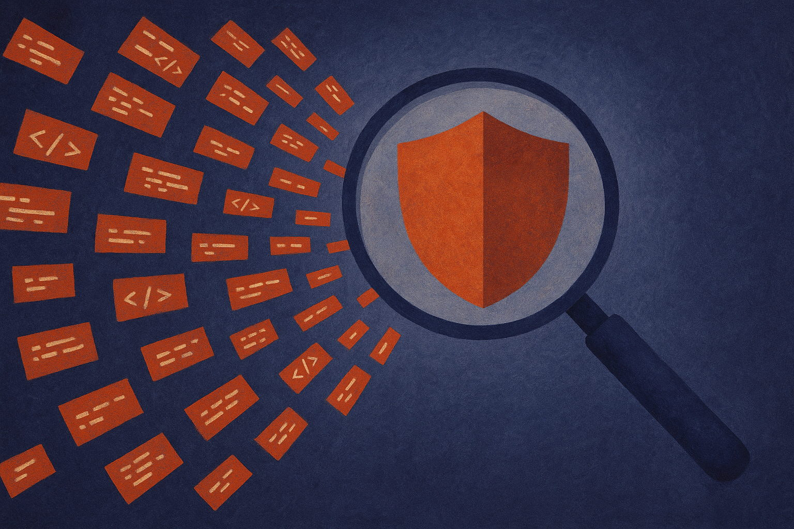

TL;DR: AI does not need to invent new attacks to change Bitcoin security, it only needs to make old bug-hunting cheaper, broader, and more persistent.

## What changed when models got cheap?

The primary source here is Decrypt’s report, “AI Has Made Bitcoin Software a Target—This Group Is Fighting Back.” Decrypt reported that a group of roughly 20 developers is scanning the Bitcoin ecosystem for flaws that AI systems can discover, with the concern that cheap, powerful models have given attackers much wider reach.

That is the important part. Not magic. Reach.

Security teams have always lived with asymmetry. A maintainer needs to defend a whole codebase, including dependencies, build scripts, old interfaces, weird edge cases, and abandoned projects still used by somebody. An attacker only needs one path through.

AI makes that asymmetry worse in boring ways. It can read more code than a human can in a weekend. It can generate fuzzing ideas. It can compare old commits against new ones and ask, “What bug was quietly fixed here?” It can translate a vulnerability pattern from one project into a search across many others. Some outputs will be garbage. Many will be shallow. But the cost of asking is now close to zero.

That matters in Bitcoin because the ecosystem is bigger than Bitcoin Core. There are wallets, mining tools, libraries, indexers, bridges, exchanges, hardware integrations, explorers, Lightning-related software, and piles of glue code. Some of it is well maintained. Some of it is not. Attackers do not need the cathedral if the side door runs on a forgotten dependency.

## Is this really a Bitcoin problem?

Partly. Bitcoin is a high-value target, so anything that lowers attack costs gets attention fast. But the pattern is not unique to Bitcoin.

Open source security has been moving toward machine-scale review for years. Static analysis, fuzzing, dependency scanning, and CI checks are not new. What changes with modern models is that more people can run a rough version of expert workflows without being experts. That includes defenders. It also includes criminals, bored opportunists, and people looking for a quick bounty.

So the practical question is not whether AI creates vulnerabilities. It does not. Software teams did that already. The question is whether AI changes which latent bugs become economically worth finding.

Decrypt’s report frames the defender response as developers scanning the ecosystem first. That is the right instinct. If model-assisted search is coming either way, the side that inventories exposed surface area earlier has the advantage. The catch is triage. AI can produce endless “maybe” findings. Maintainers can drown in reports that look serious but lack exploitability, context, or a clean reproduction path.

This is where human security work still matters. A useful report has a minimal failing case, affected versions, impact, likelihood, and a proposed fix or mitigation. A pile of model-generated suspicion is not the same thing.

## What should builders do differently now?

Treat model-assisted bug discovery as a normal part of security, not a panic event. If your project touches keys, signatures, consensus rules, payments, authentication, serialization, networking, or update paths, assume someone will point models at it.

The first move is boring hygiene. Make it easy to test. Keep dependencies current. Remove dead code. Document threat models. Run fuzzers where they fit. Add static checks in CI. Make security reporting clear, including how to share sensitive findings privately. These steps matter more when more outsiders can cheaply inspect your code.

The second move is to use the same tools attackers will use, but with discipline. Ask models to review dangerous modules, then verify everything manually. Have them generate tests around weird input boundaries. Use them to explain unfamiliar dependencies before you upgrade. Let them help write repro cases. Do not let them close issues by vibes.

For a builder, the actionable play is simple: pick one critical repo, choose one risky subsystem, and run a model-assisted review this week. Not a broad “find bugs” prompt. A narrow pass on parsing, signing, permission checks, or update logic. The catch most teams miss is that AI increases finding volume before it increases fixing capacity. Budget reviewer time, or the scanner becomes another noisy dashboard nobody trusts.
