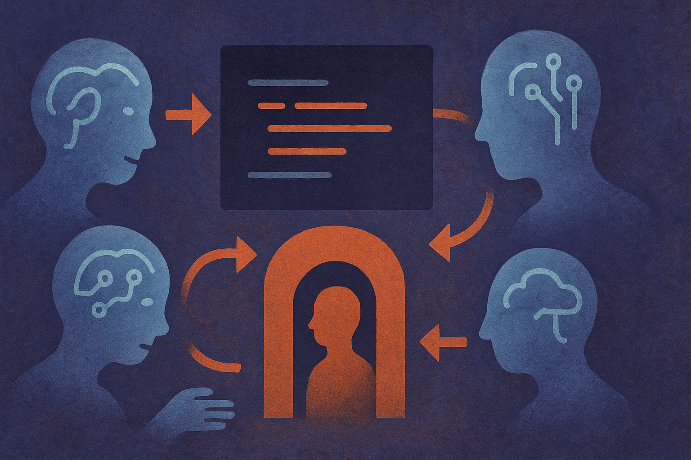

TL;DR: Treat “Codex vs. Claude” anecdotes as workflow evidence, not model truth, because the winning tool is usually the one that best fits your repo, review loop, and task shape.

## What does a week-long switch actually prove?

The primary artifact here is the Hacker News AI discussion titled “A week of using Codex more than Claude.” That framing matters. A week is long enough to get past first-impression novelty. It is not long enough to crown a universal winner.

Still, I pay attention to these posts because they are closer to the real market than most launch demos. Developers do not choose coding tools by reading model cards all day. They choose them during a refactor at 11:30 p.m., while chasing a failing test, with a half-remembered API and too many tabs open.

That is where small differences compound.

One assistant may be better at making a first pass. Another may be easier to steer. One may produce cleaner diffs. Another may recover better after being corrected. One may feel faster even if the model is not strictly “smarter,” because it asks fewer clarifying questions or fits the user’s preferred rhythm.

That is the practical point. Coding assistant quality is not one thing. It is a bundle: code generation, edit locality, context handling, tool use, test awareness, explanation quality, and how annoying it is when wrong. The last part is underrated. A model that is wrong in predictable ways can be easier to use than one that is brilliant and erratic.

## Why do these tool switches happen?

I do not read a “used Codex more than Claude” story as a claim that OpenAI has solved coding or Anthropic has fallen behind. That is too clean.

More likely, the operator found a better local fit.

“Local” is doing a lot of work here. The same assistant can feel great in a TypeScript app and clumsy in a legacy Python service. It can shine on small, well-scoped edits and fall apart when the task needs product judgment. It can be useful in a repo with strong tests and dangerous in one with weak tests. It can be pleasant for a solo builder and noisy inside a team review culture.

The mistake is treating personal productivity stories like benchmark tables. Benchmarks are useful, but they often compress away the parts that decide adoption: how the tool handles messy instructions, whether it preserves nearby code style, whether it creates reviewable chunks, whether it can be interrupted, and whether the user trusts it enough to keep it in the loop.

A week of daily use is not science. It is still data. Just a different kind.

## What should teams measure instead of vibes?

If a team is deciding between Codex, Claude, or any other coding assistant, I would not start with a debate. I would start with a task set.

Pick 10 real tasks from the last month. Not toy prompts. Real ones. A bug fix, a small feature, a dependency update, a test-writing job, a documentation cleanup, a confusing error, a refactor with constraints, and one task where the correct answer is “do less.”

Run each assistant through the same work. Track what matters to your team: accepted diff rate, number of human corrections, test pass rate, time to usable patch, review burden, and whether the assistant introduced hidden coupling. Also track the softer stuff: did developers keep using it after the trial, or did it become another tab they ignored?

That last metric is crude, but honest. Tools that feel good get pulled into the workflow. Tools that only look good in evaluation docs get praised in meetings and abandoned in practice.

I would also rotate who tests the tools. Senior engineers and junior engineers will expose different failure modes. The senior person may catch subtle design damage. The junior person may reveal whether the assistant teaches, confuses, or silently papers over gaps.

For builders, the move is simple: run your own bake-off on your own code. Do not ask “is Codex better than Claude?” Ask “which assistant helps me ship a correct, reviewable change in this repo with the least cleanup?” Try both on the same tasks, keep the diffs small, require tests where possible, and watch for the hidden catch: the model that feels fastest can still be the most expensive if it creates review debt.
