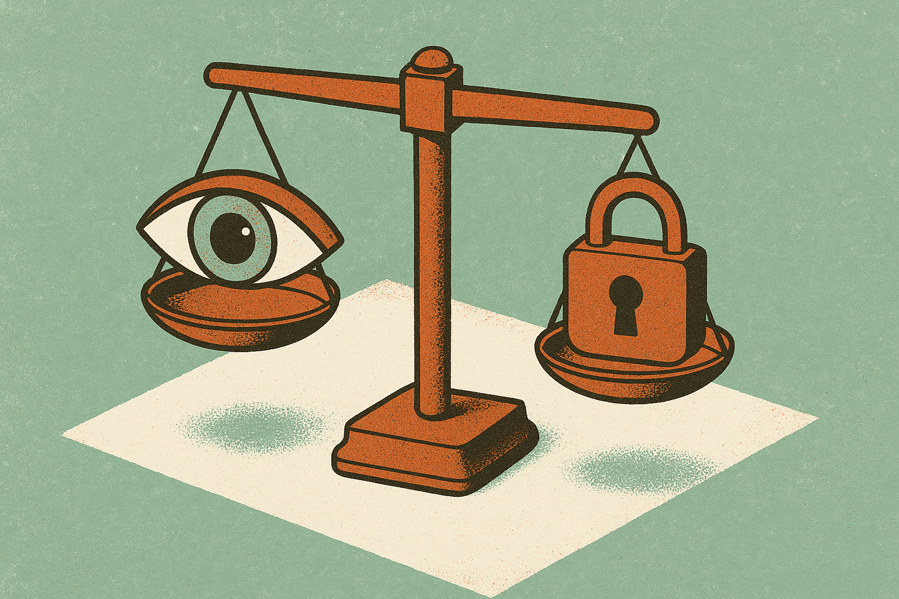
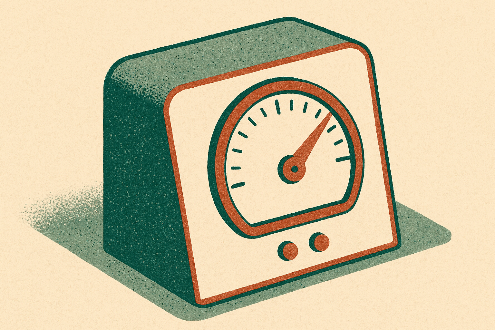

TL;DR: The "hook, hold, harvest, hide" phrase describing Meta's alleged strategy is a memorable frame, but right now it rests on a single Hacker News thread with no primary filing attached, so treat it as an allegation and study the mechanics instead of the verdict.

Here is the honest state of what I can source. The claim comes from a Hacker News (AI) post titled "Hook, hold, harvest and hide: Meta's alleged strategy laid out in first week." That is the primary source I have in front of me, and it is a link-and-discussion thread, not a court document, not a Meta filing, not a regulator's report. The word "alleged" and the phrase "first week" strongly imply this is coverage of an ongoing legal proceeding. But I do not have the underlying complaint, the docket number, or Meta's response. So I am not going to pretend I know what the plaintiffs actually filed or what Meta actually did.

What I can do is something more useful than repeating a slogan: break down whether the four-stage pattern the phrase describes is real in AI and product design, where the line sits between good retention and manipulation, and what a builder should take from it.

## What does "hook, hold, harvest, hide" actually describe?

Strip the legal drama and you are left with a lifecycle that most consumer software follows, AI products included.

Hook is acquisition and the first session. Get the user in, deliver a fast win, create a reason to come back. Hold is retention: notifications, streaks, recommendation feeds, the stuff that turns a visit into a habit. Harvest is monetization, usually through data and attention sold to advertisers or converted to subscription. Hide is the part that turns a normal funnel into an accusation: obscuring how any of the first three work, burying settings, making the data flows and the incentives hard to see.

The first three are just business. Every product I have ever shipped tried to hook, hold, and harvest in some form. The fourth is where it goes wrong. "Hide" is the allegation that matters, because it is the difference between a product that retains you and a product that deceives you about why.

AI sharpens each stage. The hook gets more personal because a model can tailor the first experience to you. The hold gets stickier because recommendation systems optimize engagement better than any hand-tuned feed. The harvest gets richer because every interaction with a chatbot or feed is training data. And the hide gets easier, because "the model decided" is a convenient fog to hide intent behind. That is the real reason this framing is worth chewing on even without the court papers: the mechanics it names are exactly the ones AI intensifies.

## Is this a real legal claim or just a catchy phrase?

I genuinely cannot confirm from what I have. The Hacker News title says "alleged strategy laid out in first week," which reads like trial or filing coverage, and Meta has been the target of multiple engagement-and-teen-safety suits from state attorneys general and school districts over the last few years. This could plausibly be one of those. But plausible is not confirmed, and I will not attach a case name or a claim to Meta that I cannot source.

Here is why the distinction matters for you as a reader. A four-word alliterative frame is engineered to travel. "Hook, hold, harvest, hide" is the kind of phrase a plaintiff's lawyer writes for a headline, not a neutral description of system behavior. It might be perfectly accurate. It might also be advocacy language that compresses a messy record into something that sounds like a smoking gun. Treat it the way you would treat any opposing-counsel summary: as a hypothesis about intent, not proof of it.

If you want the real version of this story, the thing to find is the actual complaint or the internal documents it cites. Those are where "hide" either gets receipts or gets exposed as spin. The Hacker News thread is a pointer, not the evidence.

## Where is the line between retention and manipulation?

This is the question builders should actually sit with, because most of us are one product decision away from the "hide" column without meaning to be.

The test I use is disclosure and reversibility. A retention feature is fine if the user can see what it does and turn it off without a scavenger hunt. A streak is fine. A streak engineered so that missing a day triggers manufactured loss anxiety, with the off switch buried four menus deep, is the manipulation version. The mechanic is identical. The intent and the friction around control are what change.

AI raises the stakes because personalization can find each user's specific weak point. A generic feed hooks the average person. A model-tuned feed can find the exact content that keeps a particular teenager scrolling at 1am, and it can do it without any human ever writing that intent down. That is the accountability gap. When behavior emerges from an optimizer, "we never decided to do that" becomes both technically true and morally hollow. If your objective function rewards time-on-app, you chose the outcome when you chose the metric.

So the honest question for any AI product team is not "did we intend harm." It is "what is our system optimizing for, and would we be comfortable if that objective were printed on the landing page." If the answer is no, you are building toward the fourth H whether you meant to or not.

## What should a builder take from this?

Pick an objective you would defend in public. If your model optimizes engagement, be honest that engagement is the goal, and watch for the failure modes where engagement and user wellbeing diverge. Make your controls visible and reversible: settings that a normal person can find, data practices stated in language a normal person can read. Keep a written record of why you chose your optimization target, because "the model did it" will not hold up, to a regulator or to yourself. And read the actual complaint before you repeat the slogan, because the value of a claim like this lives entirely in its receipts, and right now the receipts are not in front of me.

The catch most readers will miss: the danger is not that some team sat in a room and drew up an evil four-part plan. The danger is that hook, hold, and harvest are the default gradient of any optimized product, and "hide" is what happens when you stop looking. You do not have to be malicious to end up there. You just have to not check. That is the part worth taking seriously, whatever the court eventually decides about Meta.
