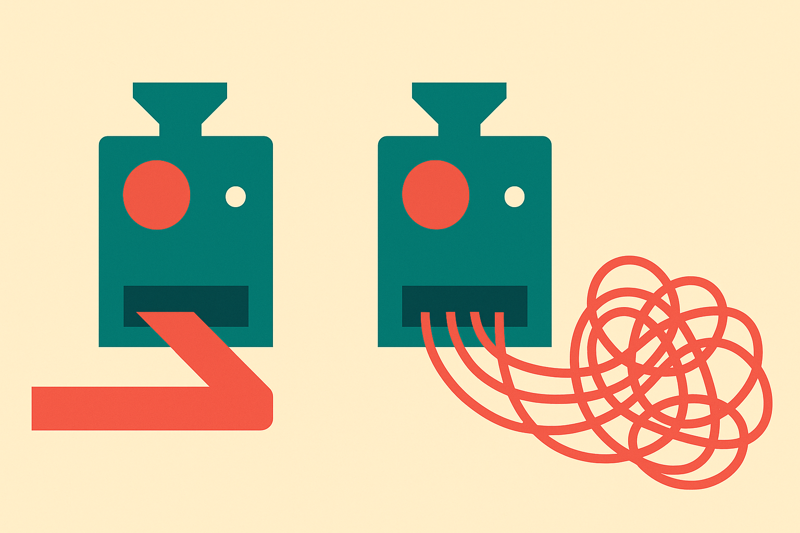

TL;DR: When your local model feels stupid, the model is usually fine and the wrapper around it is the problem: quantization, a silently truncated context window, and default sampling settings do most of the damage.

I keep seeing the same complaint, and a Hacker News thread titled "Why your local LLM feels dumber than it is" put words to it: someone runs a 70B model on their own hardware, gets mush, and concludes local is a toy compared to the API. Sometimes that is true. Often it is not. The gap between "this model is weak" and "this setup is weak" is wide, and most people never check which side they are on.

Let me be clear about sourcing up front. The specific complaint framing here comes from that Hacker News discussion, which is community commentary, not a lab benchmark. The mechanics below (how quantization and sampling and context handling work) are well established, but I am not going to hang precise quality-loss numbers on a forum thread. Where I give ranges, treat them as rules of thumb, not measurements.

## Is quantization making my model dumber?

Probably a little, and the amount depends entirely on how aggressive you went.

Quantization shrinks the model so it fits your GPU or your RAM. A model trained in 16-bit gets squeezed down to 8-bit, 5-bit, 4-bit, sometimes lower. Each step down saves memory and costs some fidelity. The catch is that the loss is not linear and it is not evenly distributed across tasks.

At 8-bit, most people cannot tell the difference from full precision on normal chat and writing. At 4-bit, general conversation still holds up well, but the cracks show on the hard stuff: multi-step math, long code generation, careful instruction following, anything that needs the model to stay precise over many tokens. Go below 4-bit and you are trading real capability for memory you probably should have solved another way.

Here is the part people miss. If you downloaded a 4-bit quant of a big model because it was the only way to fit it, you might be better off running a smaller model at higher precision. A well-run 8-bit 14B model can beat a mangled 3-bit 70B model on the tasks you actually care about. Bigger is not automatically smarter once you factor in what you had to destroy to make it fit.

## Why does my model forget things mid-conversation?

Because your context window is smaller than you think, and a lot of tools quietly throw away the overflow.

Every local runtime has a context length setting. The model might support 128K tokens, but your runtime may default to 4K or 8K to save memory. When the conversation or the document exceeds that, the software does not warn you. It silently drops the oldest tokens. The model looks like it forgot the instruction you gave three messages ago because, from its point of view, that instruction no longer exists.

This is the single most common cause of "it worked fine, then it went off the rails." Nothing degraded. Your prompt scrolled out of the window.

Two things to check. First, what is your runtime's context length actually set to, not what the model card claims it supports. In llama.cpp and its descendants this is the context size flag, and the default is often low. Second, watch memory. Big context windows are expensive. Doubling context can blow past your VRAM and force everything into slower memory or crash the run. If enabling long context makes generation crawl, that is the tradeoff biting you, not a broken model.

## What sampling settings are quietly sabotaging output?

The ones you never touched, because the defaults were tuned for something other than your task.

Temperature, top-p, top-k, repetition penalty, min-p: these control how the model picks each next token. Defaults vary between runtimes, and a default that produces lively creative writing will produce sloppy, drifting reasoning. A high temperature adds randomness. Good for brainstorming, bad for code and math where you want the single most likely correct token.

If your model rambles, contradicts itself, or invents details, try dropping temperature toward 0.1 to 0.3 for anything factual or technical. If it repeats phrases in loops, a repetition penalty helps, but crank it too high and the output turns stilted and strange because you have penalized normal language. Repetition penalty is a scalpel, not a sledgehammer.

There is also the prompt template problem, which is nastier because it is invisible. Instruction-tuned models were trained with a specific chat format: particular tokens marking where the system prompt ends and the user turn begins. If your runtime applies the wrong template, or none, the model receives input that looks nothing like its training data. It still responds, but worse, sometimes dramatically worse. A model that seems to ignore your system prompt is often a model whose template is mangling that prompt into noise.

## How do I tell a weak model from a bad setup?

Change one variable at a time and compare against a known-good reference.

Take one prompt you care about. Run it against the same model through a hosted API, or through the reference implementation with documented settings. If the hosted version nails it and yours does not, the model is capable and your local config is the problem. Now work down the list: bump precision, confirm your context length is set high enough for the input, drop temperature for technical work, verify the chat template matches the model.

If you have done all that and the output is still weak, then fine, the model is not good enough for the task and you need a bigger or better one. But you earned that conclusion instead of assuming it. Most people skip the diagnosis and jump straight to the verdict.

The Hacker News framing was right about the feeling and worth taking seriously as a signal: a lot of people are disappointed by local models. But the honest read is that a big chunk of that disappointment is self-inflicted through defaults nobody chose on purpose.

Before you conclude your local model is dumb, run the four-variable check: precision, context length, sampling temperature, chat template. Set up one reference prompt against a hosted version of the same model as your control, then change exactly one thing at a time locally until you match it or run out of knobs. The catch most people miss is the chat template, because it fails silently and invisibly: nothing errors, the model just gets quietly worse, and you spend a week blaming the weights when the real bug was three tokens in the wrong place. Fix the setup first. Judge the model second.
