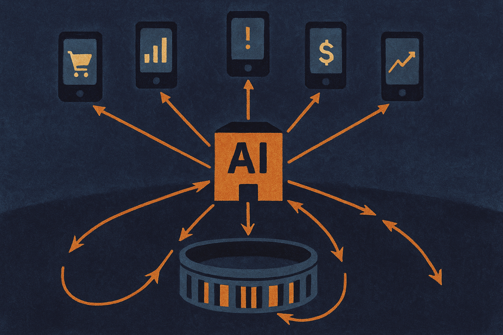

TL;DR: The useful signal in the reported Gemini-Apex deal is not crypto speculation, it is prediction markets getting packaged into regulated brokerage infrastructure that AI products may eventually read, route, and act around.

## What was actually reported?

CoinDesk’s “Gemini strikes Apex deal to widen prediction markets reach” reported that a planned tie-up would make Gemini the exclusive CFTC-regulated venue for crypto event contracts offered through Apex’s futures commission merchant.

The Block’s “Gemini to provide crypto prediction markets venue for Apex’s brokerage clients” reported the same basic shape from a different angle: brokerages offering crypto event contracts through Apex would use Gemini for execution and clearing, according to the firms.

That is all we can responsibly say from the material provided. No pricing. No launch date. No list of brokerages. No user eligibility details. No contract menu. Those details matter, and they are not in the supplied first-party docs because we do not have first-party docs here.

Still, the structure is interesting. Gemini is not just trying to attract users to a standalone prediction market. Apex is brokerage infrastructure. If the reporting holds, the strategy is distribution through financial plumbing that already serves brokerages, not another isolated crypto app hoping users show up.

That is a different bet.

## Why does brokerage distribution matter more than the crypto wrapper?

Prediction markets usually get discussed in two bad modes: gambling discourse or “wisdom of crowds” hype. Both miss the operator question: where do these markets sit in a user’s workflow?

If event contracts appear inside brokerage products, they become closer to portfolio tools, hedging tools, sentiment gauges, and news-adjacent interfaces. That does not make them automatically useful. It does make them easier to bundle into places where financially engaged users already are.

The regulatory wrapper also matters. CoinDesk framed Gemini as the exclusive CFTC-regulated venue in the planned arrangement. That phrase is doing real work. Prediction markets live or die on trust in contract rules, market integrity, settlement, and access controls. Crypto-native culture often treats market creation as the hard part. In mainstream brokerage contexts, the hard parts are execution, clearing, compliance, supervision, and customer suitability.

For AI builders, the bigger point is data exhaust. Event markets create live probabilities attached to real-world questions. If those markets get wider distribution, they may become another input into research assistants, newsroom tools, policy monitors, trading dashboards, corporate planning systems, and agent workflows.

But there is a catch. A price in a prediction market is not truth. It is a market signal produced by participants, incentives, liquidity, fees, constraints, and sometimes thin participation. AI systems that treat that signal as “the probability” will overstate what the market knows.

## Where do AI agents fit?

Not today as autonomous bettors. That is the wrong mental model, and a risky one.

The practical near-term use is read-only and advisory. An agent can monitor event markets alongside news, filings, earnings calendars, weather data, public polls, and internal business metrics. It can flag when market-implied expectations move. It can explain possible causes. It can ask whether a team’s operating plan still matches the outside view.

For example, a policy team might track markets around election outcomes or regulatory milestones. A supply chain team might watch event contracts tied to macro shocks, if those contracts exist and are liquid enough. A media analyst might compare market moves with source reporting. In each case, the AI system should cite the market as one signal, not the signal.

The Gemini-Apex angle matters because agents need reliable rails before they need autonomy. If prediction market data becomes available through brokerage-grade systems, builders can design around clearer execution records, settlement states, and compliance boundaries. That is more boring than “AI agents trading everything.” It is also more useful.

I would treat this as infrastructure to watch, not a product category to chase blindly. If you are building with event data, start by testing prediction-market signals as a read-only feature in a dashboard or assistant: show the market move, pair it with primary-source news, capture user feedback, and log when the signal was wrong. The catch most readers miss is liquidity. A clean interface around a thin market is still a thin market, and AI will make that look more authoritative than it is.
