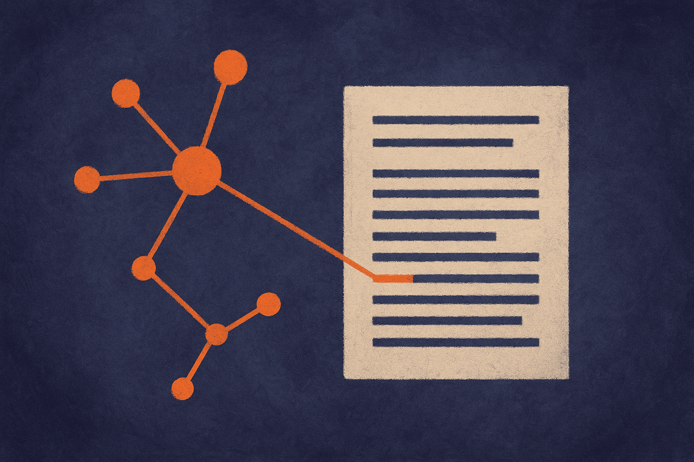
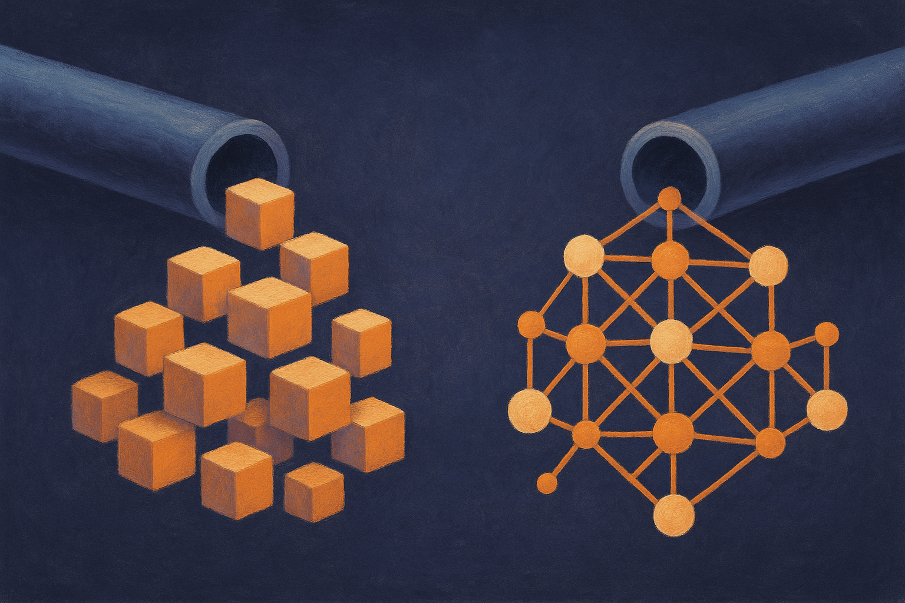

TL;DR: EnSI-RAG builds its search index out of entities and their relationships instead of raw text chunks, and on two long-document QA benchmarks that shift beats the referenced baselines by 6.62 points, which is a real signal that chunk-boundary problems are a fixable design flaw, not a law of nature.

The paper is "EnSI-RAG: Entity-Structure-Indexed Retrieval-Augmented Generation for Long-Document Question Answering," posted to arXiv under both cs.AI and cs.CL. Code is up at github.com/RamonMeng/EnSI-RAG. I want to walk through what it actually does, because the core idea is simple enough to steal even if you never touch their repo.

## What is actually broken with chunk-based RAG?

The default RAG recipe is almost embarrassingly blunt: cut a document into fixed-size chunks, embed each one, and at query time retrieve the chunks whose embeddings sit closest to your question. It works well enough for short, self-contained facts. It falls apart on long, connected documents, and the paper names the two failure modes precisely.

First, chunk boundaries. When an entity and the evidence that supports a claim about it land in different chunks, similarity search can grab one and miss the other. The information was there. Your retriever just sliced it in half.

Second, multi-hop reasoning. If a question needs you to connect entity A to entity B through some relationship, and those live in different parts of the corpus, embedding similarity to the raw question text often does not surface both. The question does not lexically resemble the bridge fact.

If you have shipped a RAG system over anything real (contracts, research corpora, incident reports, a knowledge base with cross-references), you have felt this. You tune chunk size, you add overlap, you fiddle with top-k, and you get incremental relief without fixing the underlying mismatch. The index is organized by text proximity. The questions are organized by meaning and relationships. Those are not the same coordinate system.

## How does EnSI-RAG index by entity instead?

The move is to build a query-independent, entity-centered index. Instead of storing chunks, the system extracts structured records shaped as (e, t, k, v): an entity `e`, its type `t`, a semantic category `k` drawn from \{property, relation, aspect\}, and a value `v`. Each record keeps a link back to the original source passage it came from.

So a record might capture that a given person (entity, type) has a certain role (property) and reports to someone else (relation), each tied to the passage that stated it. The index is now a set of small, meaning-bearing handles rather than a pile of text blocks.

At query time those records serve as retrieval handles. You match against the structured index, pull the linked passages, and then an LLM synthesizes the retrieved passages into the final answer. The paper frames this as separating evidence localization from answer synthesis. Find the right evidence first, using structure. Write the answer second, using the actual source text.

That separation is the part I find most useful, independent of the benchmark numbers. A lot of RAG systems blur these two jobs, letting embedding similarity do both the "where is it" and implicitly the "what matters" work. EnSI-RAG makes localization a structured lookup over entities and relationships, which is exactly the shape of a multi-hop question, and leaves synthesis to the model with the raw passages in hand. It also means the evidence stays traceable: every record points back to where it came from, so you can audit why the answer says what it says.

## Do the numbers hold up?

Across Loong and Oolong, two long-document QA benchmarks, EnSI-RAG reports an average accuracy of 78.24, which the paper says is 6.62 points higher than the published baseline scores it uses as references. The authors' own framing is measured. They say this "suggests its effectiveness" across these settings, not that it settles anything.

I would hold the same posture. A few honest caveats worth keeping in view.

The comparison is against "published baseline scores used as references," not necessarily against every baseline re-run under identical conditions by the same team. That is common in retrieval papers and it is not damning, but it means the 6.62-point gap is a comparison to reported numbers, not a controlled head-to-head you should treat as the final word.

Two benchmarks is a start, not a coronation. Loong and Oolong are long-document QA sets, which is the right target for this method, but entity-centric indexing could plausibly help more on relationship-heavy corpora and less on documents where the questions are mostly local lookups. The paper does not claim otherwise.

And the extraction step has a cost that the headline accuracy number does not surface. Building (e, t, k, v) records means running extraction over your corpus up front, which is more expensive and more error-prone than naive chunking. If your entity extraction misfires, your index inherits the mistake. The paper positions the index as query-independent, meaning you build it once, which amortizes that cost across many queries. Whether that trade lands in your favor depends entirely on how many questions you run against how large a corpus.

## Should you actually build this?

Here is the practical read. The idea generalizes even if the specific framework does not fit your stack. If your RAG system struggles on questions that require connecting facts across a document, or across many documents, the diagnosis is probably that your index is organized by text proximity when your queries are organized by entities and relationships. That is EnSI-RAG's whole thesis, and it is portable.

Practitioner's take: before you rebuild anything, instrument your failures. Pull the last fifty queries your current RAG got wrong and label each one as either "the right chunk was retrieved but the answer was bad" or "the right evidence was never retrieved." If most of your misses are retrieval misses on multi-hop questions, an entity-structured index is worth a prototype, and the code is public so you can test the approach rather than argue about it. Start small: extract (entity, type, category, value) records over a single hard corpus, keep the source links, and measure retrieval recall on your own multi-hop questions before you touch answer quality. The catch most readers will miss is the extraction tax. This method moves work from query time to index time, so it pays off when you run many questions against a stable corpus and hurts when your documents churn constantly or your entity extraction is unreliable. Match the tool to that shape, not to the benchmark headline.
