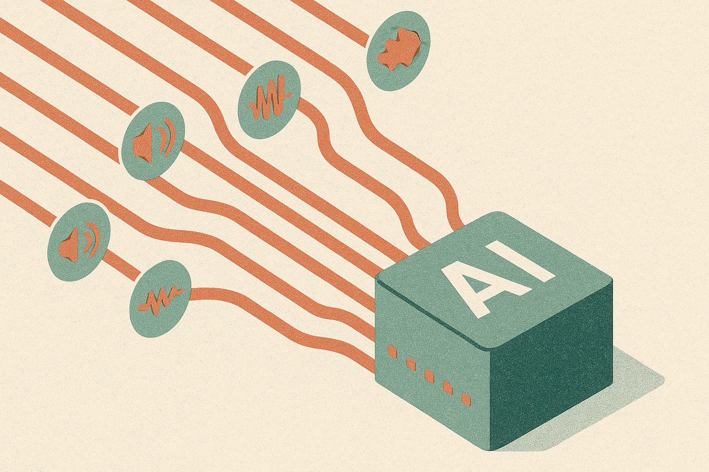

TL;DR: TurboBias 2.0 lets a batched, streaming ASR system give every user their own private list of boosted phrases at the same time, so your names, SKUs, and jargon get transcribed correctly without slowing the pipeline down.

The demo version of speech recognition looks solved. You talk, text appears, the error rate on some benchmark is under 5 percent. The production version is where things fall apart, and they usually fall apart on the same word: the one that matters. A customer's name. A drug name. An internal product code. A ticker. The general model has never seen it or sees it rarely, so it guesses the nearest common word and moves on. Context biasing is the fix, and the paper worth reading here is **TurboBias 2.0: Streaming Context-Biasing for Production-Efficient ASR Systems**, posted to arXiv across cs.AI, cs.CL, and cs.LG.

## What is context biasing and why does it keep breaking in production?

Context biasing means handing the recognizer a list of phrases you care about and nudging it toward them during decoding. If you tell the system "expect the words Ozempic, Xarelto, and metoprolol," it stops rendering them as "oh sem pick" and starts getting them right. The concept is old. The trouble, as the TurboBias 2.0 authors frame it, is that most published biasing methods improve accuracy in a paper and then ignore what an actual production system needs: streaming inference, efficient batched decoding, user-specific context lists, and low runtime overhead.

Read that list again, because it is the whole story. Those four requirements are exactly the things that get dropped when a method is tuned to win on a benchmark.

Streaming means you cannot wait for the full utterance. You are emitting text as the audio arrives, so any biasing has to work incrementally. Batched decoding means you are processing many audio streams together on the same GPU to keep costs sane. Low overhead means the biasing cannot eat the latency budget you were protecting in the first place. And user-specific context lists is the one that quietly breaks everything else.

## How does per-user biasing survive batched decoding?

Here is the tension. Batching wants uniformity. You process a batch efficiently because every item in it goes through the same operations. But personalization wants the opposite: my context list is my contacts and my jargon, yours is yours, and they must not mix. If user A's list bleeds into user B's stream, you get wrong transcripts and, depending on the data, a privacy problem.

The contribution TurboBias 2.0 claims is per-stream batched decoding, where each utterance in a batch uses an independent context-biasing configuration. That is the sentence to underline. It means the system can serve many simultaneous users, each with a private phrase list, inside a single efficient batch, without sharing or mixing their lists. The paper positions this as an extension of a GPU-accelerated predecessor, TurboBias, plus a case-insensitive boosting graph so "Ozempic" and "ozempic" both land.

I want to be careful here about what the sources actually support. The abstract states the framework improves contextual phrase recognition while preserving low latency and high throughput, and that it works for both offline and streaming inference with greedy and beam-search decoding. It does not, in the material I have, give the numbers: no word error rate deltas, no latency figures, no throughput comparison against a baseline. So treat the accuracy and speed claims as asserted by the authors and pending the full results table. The architecture idea is the news. The magnitude is not quantified in what is in front of me.

## Where does this actually fit in a stack?

If you are building anything with voice, this maps to a very specific pain you have probably already hit. Think about a medical scribe app transcribing a clinic. Every physician has a different patient roster, a different set of medications they prescribe, a different subspecialty vocabulary. You cannot ship one global bias list, because a cardiologist's terms would pollute a dermatologist's transcripts. You also cannot spin up a dedicated model instance per doctor, because the GPU bill would be absurd. Per-stream biasing inside a shared batch is the thing that makes that economically possible.

Same shape in a contact center: each caller's account has known names and product references. Same shape in a voice assistant: my contacts are not your contacts. Same shape in live captioning for an event: the speaker list and company names are known in advance and change per session.

The reason this is a Transducer-specific paper matters too. The framework targets Transducer-based ASR, the RNN-T style architecture that dominates streaming production systems because it emits tokens as audio arrives rather than waiting for the end. If you are running a whole-utterance attention model offline, your biasing options look different. If you are running streaming Transducers, which most real-time products are, this is aimed directly at your setup. NVIDIA's NeMo ecosystem has been the main home for GPU-accelerated Transducer work and TurboBias, so that is the likely context, though I will not assert an implementation detail the abstract does not state.

## What should you not read into this?

Two cautions. First, context biasing helps with known phrases. It does nothing for words you did not anticipate. If a user says a name that is not on any list, the model is back to guessing. Biasing raises the ceiling on the vocabulary you can enumerate in advance, which is a lot in enterprise settings and very little in open-domain chat. Know which world you are in before you budget engineering time for this.

Second, "preserving low latency and high throughput" is a comparative claim that needs a baseline to mean anything, and the abstract-level material here does not hand you one. Before you commit, the thing to extract from the full paper is the latency table: overhead per stream as the context list grows, and how throughput degrades as you pack more distinct lists into one batch. Personalization at scale usually has a cost curve. The question is not whether TurboBias 2.0 has one, it is whether that curve stays flat enough at the list sizes you actually use.

A practitioner would treat this as a build-versus-tune decision, not a rip-and-replace. If you already run streaming Transducer ASR and you are hand-rolling biasing, the concrete move is to pull the full paper, find the per-stream overhead numbers, and benchmark against your current approach using your real context lists at your real batch sizes, not the paper's. The catch most readers will miss: the win here is not raw accuracy, it is that personalization stops forcing you to choose between correct transcripts and affordable batching. That trade-off is the tax you have been quietly paying, and this is a paper about not paying it. Verify the tax was actually removed before you celebrate.
