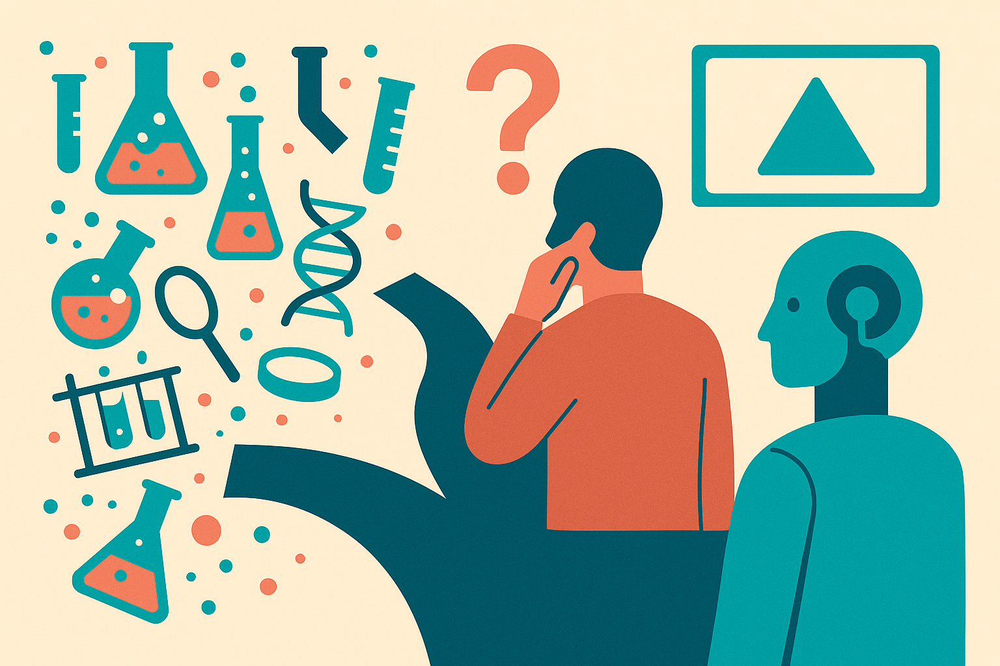

TL;DR: VIALS is a useful warning for biotech AI builders: general vision fluency does not mean a model can read the messy artifacts that drive real lab decisions.

## What does VIALS actually test?

The primary source is the arXiv cs.AI paper, "VIALS: A Benchmark for Visual Interpretation of Artifacts in the Life Sciences." It introduces a benchmark with 161 visual question-answering tasks drawn from professional life sciences workflows.

That detail matters. VIALS is not asking models to caption a clean stock photo of a microscope or identify a famous diagram from a textbook. It focuses on artifacts scientists actually use while working: gel blots, microscopy images, plasmid maps, flow cytometry plots, molecular structures, and similar materials.

These are decision objects. A scientist looks at them to decide whether an experiment worked, whether a construct is plausible, whether a sample looks contaminated, or whether a next step is worth running. The paper’s claim is blunt: frontier vision-language models may describe natural images fluently, but they are not accurately interpreting these scientific images.

That is the gap. Not “can the model see?” More like, “can the model see the thing a trained scientist sees, in the context where the answer changes the next action?”

## Why do general vision models fail here?

VIALS points to two missing pieces: domain knowledge and domain-specific visual reasoning.

That tracks with what I see in applied AI work. Many vision-language models are good at surface recognition. They can say an image contains cells, a blot, a chart, or a molecular diagram. But scientific interpretation often lives one level deeper. It depends on conventions, expected patterns, experimental context, and the difference between “this looks like the right kind of image” and “this result supports the next step.”

A gel blot is not just bands on a background. A flow cytometry plot is not just colored dots. A plasmid map is not just a circular diagram. Each artifact encodes decisions, assumptions, and failure modes.

VIALS reports that scientists with relevant domain expertise find these tasks straightforward. That comparison is important because it avoids a common benchmark trap. If humans also struggled, the issue might be ambiguity in the task. Here, the paper says domain experts can handle the interpretations. The models cannot do the same reliably.

So I would not read VIALS as “vision-language models are bad.” I would read it as “general multimodal skill is overestimated when the work product is specialized.” For biotech, that is the whole game.

## What should biotech teams do with this?

The immediate lesson is not to ban models from lab workflows. It is to stop treating generic visual reasoning as a proxy for scientific usefulness.

If you are building an AI assistant for R&D, VIALS suggests your eval set should look like your actual internal artifacts. Not press-release images. Not textbook examples. Not screenshots chosen because they are tidy. Use the ugly middle of the workflow, including the artifacts that scientists pass around in Slack, ELNs, slide decks, and instrument exports.

It also suggests that “multimodal” should not be a product claim by itself. The useful question is narrower: can the system answer the specific visual questions your scientists ask before making a decision? Can it explain what evidence in the artifact supports the answer? Can it say when it lacks context? Can it route to a human instead of bluffing?

That last part is where hype can get expensive. A model that confidently misreads a scientific image is worse than a model that refuses. In a lab setting, the cost is not just a bad answer. It can be wasted runs, bad handoffs, contaminated downstream analysis, or a false sense that an experiment is ready to scale.

For a builder, I would start small: collect 50 to 100 internal visual tasks from one workflow, have domain experts write the expected interpretation, then test your chosen vision-language models against that set before any product build. The catch most readers miss is that the hard part is not adding image upload to a chat UI. It is encoding the tacit visual judgment your scientists already use, then measuring whether the model can match it under real workflow conditions.
