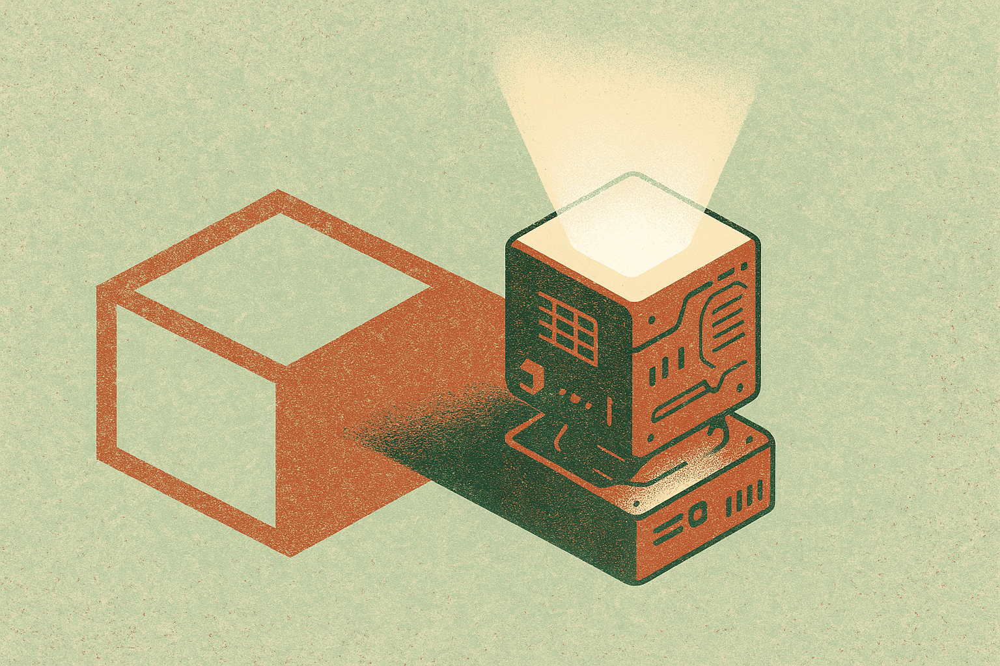
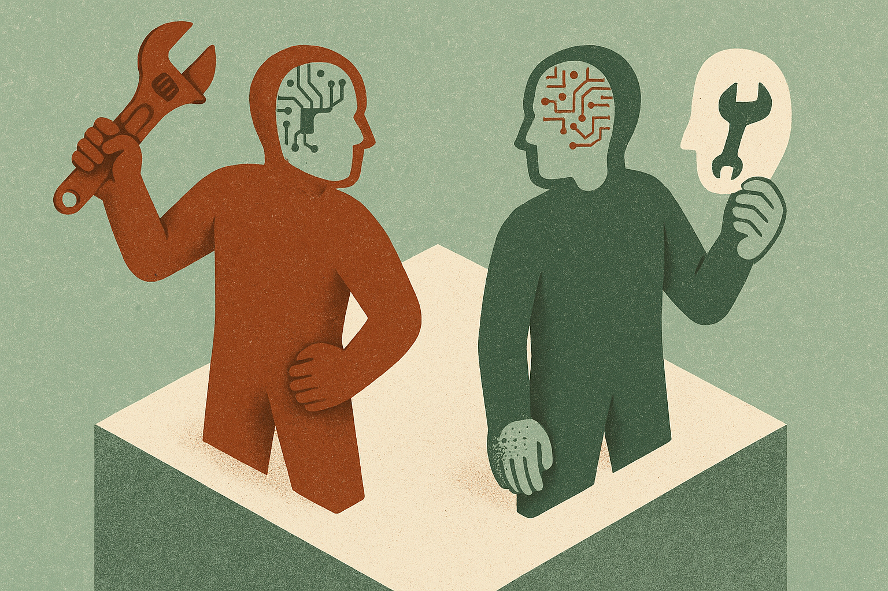

TL;DR: "AI supercomputer" is now a proven fraud prop, and the Kovar conviction shows the pattern is old-school Ponzi mechanics wearing a machine-learning costume, so the defense is due diligence on the plumbing, not the pitch.

A Las Vegas businessman named Brent Kovar was convicted of running a $24 million crypto Ponzi scheme built on a story about an AI supercomputer that was supposedly mining cryptocurrency for at least 400 investors. Both Decrypt and CoinDesk reported the verdict, and the details they lay out are worth sitting with, because this is not a one-off. It is a template. The word "AI" did real work in this fraud. It made an impossible claim sound cutting-edge instead of implausible. That is the pattern builders, investors, and platform operators are going to keep seeing, and it is worth mapping precisely.

This post is the current-state reference on AI-as-fraud-bait: what actually happened here, why the AI framing works on victims, what is settled versus contested about how these scams run, and what a practitioner should do when the letters "AI" show up next to a promise of returns.

## What actually happened in the Kovar case?

Here is what the named sources establish. Decrypt reported, in a piece titled "Jury Convicts Las Vegas Man of $24M AI Crypto Mining Ponzi Scheme," that Brent Kovar told at least 400 investors a supercomputer was mining crypto for them, and that their money was insured by the FDIC. CoinDesk, in "Las Vegas businessman convicted in $24 million 'AI supercomputer' crypto Ponzi scheme," reported the same core facts: Kovar was found guilty of running a crypto Ponzi scheme that defrauded at least 400 investors out of $24 million.

Both outlets are tier-two trade coverage, so treat the courtroom specifics as reported rather than as something I independently verified. But the two accounts agree on the load-bearing claims: the scale ($24 million), the victim count (at least 400), the crypto-mining cover story, and the AI supercomputer framing. When two independent outlets converge on the same numbers and the same narrative, that is about as solid as a verdict recap gets before the court documents circulate.

The FDIC detail is the tell. The FDIC insures bank deposits. It does not insure crypto mining returns, and it never has. Anyone who understood what FDIC insurance actually covers would have flagged that claim instantly. The scheme relied on victims not knowing that, and on the AI supercomputer story being impressive enough that they did not ask.

## Why does the "AI supercomputer" framing work so well on victims?

Strip the technology out and this is the oldest financial crime there is. A Ponzi scheme pays early investors with money from later investors, produces no real yield, and collapses when new money slows. Charles Ponzi ran the original in 1920 with postal reply coupons. The mechanics have not changed in a century.

What changes is the cover story, and the cover story's only job is to explain where the returns come from in a way that is impressive enough to discourage questions. In the 1920s it was arbitrage on postal coupons. In the 2008 era it was Bernie Madoff's "split-strike conversion" strategy, opaque enough that sophisticated investors nodded along. In the crypto boom it was mining, staking, and yield farming. Now it is AI.

AI is a nearly perfect cover story for three reasons.

First, it is genuinely hard to evaluate. Most people, including most investors, cannot tell a real GPU cluster running inference from a rack of blinking lights. The knowledge gap is real, which means the lie does not have to be sophisticated to survive scrutiny. It just has to be technical.

Second, AI carries a legitimate halo. Real companies are spending real billions on real compute. Nvidia's data-center revenue is not fiction. So when a scammer says "supercomputer" and "AI," they are borrowing the credibility of an actual boom. The victim's prior is "AI makes lots of money," which is true in aggregate, so "this AI makes money for you" slots right in.

Third, AI supplies a plausible reason for secrecy. Proprietary models, proprietary training data, proprietary hardware: all of it gives a fraudster cover for refusing to show the thing. "I can't reveal the algorithm" sounds like protecting a trade secret. It is actually hiding the absence of one.

The crypto layer compounds every one of these. Crypto adds irreversibility (once the money moves, it is gone), pseudonymity, and a second technical fog on top of the first. AI supercomputer plus crypto mining is two nested black boxes, each one making the other harder to inspect.

## Is this an isolated case or a pattern?

It is a pattern, and the pattern is broader than crypto Ponzis. The Kovar verdict is one clean, convicted instance of a much larger phenomenon: AI being used as a fraud multiplier across the whole abuse landscape.

I wrote about the other end of this earlier this month in [What OpenAI's Cambodia Scam Takedown Tells Builders About Abuse Detection](/blog/2026-08-01-what-openais-cambodia-scam-takedown-tells-builders-about-abuse-detection/). That case was different in mechanism: real AI tools being used operationally by scam compounds to run pig-butchering fraud at scale. Kovar's case is the inverse: fake AI used as the narrative bait. Between those two poles you have the full range. AI as the weapon, and AI as the story.

Both matter, and builders should hold them as separate threats. Real AI in the hands of fraudsters lowers the cost of running scams: translation, persona generation, automated conversation, target selection. Fake AI in the mouths of fraudsters raises the ceiling on what they can promise, because "an AI does it" is a black box that explains any return.

The Kovar case sits in the fake-AI camp. There is no evidence in either Decrypt's or CoinDesk's reporting that any real AI system existed at all. The supercomputer was a prop in a story. That is the crucial distinction: this was not a technology failure, it was a marketing success. The AI never had to work. It only had to be believed.

## What is settled versus still contested here?

Settled: the mechanics. Ponzi schemes are fully understood. The AI-as-cover-story move is now demonstrated in court, not just theorized. The FDIC-insurance lie is a known red flag that predates AI by decades. None of the fundamentals are novel.

Settled: the incentive. As long as AI is associated with outsized returns in the public mind, "invest in my AI that generates returns" will be an attractive fraud vector. That association is not going away soon.

Contested, or at least unsettled: the scale and detection difficulty going forward. We do not have good public numbers on how much fraud specifically uses AI framing as the hook, versus crypto framing, versus real-estate framing, versus the classics. The Kovar case gives us one data point: $24 million, 400-plus victims, per Decrypt and CoinDesk. It does not tell us whether AI-themed fraud is growing faster than the baseline or just getting more press because AI is the story of the moment.

Also unsettled: how much better real AI makes the delivery of these scams. It is intuitive that generative tools help fraudsters produce slicker pitch decks, more convincing fake dashboards, more responsive "customer service," and deepfaked testimonials. The OpenAI Cambodia takedown is direct evidence that AI tools get used operationally in fraud. But quantifying the lift AI gives to a fraud operation's conversion rate is genuinely hard, and I have not seen a clean, sourced number I would stand behind. Anyone who gives you a precise percentage there is probably guessing.

## What should a builder or investor actually do about it?

The defense is boring, and that is the point. Fraud that dresses itself in novelty is defeated by unglamorous process.

Interrogate the plumbing, not the pitch. The question is never "does the AI sound impressive." The question is "where do the returns actually come from, and can I inspect that mechanism independently." In the Kovar case, the answer was a supercomputer nobody could see doing mining nobody could verify. If the yield-generating mechanism cannot be independently audited, the yield is a claim, not a fact.

Treat the FDIC claim as a hard stop. This is the single most transferable lesson from the case. The FDIC insures deposits at member banks. It does not insure investment returns, crypto, or mining. Anyone invoking FDIC insurance to make a non-deposit product feel safe is either ignorant of what the FDIC does or lying about it, and neither is someone you want holding your money. Extend the same logic to "SEC-approved" (the SEC does not approve investments), "guaranteed returns" (real yield is never guaranteed), and any regulator's name used as a comfort blanket.

Separate the AI question from the money question. Ask two things independently. One: is there real AI here, and can I verify it (real infrastructure, real model, real outputs I can test)? Two: does the business model make sense on its own terms even if the AI is exactly as good as claimed? A lot of fraud survives because people collapse these into one impressed nod. Real AI does not make a Ponzi structure legitimate, and a legitimate structure does not need real AI to justify impossible returns.

For platform operators, the abuse-detection lens matters. If you run a marketplace, a payment rail, an ad network, or a model API, "AI-powered returns" and "AI supercomputer" and "AI trading bot" are keyword clusters worth flagging the same way you would flag other high-risk financial promises. The Cambodia takedown showed OpenAI building detection around abuse patterns rather than individual bad actors; the same pattern-matching applies here. The fraud template is stable even when the specific project name changes.

For builders specifically, understand that fraudsters are borrowing your credibility. Every legitimate AI company that overpromises on returns, every "our AI beats the market" claim that is technically true-ish but practically misleading, widens the space that outright fraudsters operate in. The more the honest edge of the industry hypes, the easier it is for the dishonest edge to hide. That is a reason to be precise about what your product actually does, beyond just being honest for its own sake.

## What does the .ai domain gold rush have to do with any of this?

At first glance, nothing. Domain Name Wire's DNW Podcast #601, "Ai end user domain stories," is about two entrepreneurs who moved their businesses to .ai domains, one migrating from a .so and one from a .com, and what they think of the switch. It is a legitimate small-business story about the .ai extension being, in Domain Name Wire's word, hot.

But it belongs in this pillar because it is the same underlying force viewed from the legitimate side. The .ai land rush exists because attaching "AI" to your identity now carries real market value. That value is exactly what the Kovar fraud exploited. The same signal that makes a .ai domain worth paying up for is the signal that makes "AI supercomputer" a persuasive lie. Legitimacy and fraud are drinking from the same well: the public's belief that AI equals value.

The operator lesson is symmetry. When a label becomes a shortcut for credibility, it becomes attractive to buy legitimately (the .ai domain) and to fake fraudulently (the imaginary supercomputer). If you are building on the honest side, assume the label alone is doing less work than you think for discerning buyers, precisely because everyone knows scammers use it too. The .ai extension gets you noticed. It does not get you trusted. Trust still comes from verifiable substance, which is the same thing that would have protected Kovar's victims.

## What to watch next

Three things.

First, watch for the delivery quality to rise even when the underlying fraud is fake. Expect AI-generated dashboards, deepfaked testimonial videos, and responsive chatbot "support" that make fake operations feel more real than Kovar's ever did. The Cambodia case tells us fraudsters already reach for real AI tools. The next Kovar will likely have a much slicker front end, which makes the "inspect the plumbing" discipline more important, not less, because the surface will look better while the substance stays empty.

First-party detection efforts are the other side to watch. If the major labs and payment platforms treat AI-investment fraud framing as a named abuse category the way OpenAI treated the Cambodia operation, that shifts detection upstream. Whether they do, and whether they publish about it, is worth tracking.

And watch the regulators. Ponzi convictions like Kovar's are after-the-fact: the money was already gone by the time the jury ruled. The interesting question is whether enforcement gets faster and more pattern-aware about AI-framed fraud specifically, or whether it keeps arriving a full collapse too late. Based on the century-long track record of Ponzi enforcement, I would not bet on prevention. I would bet on the same schemes running under new AI labels until the next verdict.

Here is the forward judgment no single source gives you: the AI fraud wave is not primarily a technology problem, it is a credibility-arbitrage problem. Fraudsters are shorting the gap between what the public believes AI can do and what it actually does for a given operation. That gap is widest when hype is loudest, which means the fraud pressure tracks the hype cycle, not the capability curve. The technical sophistication of the scam barely matters. Kovar's supercomputer did not have to exist.

The practitioner's take: build one reflex and apply it to every AI-plus-money pitch you encounter, including your own. When you hear "our AI generates returns," mentally delete the word "AI" and ask whether the sentence still makes sense as an investment. "Our system generates returns, verified how, paid from what source, auditable by whom." If the AI framing is the only thing making the pitch sound plausible, the AI framing is the fraud. The catch most readers miss: this reflex has to point inward too. The honest AI industry's habit of overclaiming on outcomes is the cover that lets the Kovars of the world blend in, so the most useful anti-fraud thing you can do as a builder is describe what your product actually does, in plumbing terms, and never once lean on the word "AI" to carry a promise it cannot keep.
