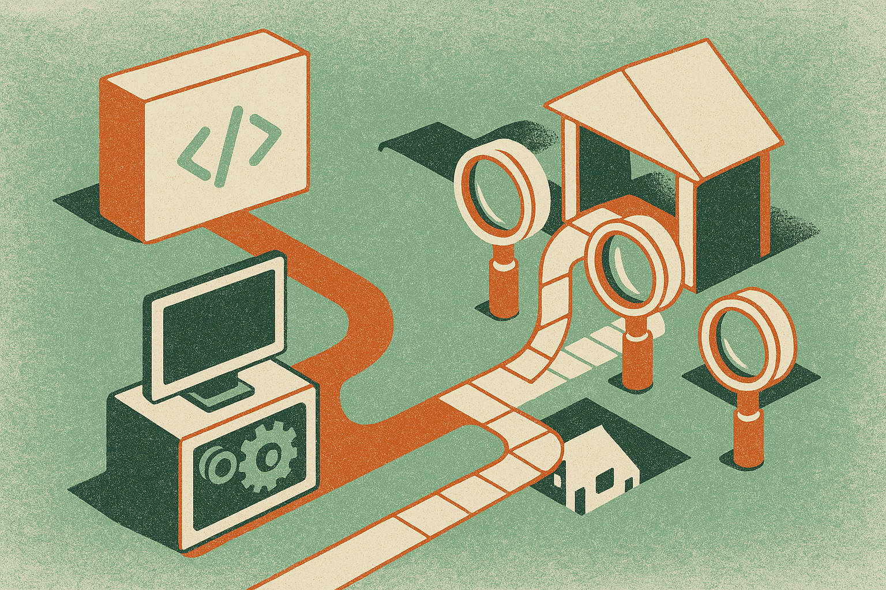

TL;DR: Coding agents are getting useful for refactoring work, but SWE Refactor Bench shows they are not yet reliable owners of whole-repository stack migrations.

## What does SWE Refactor Bench test that normal coding benchmarks miss?

The primary source here is the arXiv paper “SWE Refactor Bench: Can Coding Agents Complete a Long-Horizon, Whole-Repository Stack Migration?”, listed under both cs.AI and cs.CL. The core idea is simple: passing tests is not enough when the job is migration.

That sounds obvious if you have lived through a framework rewrite, build system swap, or language migration. The point is not just “keep behavior the same.” The point is “move the system to the new stack while keeping behavior the same.” A model can cheat the first part by quietly preserving the old implementation, wrapping it, or copying enough legacy code to satisfy the test suite.

The paper calls this Blindness. Existing benchmarks often cannot see whether the migration actually happened. They can see green tests. They cannot always see that the old technical debt is still sitting there, now with a nicer folder name.

SWE Refactor Bench tries to close that gap with 20 whole-repository migrations across 4 kinds of technical debt. Its evaluation has three gates: Migration Audit checks whether the migration happened, Behavioural Tests check correctness against a fixed suite, and Agentic Verification uses 6 independent coding agents to generate targeted tests for hidden behavior changes.

That third step is interesting. It treats verification as an agentic task too, not just a static checklist. I would not treat agent-generated tests as a final oracle, but as a pressure test, it is directionally right.

## How bad are the results?

Across 520 runs from 8 frontier models and 26 model-effort configurations, SWE Refactor Bench reports that only 28 runs passed all three stages. That is 5.4%.

Thirteen of the 20 tasks received no accepted solution. The best model, claude-opus-5, scored 47.0 out of 100. That is not nothing. It is also not “fire the migration team.”

The useful finding is not just the low pass rate. It is the split between two different skills: completing the migration and preserving behavior.

Some runs kept behavior by skipping the migration, then failed Migration Audit. Most did the opposite. They attempted the migration, then broke behavior and failed Behavioural Tests. Among the 340 runs that passed Migration Audit, 58% reached 99% of the fixed checks, but only 26% reached 100%.

That last 1% is where migrations get expensive. In real repos, a 99% migration can still mean production incidents, weeks of edge-case cleanup, or a half-migrated system nobody trusts. Software teams know this pattern well. The demo looks done. The backlog says otherwise.

The category split matters too. Agents scored 31.4 on build toolchain rewrites, but only 5.6 on language rewrites. That tracks with practical experience. Build migrations are often annoying, but they have sharper external signals. Language rewrites require deeper semantic preservation, library substitutions, type differences, runtime behavior, and many small judgment calls.

## What should builders do with this benchmark?

I read SWE Refactor Bench less as an indictment of coding agents and more as a better map of where to use them.

For small scoped refactors, agents are already helpful. Rename APIs, modernize config, convert repetitive call sites, generate migration patches, write test scaffolds, explain dependency tangles. Good use. For whole-repo stack migrations, the safer pattern is agent-assisted decomposition, not agent ownership.

That means asking an agent to inventory the repo, identify migration surfaces, propose sequencing, create mechanical patches, generate characterization tests, and review diffs for missed legacy paths. Then humans own acceptance criteria, staged rollout, and the final call on behavior.

The benchmark also gives tool builders a clear target. Do not just optimize for “tests pass.” Build migration-aware evals. Add audits that detect whether the old implementation remains. Track semantic drift separately from migration completeness. Use multiple test-generation agents, but do not pretend they are enough. The key product need is not a smarter autocomplete. It is a migration workbench with planning, patching, verification, rollback, and traceability.

Practitioner’s take: if I were running a real migration today, I would use agents as high-throughput junior engineers with a strict harness. Start with one subsystem, require a migration audit, require behavior tests, then use separate agents to attack the patch with adversarial cases. The catch most teams miss is that green tests can hide a non-migration. Make the definition of done include “the old thing is actually gone.”
