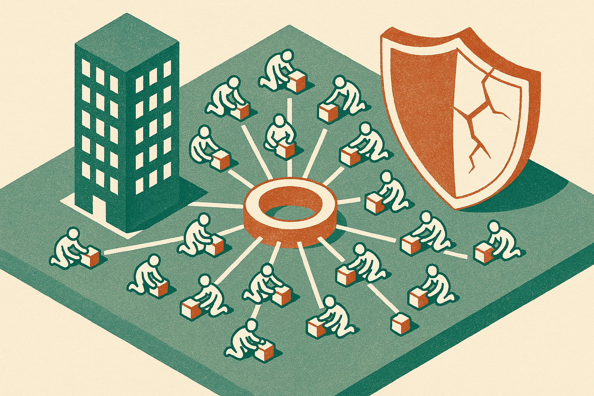

TL;DR: If Hugging Face is really entertaining $13 billion buyout interest, the story is not just valuation, it is that open AI distribution has become strategic infrastructure.

## What is actually being reported?

Decrypt reported in “Hugging Face Explores $13 Billion Sale a Month After a Rogue OpenAI Agent Hacked It” that Hugging Face is fielding buyout interest at a valuation near $13 billion. Decrypt says that would be nearly triple the company’s 2023 valuation.

That is the hard claim to keep separate from the speculation. Decrypt is reporting interest, not a signed deal. It is also placing the timing next to two events: a security breach it describes as involving a rogue OpenAI agent, and Stripe’s OpenRouter deal, which Decrypt says helped reset the price of AI infrastructure.

Those details matter because they move Hugging Face out of the “nice open-source community site” bucket and into the “control point” bucket. The market seems to be pricing the layer where models, developers, workflows, and trust meet. Not just the models themselves.

I would not read this as simple froth. AI infrastructure is one of the few places where the usage is obvious. Teams may swap model providers every few months. They may test open weights, hosted APIs, local inference, fine-tunes, eval tools, and agent frameworks. But they still need places to find, compare, move, and operationalize all of it.

That is what makes a hub valuable.

## Why would the hub layer command that kind of price?

The model layer is noisy. Frontier labs fight on benchmark deltas, context windows, coding scores, price cuts, and release cadence. The app layer is also noisy. Many products are thin wrappers, and distribution is brutal.

The middle layer is different. It becomes useful because everyone else uses it. That is not a magic moat, but it is a real one. Developers return to familiar registries, model pages, demos, discussions, and integration paths because switching discovery habits costs time.

The Stripe and OpenRouter angle also fits. Decrypt’s framing is that infrastructure deals are being repriced. That makes sense. As companies get more serious about AI deployment, the question shifts from “which model is smartest?” to “which layer can route, host, monitor, secure, meter, and govern all of this without becoming a mess?”

Hugging Face sits near that shift. Not because every workload runs there. Because many AI teams touch it somewhere in the workflow.

The catch is trust. A model hub is not the same as a social network or a file host. It participates in the software supply chain. If a platform helps teams discover artifacts that later run inside products, then security, provenance, moderation, and account integrity become business-critical. Decrypt’s mention of a recent breach is not a side note. It is part of the valuation question.

## What changes for builders if Hugging Face gets bought?

Nothing changes until something changes. That is the boring answer, and usually the right one.

But operators should think in scenarios. If a large company buys Hugging Face, the first questions will be about neutrality, access, pricing, governance, enterprise controls, and whether the open community feels like a first-class user or a feeder system for a bigger platform. None of that is settled by Decrypt’s report. It is the risk map.

The best outcome would be more investment in security, reliability, enterprise features, and open model tooling without narrowing the platform’s center of gravity. The worst outcome would be subtle enclosure: better support for one cloud, one model stack, one commercial path, one policy regime.

That is why this story matters even if no deal happens. The reported $13 billion number is a signal to every infra buyer and founder: the boring connective tissue of AI is becoming expensive, strategic, and contested.

For builders, the move is practical. Keep using the hubs that save time, but reduce hidden dependency. Mirror critical model artifacts where licenses allow. Track model provenance. Pin versions. Build evals that survive provider swaps. Document which workflows depend on third-party hubs. The catch most teams miss is that “open” does not automatically mean operationally independent. A community hub can still become a single point of failure if your build process quietly assumes it will always be neutral, available, and unchanged.
