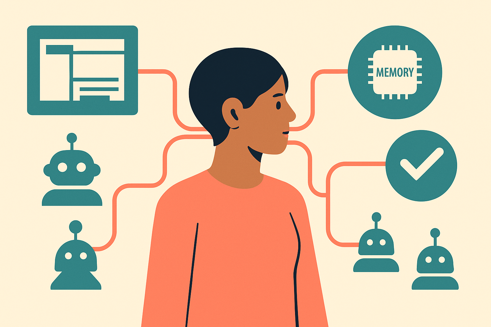

TL;DR: Prime Agent argues that for long-horizon work, the agent harness is not plumbing, it is part of the capability being tested.

## What does Prime Agent actually change?

My primary source is the arXiv paper **“Prime Agent: A Self-Improving RLM Harness”**, with code listed at `https://github.com/PrimeIntellect-ai/prime-agent`.

The core claim is simple: language models process sequences, but real agent work needs more than weights plus the active context window. It needs external computation, persistent state, tool execution, recovery, and some way for humans to inspect what is happening before everything turns into a pile of logs.

Prime Agent’s answer is a harness built around a persistent IPython REPL, using the paper’s Recursive Language Model abstraction for programmatic context processing and test-time compute. That sounds academic, but the practical version is familiar: give the model a real scratchpad that can run code, keep state, call subagents, save skills, and resume work across trajectories.

The Continual Harness preserves histories, memories, skills, prompts, and subagent specifications. Recursive subagents can communicate directly with each other. An Agents View gives humans a way to inspect and manage daemon-backed sessions.

That matters because a lot of agent evaluation quietly measures the harness. Did the process crash? Did the agent lose state? Did verification happen? Did a long-running task get chopped into context-window confetti? If yes, the model may look worse than it is, or better than it is, depending on which failure the benchmark accidentally hides.

## Are the benchmark claims meaningful?

The headline number is big. **“Prime Agent: A Self-Improving RLM Harness”** reports that Prime Agent raises ARC-AGI-3 RHAE Best@1 from 30% to 95.5%. The paper also says it matches or exceeds native and popular harnesses across long-context coding, GPU-kernel generation, emulator construction, and autonomous nanoGPT speedruns. On Factorio, it reports that refinement enables continuous technology progression, while dedicated subagents allow parallel work.

That is impressive. It is also exactly the kind of result I would not overread without the full benchmark setup, baselines, model choices, and failure analysis in hand.

The useful takeaway is not “agents are solved.” It is that long-horizon benchmarks are hypersensitive to the execution environment. A better harness can look like a smarter model because the model is finally allowed to use compute, memory, and coordination in ways closer to how a human operator would work.

That does not make the gains fake. It makes them operational.

If one harness standardizes execution, recovery, verification, and resource accounting, while another leaves those pieces brittle or implicit, the comparison is partly about agent infrastructure. Prime Agent is making that infrastructure explicit. I like that direction. It gives builders more knobs, and it gives evaluators fewer excuses.

## What should builders copy first?

The tempting move is to copy the whole architecture: persistent REPL, continual memory, subagents, agent-to-agent messaging, inspectable daemon sessions. Maybe that is right for research labs or teams running long autonomous jobs.

Most product teams should start smaller.

First, make state durable. If your coding agent or ops agent forgets what happened between runs, it is not doing long-horizon work. It is doing repeated short-horizon work with a costume on.

Second, separate strategy from execution. Prime Agent’s paper frames the harness as a membrane that standardizes execution, recovery, verification, and accounting while leaving strategy construction to the model. That is a clean split. The model decides what to try. The harness makes sure attempts are runnable, inspectable, recoverable, and measured.

Third, add verification before adding autonomy. Subagents are fun. Persistent daemons are fun. But if the system cannot check its own work, recover from tool errors, and show a human what changed, more autonomy just creates more mess at higher speed.

Prime Agent is a reminder that agent progress will not come only from bigger models. It will come from better runtimes around them. A builder should try one long task that currently fails because of lost context, broken recovery, or weak verification, then rebuild the harness around that task before swapping models. The catch most readers miss: if the harness changes the score, your benchmark was never just measuring the model.
