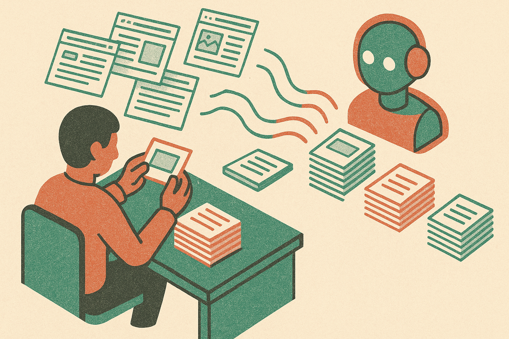

TL;DR: Use Claude Code as a research layer for domain renewal decisions, not as a magic appraiser or a substitute for judgment.

## What problem is Claude Code actually solving here?

Domain Name Wire’s “How to use Claude Code to improve domain renewal decisions” makes a practical point: renewal decisions often happen on stale assumptions.

That is the real workflow problem.

A domain portfolio can look static from the outside. Same names. Same registrar account. Same annual fees. But the outside world changes. Companies launch. Terms trend up or die off. Search behavior shifts. Categories get renamed. A name that looked mediocre 10 months ago might now map to a real market. A name that felt promising may have no visible demand at all.

Domain Name Wire describes looking at renewals on a 6- to 12-month horizon, then deciding whether each name should be renewed or dropped. That timing matters. If you wait until the renewal notice is urgent, you are more likely to make the lazy choice. Renew everything because the cost of thinking is high, or drop names because the carrying cost is annoying.

Claude Code enters as a way to lower the cost of thinking.

Not by telling you “this domain is valuable.” That is where the hype gets dangerous. Domains are tradable assets, and AI-generated confidence can turn into a very clean-looking mistake. The better use is narrower: ask the agent to collect and organize fresh evidence before you decide.

## What should an AI agent check before a renewal?

The useful pattern is a renewal memo.

For each domain, the agent can help assemble the context you would otherwise skip. What does the phrase refer to now? Are there active companies, products, communities, or open-source projects using adjacent language? Has the category grown, split, or faded? Are there obvious trademark risks that make the name less attractive? Is the name still tied to a plausible buyer or use case?

That is not appraisal. It is diligence.

The key is to keep the output evidence-based. I would not ask Claude Code, or any model, “Should I renew this?” as the first question. That invites a fake answer. I would ask for a short brief with sources, contrary signals, and open questions. Then I would make the call myself.

The same structure works outside domains too. Software renewals. Vendor contracts. Old side projects. Cloud resources. Anything that gets renewed because it already exists is a candidate for this kind of agent-assisted review.

## Where can this go wrong?

The obvious failure mode is hallucinated conviction. A model can connect dots that are not there. It can make a sleepy category sound alive. It can over-read a few search results. It can also miss the part a human domain operator cares about most: taste.

A good domain is not only a pile of signals. It has language quality, memorability, commercial fit, legal exposure, and timing. Some of that can be researched. Some of it is pattern recognition built from years of seeing what sells, what gets ignored, and what creates headaches.

There is also a portfolio trap. If AI makes every marginal name feel newly interesting, it can increase renewals instead of improving decisions. That is not intelligence. That is expensive procrastination with citations.

So the control system matters. Decide the decision rule before running the agent. Maybe the output has to identify a current use case, a credible buyer type, and a reason the name is better kept than replaced. If it cannot, the default should not automatically be renewal.

The practical move: build a simple renewal folder, one file per domain, then have Claude Code generate a fresh memo before the renewal window. Require citations, ask for negative evidence, and separate facts from guesses. The catch most readers miss is that the agent should not make you more optimistic. It should make your uncertainty visible early enough that you can act on it.
