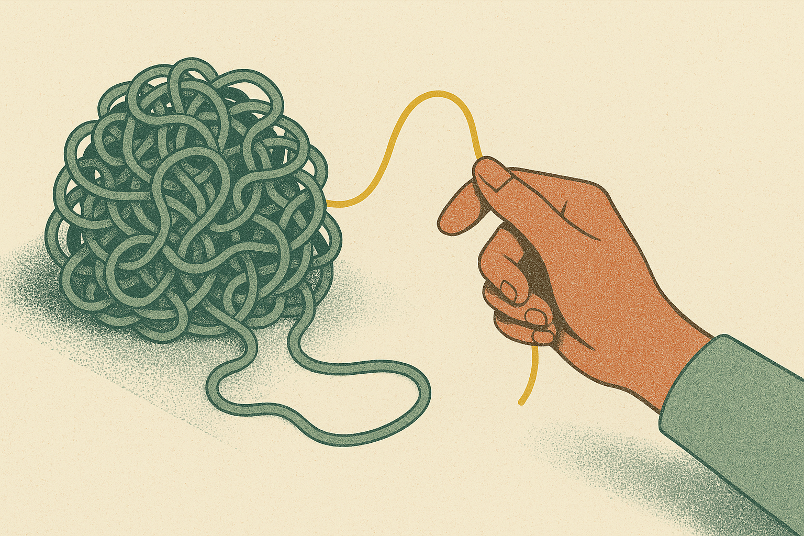
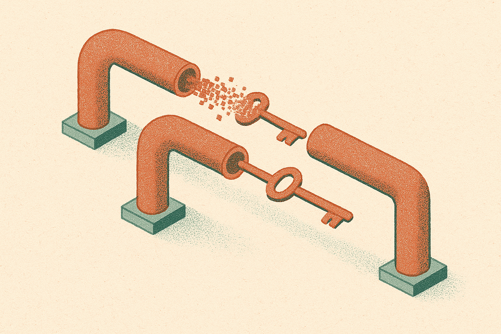

TL;DR: An LLM can quote a company's risk disclosure back to you word for word and still make an investment judgment as if it never saw it, and the fix is workflow design, not a bigger model.

That is the finding in "Reading Is Not Using: Retrieval, Judgment, and the Design of AI Financial Research Workflows," posted to arXiv under both cs.AI and cs.CL. The authors call it a retrieval-integration gap, and it should change how anyone building an AI analyst thinks about evaluation. Because the standard test, "can the model find the relevant passage," turns out to certify systems that find the passage and then ignore it when it counts.

## What is the retrieval-integration gap?

The setup is clean. Hold the information about the company you care about fixed. Then bury it in more and more unrelated context, sweeping from 2,000 tokens up to 128,000. Ask the model two different things: can you retrieve this specific risk disclosure, and does this risk disclosure change your investment judgment.

Retrieval stays accurate. The model keeps finding the passage no matter how much junk surrounds it. But the disclosure's *influence* on the judgment falls all the way to what the authors call the experimental noise floor. In plain terms: at long context, the risk factor stops mattering to the decision even though the model can still tell you it's there.

That is the whole trap. Reading is not using. A model that scores perfectly on a needle-in-a-haystack retrieval benchmark can be making judgments that are effectively blind to the needle it just found.

This isn't one model having a bad day. The authors report the pattern replicates across model families and across different judgment tasks. They also ran it the hard way: removing real risk disclosures from actual 10-K filings and checking whether their absence changed the output. Same story. The information is present and retrievable, and the judgment behaves as if it isn't.

## Does a bigger model fix it?

Short answer from the paper: no, it just delays the failure.

More capable models "postpone but do not eliminate the gap." So the smarter model holds onto the disclosure's influence for longer as context grows, then loses it too. That is an important nuance and worth being precise about. This is not "frontier models solve this." It's "frontier models push the cliff further out." If your production context regularly runs long, and in financial research it does, you will hit the cliff eventually regardless of which model you're paying for.

I want to be careful here because it's tempting to read this as a doom story about LLMs and finance. It isn't. The authors are explicit that AI analyst performance is "jointly determined by model capability and workflow architecture." Model capability is one lever. The one most builders ignore is the other one.

## Why do chunk-and-summarize pipelines make it worse?

This is the part that should make every RAG builder sit up.

The authors did causal memory interventions, meaning they didn't just correlate, they manipulated what the model had access to and watched the judgment move. Two channels carry a disclosure into the actual decision: compressed summaries and source-text lookup. Both together are what transmit the information into judgment.

Now here's the sting. The single most common architecture in production RAG, chunk-and-summarize, is the one that breaks this. The paper's finding is direct: chunk-and-summarize pipelines *evict* relevant information. You split the document, summarize the pieces, and the risk disclosure gets smoothed out of existence somewhere in the compression. It survives retrieval and dies in summarization.

The fix they found is almost boringly practical. A targeted, structured restatement placed adjacent to the decision restores the disclosure's influence. Not a bigger context window. Not a smarter model. Put the relevant fact, restated cleanly, right next to the point where the judgment happens.

If you've built retrieval systems, you probably already have an intuition for why. Summarization is lossy by design, and it's lossiest on exactly the kind of hedged, caveated, low-frequency language that risk disclosures are written in. The summary keeps the gist and drops the warning. Then the model reasons over the gist.

## What this means for how we evaluate AI analysts

The evaluation critique is the sharpest thing in the paper, and it generalizes well beyond finance.

The authors put it bluntly: "Retrieval-based evaluations can certify systems whose investment judgments ignore information they demonstrably retrieved." Read that twice. Your eval can pass. Your system can be broken. The eval measures whether the model can find the thing. The thing that matters is whether finding it changed anything.

This maps to a gap I keep seeing in agent and RAG evaluation across domains, not just financial disclosures. We test recall. We test whether the citation is present. We rarely test *influence*: did the retrieved fact actually move the output in the direction it should have. A medical assistant that retrieves a contraindication and then recommends the drug anyway would pass most retrieval evals too.

The methodology here is the transferable part. Hold the decision-relevant fact fixed, vary the surrounding context, and measure the delta in the output with and without the fact present. If the delta collapses while retrieval accuracy holds, you have a retrieval-integration gap. That's a test you can build for your own system this week.

One honest caveat about scope. This is a single paper, cross-listed but from one research group, focused on financial judgments and risk disclosures. It replicates across model families and across a real-10-K ablation, which is more than most papers offer, but I'd want to see it reproduced by other labs and stretched to other decision domains before treating "chunk-and-summarize evicts information" as a universal law rather than a strong, well-supported finding in this setting. The mechanism is plausible enough that I'd design around it now and confirm as more work lands.

Here's how I'd actually apply this. Stop trusting your retrieval eval as a proxy for correctness, and build an influence test: take a decision your system makes, inject and remove the one fact that should flip it, and confirm the output actually flips. If it doesn't, you have this bug. For the fix, don't reach for a longer context window first. Reach for structure: pull the decision-critical facts out of your chunk-and-summarize flow and restate them, cleanly and explicitly, right next to the prompt where the judgment gets made. The catch most people miss is that this failure is invisible on the dashboards teams already have. The system looks like it's working, cites its sources, passes review, and quietly ignores the one disclosure that mattered. Bigger model won't save you. Better plumbing will.
