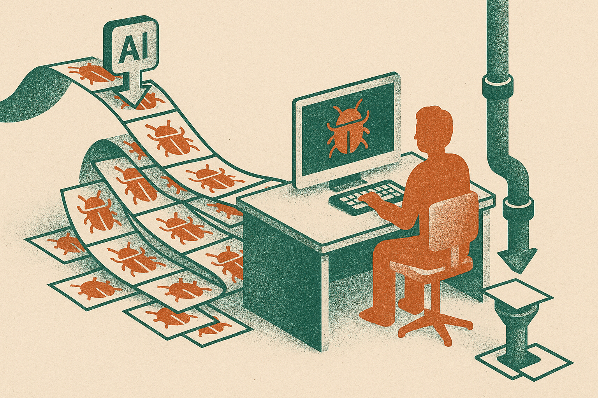

TL;DR: AI-assisted bug finding is now real enough to trigger emergency response in critical open-source infrastructure, so maintainers need disclosure, triage, and patch pipelines built for volume.

## What actually happened with Lightning?

Decrypt reported in “AI Finds Critical Flaw in Bitcoin Lightning, Devs Issue Emergency Warning” that the Lightning software project is preparing fixes after confirming several AI-generated vulnerability reports were accurate.

CoinDesk reported in “AI bug reports trigger emergency warning for Bitcoin Lightning node operators” that developers are holding back technical details for two weeks while fixes reach operators. CoinDesk also described this as the second Lightning security emergency this month tied to AI work on Bitcoin code.

That is the important part. Not “AI broke Bitcoin.” Not “AI secured Bitcoin.” A system, or a person using a system, found bugs serious enough that maintainers treated the reports as real security work.

Lightning is payment infrastructure. Node operators run software that routes payments. If a bug is bad enough, public details can become an attack manual before enough operators upgrade. That is why embargo windows exist. CoinDesk’s reported two-week delay fits the usual security tradeoff: tell operators enough to act, without giving opportunistic attackers a checklist.

The uncomfortable piece is that AI changes who can produce plausible vulnerability reports. Some of those reports will be nonsense. Some will be duplicates. Some will be subtly wrong in ways that waste maintainer time. And some, apparently, will be accurate enough to trigger emergency warnings.

## Is AI actually finding serious bugs now?

Yes, but the bar for saying that should stay high.

The useful distinction is between “AI generated a bug report” and “maintainers confirmed a vulnerability.” Decrypt’s key claim is not that an AI tool sounded scary. It is that the Lightning software project reportedly confirmed several reports were accurate and began preparing fixes.

That matters because security is full of confident garbage. LLMs can produce beautiful writeups for bugs that do not exist. Static analyzers have been doing a version of this for decades: lots of findings, lots of noise, occasional gold. AI raises the ceiling on the writeup quality and may lower the skill needed to inspect unfamiliar code. It also raises the noise floor.

For open-source maintainers, this is not just a technical story. It is a workload story.

A serious report needs reproduction, impact analysis, patch design, review, release coordination, operator comms, and sometimes private disclosure to downstream teams. If AI tools make it 10 times easier to submit “security findings,” even a small accuracy rate can swamp a small maintainer group. And if a project ignores AI-generated reports by default, it may miss the real one.

The Lightning case is a good signal because it sits at the intersection of money, open code, and distributed operators. Bugs matter. Patches take coordination. Attackers watch public repos and advisories. AI does not remove any of that. It compresses the front end of discovery.

## What should builders change now?

The mistake is treating AI bug reports as a novelty inbox.

Projects that maintain important software need a specific path for machine-assisted reports. Not because AI deserves special status, but because it changes volume and style. Require reproduction steps. Require affected versions if known. Ask reporters to separate model output from human verification. Keep a private security contact that is easy to find. Have a template that forces the boring details: environment, commit hash, exploitability assumptions, crash logs, minimal proof of concept.

On the AI side, builders should stop demoing “find bugs in this repo” as if the output is the product. The product is the verified handoff. Can the system reduce false positives? Can it create a minimal repro? Can it rank exploitability without theatrics? Can it draft a patch that passes tests? Can it produce a disclosure-safe summary for operators that does not leak exploit details?

That is where the money is, not in another screenshot of a model accusing a codebase of having a “critical vulnerability.”

For security teams, I would test AI tools against old fixed bugs in your own codebase. Hide the patch. Give the model the vulnerable version. See whether it finds the issue, explains it correctly, and avoids inventing three others. Then measure triage time, not vibes.

If you maintain software people depend on, assume AI-generated reports are now part of the threat and maintenance surface. Set up intake rules, rehearse private patch coordination, and decide in advance what gets disclosed when. The catch most readers miss: the hard part is not making AI find more bugs. It is preventing the real bugs from getting buried inside a pile of convincing junk.
