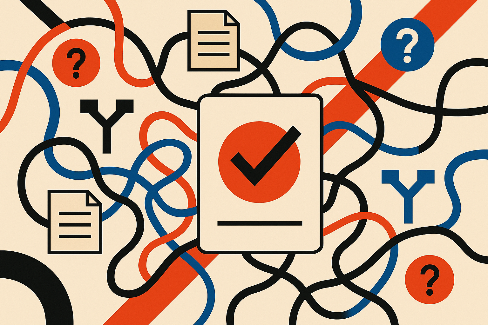

TL;DR: AI search reduces the work of finding and reading, but it often adds new work around asking, checking, trusting, and deciding.

## What work did AI search actually remove?

My primary source here is Duane Forrester’s Search Engine Journal piece, “AI Search Didn’t Remove Cognitive Load, It Moved It.” The useful point is right in the title. The standard playbook for AI search content says: answer sooner, write less, simplify. That can help. It can also hide the fact that the user still has to do the hard part somewhere else.

Classic search spread effort across steps: pick keywords, scan links, open tabs, compare pages, synthesize an answer. AI search compresses that into a single response. Nice. Less tab chaos. Less hunting.

But compression is not deletion.

Now the user has to judge whether the generated answer is complete, whether it missed a key exception, whether the sources are decent, whether the question was framed correctly, and whether the confident paragraph is good enough to act on. That is still cognitive load. It just shows up after the answer, not before it.

This matters because a shorter answer can feel easier while making the decision riskier. If the user is asking “What is the best CRM for a 12-person agency?” a neat answer is not the same as a safe decision. The real work is constraints: budget, migration pain, reporting needs, support quality, who owns the tool internally, what happens when the agency doubles. AI can summarize options. It cannot know the hidden mess unless the workflow asks for it.

## Where does the cognitive load move?

It moves into prompt design first. Users have to know what to ask, how specific to be, and what context to include. That is not trivial. A novice often cannot describe the problem well because the missing knowledge is the problem.

Then it moves into verification. Search results used to make uncertainty visible. You saw multiple links, brands, dates, headlines, forum posts, and weird outliers. AI answers can flatten that variety into one smooth voice. Smoothness feels helpful, but it can also erase the smell of disagreement.

Then it moves into action. A generated answer may be clear, but the next step still needs judgment. Should I follow this legal template? Should I change this schema? Should I trust this medical explanation enough to call a doctor, or ignore it? The answer is not just information. It is a nudge toward behavior.

Forrester’s framing is strongest when applied to builders. If you design AI search as “shorter page, earlier answer,” you may improve surface usability while increasing hidden burden. The better question is: where does the user still have to think, and can the system make that thinking safer?

## What should builders change?

For content teams, this means “write less” is incomplete advice. The more useful move is to write with decision structure. State assumptions. Show when the answer changes. Give edge cases. Include source trails where they matter. Make uncertainty legible.

For product teams, it means the answer box should not be the whole product. Good AI search needs follow-up paths: compare, verify, narrow, expand, show evidence, ask me for missing context. Not because users love extra UI. Because many tasks are not answer retrieval. They are judgment under constraints.

For internal company tools, I would test this directly. Give a team an AI search assistant and watch where people slow down. Do they rewrite questions three times? Do they paste the answer into Slack for a second opinion? Do they open the original docs anyway? Those are not failures. Those are signals about where the real workload lives.

The trap is measuring only speed to first answer. That metric will make almost every AI search tool look good. Measure confidence after verification, number of follow-up checks, quality of the final decision, and how often users discover the answer was missing an important constraint.

Practitioner’s take: if you are building with AI search, do not stop at summarization. Pick one high-value workflow and map the before and after work: asking, finding, reading, comparing, verifying, deciding. Then add product affordances around the heaviest remaining step. The catch most teams miss is that the clean answer is not the finish line. It is often where the real work starts.
