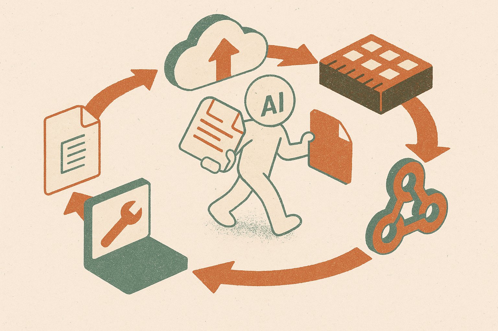

TL;DR: Anthropic’s Python SDK updates this week are mostly plumbing, but it is the kind of plumbing that decides whether agent apps survive contact with real files, tool loops, and production infrastructure.

## What changed in Anthropic’s Python SDK?

The primary source here is Anthropic’s GitHub release note for `anthropics/anthropic-sdk-python v1.2.0`, published 2026-08-27, with `anthropics/anthropic-sdk-python v1.1.0` from 2026-08-26 as the setup.

Taken together, the two releases look less like a feature splash and more like an SDK getting shaped around production agent work.

In `v1.2.0`, Anthropic says the beta files and skills namespaces now use GA shapes and no longer need dated beta header pins. That is the headline for anyone who has been wiring against beta APIs and carrying little bits of time-stamped compatibility state through their codebase. It does not mean every rough edge is gone. It does mean Anthropic is reducing one common source of brittle client code.

The rest of `v1.2.0` is a useful tell. Anthropic fixed AWS Bedrock request signing so binary file uploads work. It fixed file byte preservation in the agent toolset and memory tool, specifically avoiding newline translation. It let the read tool return a `view_range` for a file over the size cap. It made the sessions event accumulator forward-compatible with new event types. It also changed webhook handling so headers must be passed to `unwrap()`.

That is not sexy. Good.

This is what agent infrastructure starts to look like when the demos meet PDFs, CSVs, archives, images, logs, and cloud gateways.

## Why do byte-level fixes matter for agents?

A lot of AI product talk treats “file support” as a checkbox. Upload the file. Ask the model. Get the answer.

Builders know the real version is messier. Files have encodings. Some are binary. Some are too large to read whole. Some need partial inspection. Some must remain byte-identical because they are evidence, signed payloads, source artifacts, media, or data exports where a silent newline conversion can corrupt meaning.

That is why the `v1.2.0` fixes are more interesting than they first appear. Preserving exact bytes in the agent toolset and memory tool is not a nice-to-have if your agent edits files, audits files, or passes files between systems. Supporting binary uploads through Bedrock matters if your deployment path is AWS, not just Anthropic’s direct API. Letting a read tool return a range over the size cap is a practical pattern: agents do not always need the whole object, they need the right slice.

The forward-compatible session event accumulator points at another production truth. Agent systems are streams of events, not single request-response calls. If a client falls over every time the provider adds an event type, the app is not really ready for long-running agent work.

`v1.1.0` fills in the adjacent picture. Anthropic added support for Organization API endpoints, a beta `updates` thinking display mode, and missing `anthropic-beta` values. It also fixed the tool runner so it keeps going on `pause_turn`. That last item is small on paper, but pause and resume behavior is central to agents that wait on tools, user input, approvals, or external state.

## Is this a product milestone or just SDK housekeeping?

Both, but mostly the second. And that is the point.

There is no reason to oversell these releases as a new agent platform. Anthropic’s release notes do not claim that. They show the Python SDK absorbing the boring constraints that appear after developers build with files, skills, sessions, webhooks, org-level controls, and cloud-specific transports.

I read this as a maturation signal. The center of gravity is moving from “can the model do the task?” toward “can the surrounding client code keep the task coherent?” For many applied teams, the failure mode is not the model missing a subtle reasoning step. It is the pipeline dropping bytes, mishandling a stream event, breaking on a beta header change, or stopping a tool loop at the wrong moment.

Practitioner’s take: if you are building on Anthropic’s Python SDK, upgrade in a staging branch and run tests that use ugly files, not toy prompts. Try binary uploads, oversized files, partial reads, memory writes, webhook verification, Bedrock transport if you use it, and tool loops that pause and resume. The catch most teams miss is that “agent quality” is partly SDK behavior. You cannot evaluate it only with chat transcripts.
