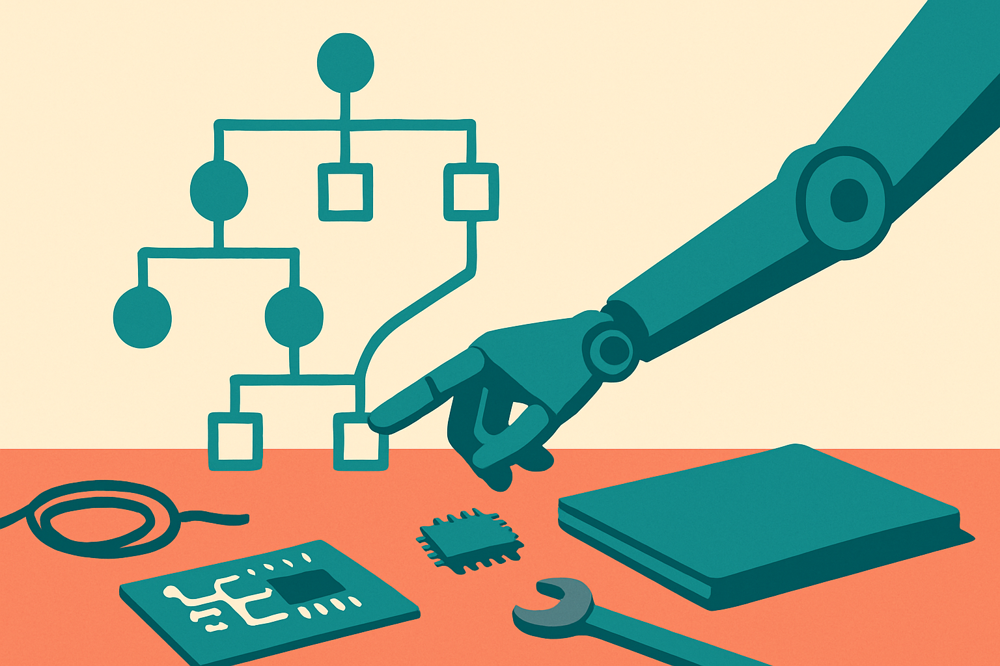

TL;DR: R³ shows that a vision-language model trained to reason in plain language before acting can steer clumsy low-level robot policies through long tasks better than an instruction-following baseline, but the evidence so far lives in two controlled testbeds, not on a real bimanual robot in your warehouse.

The paper is "$R^3$: Training Robots to Reason in Natural Language via Reinforcement Learning," posted to arXiv across cs.AI, cs.CL, and cs.LG, with a project page at robotic-reasoner.github.io. It asks a question that has been floating around since chain-of-thought took over the language model world: reasoning traces made models better at math and code by letting them spend more compute at test time on hard problems, so does the same trick help a robot pack groceries?

That is not an obvious yes. Reasoning helps when a problem decomposes into steps, tracks constraints, and rewards thinking ahead. A lot of manipulation is the opposite: fast, continuous, reactive control where the hard part is the motor policy, not the plan. R³ is a bet that the planning-shaped part of manipulation, tracking partial progress and recovering from mistakes across a long horizon, is exactly where language reasoning earns its keep.

## What is R³ actually doing differently?

The core move is that R³ trains the model to reason in free-form language and then uses that reasoning as test-time guidance for the low-level policy. That framing matters, because the authors position it against prior robotic reasoning work that mostly used structured traces as auxiliary supervision. In plain terms: a lot of earlier work treated reasoning as a side task the model learned to predict alongside actions, a kind of extra label. R³ instead treats the language reasoning as the thing that actually steers behavior at run time.

The recipe has two stages, and it is refreshingly unfancy. First, mid-train an off-the-shelf VLM on expert-generated reasoning traces to set the reasoning style, so the model learns roughly how to think about the task before you optimize it. Second, improve that reasoner with single-step, rubric-based reinforcement learning from offline action data. The rubric-based part is the interesting choice. Instead of rolling out full episodes and rewarding success at the end, which is expensive and noisy in robotics, they score reasoning against a rubric on single steps using data they already have. That keeps the RL loop cheap and grounded in offline logs rather than live robot time.

Two things are worth flagging honestly. The abstract does not give numbers, only that R³ "significantly outperforms instruction-only imitation learning baselines" on both benchmarks. And "expert-generated reasoning traces" is doing quiet work here. Somebody or something had to produce those traces to seed the reasoning style, and the quality of that seed usually decides how well the RL stage can build on it. Neither the source of those traces nor the size of the gains is in the material I have, so treat both as open until the full paper spells them out.

## Does the reasoning actually change what the robot does?

This is the claim that separates a real result from a nice-looking one. It is easy to bolt a language model onto a robot, print pretty reasoning to a log, and have the actual gripper ignore all of it. The authors argue that in R³ the free-form reasoning functions as a genuine test-time compute mechanism for steering the low-level policy, and they say it improves exploration and generalization across unseen tasks. Improving generalization to tasks the model has not seen is the part I care about most, because it is the tell that the reasoning is doing planning-shaped work rather than memorizing trajectories.

The mechanism story is plausible. In a long task, a low-level policy is noisy and myopic. It knows how to nudge a block or close a gripper, but it does not hold the whole plan. A reasoning layer that says, out loud, "the red block is already placed, now move to the blue one, and if the grasp slips, re-approach" gives that noisy policy a running commentary of intent. That is closer to a manager narrating the next subgoal than to a controller computing torques. If it works, it works because the language layer supplies memory and error recovery the motor policy lacks on its own.

## Should an operator care yet, or is this a simulation demo?

Here is where I keep my optimism on a leash. R³ is instantiated on Language Table and a simulated bimanual grocery packing task. Language Table is a well-known tabletop pushing benchmark, and the grocery packing is explicitly simulated. These are described by the authors as controlled testbeds for studying robotic reasoning and long-horizon manipulation, which is the correct and honest framing. They are testbeds, not deployments.

That gap is the whole game in robotics. The graveyard of robot learning is full of methods that shine in simulation and fall apart on real hardware, where perception is noisier, contact dynamics are cruel, and latency matters. A reasoning layer that spends test-time compute also spends wall-clock time, and a real arm cannot always wait for a paragraph of deliberation between moves. None of that is a knock on the paper. It is a study, and it says so. It is a knock on anyone who reads this and pitches a language-reasoning robot to a customer next quarter.

## How this fits the broader test-time compute story

Zoom out and R³ is one more data point in the year's biggest theme: spend more compute at inference on the problems that reward it. Language models got reasoning. Agents got planning loops. R³ is the attempt to carry that idea into the physical world, where the payoff is not a better answer but a completed multi-step task. The intellectual bet is that manipulation has a decomposable, constraint-tracking layer that looks enough like reasoning for the same tools to transfer. This paper is early evidence that at least in constrained settings, they do.

What I like is the modesty of the recipe. Take an existing VLM, seed it with reasoning traces, tune it with cheap offline RL against a rubric. No exotic architecture. That is the kind of method that spreads, because other labs can copy it without a new hardware budget.

Practitioner's take: if you build robot policies, the reusable idea here is not "add a chatbot to your arm," it is the two-stage recipe: seed reasoning style with a small set of expert traces, then refine with single-step rubric RL on the offline logs you already collect. That is doable without live-robot RL, which is the expensive part everyone avoids. Try it first as a planning and recovery layer on a task where your low-level policy already works but drops long-horizon progress, and instrument whether the reasoning changes actions or just decorates them. The catch most readers will miss: the gains reported live in Language Table and simulated packing, so before you trust it on hardware, budget for the sim-to-real gap and the inference latency that a paragraph of reasoning adds between every move.
