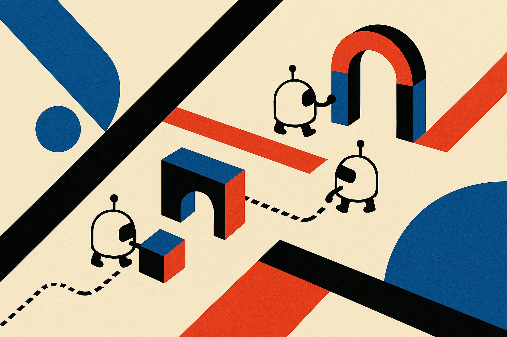

TL;DR: The useful idea in SwarmWorld is not “more agents equals smarter,” it is that agents can coordinate through persistent artifacts and a shared environment instead of constant chat.

## What did SwarmWorld actually test?

My primary source is the arXiv paper “SwarmWorld: Stigmergic technological evolution in societies of language-model agents.” The setup is interesting because it avoids the usual multi-agent theater: no fixed manager, no assigned roles, no scripted workflow, no recipe for what the group should build.

Instead, initially similar language-model agents enter a spatial simulated world. They explore, process resources, test materials, build artifacts, and write executable controllers. Then the agents are removed. The artifacts are evaluated by a deterministic simulator under unseen disturbances.

That last part matters. SwarmWorld separates talk from consequence. The agents can propose designs and controllers, but the world decides whether the thing works. Not a judge model grading vibes. Not a transcript that looks impressive. A simulator tests function.

The paper reports that shared societies developed broader and more resilient portfolios than a strong best-of-N isolated-search baseline. That is the cleanest claim here. The swarm was better at producing a wider technology base. But the isolated-search baseline stayed competitive for the strongest single artifact. So the story is not “swarms beat solo agents.” It is narrower, and more useful: shared environments help groups accumulate and maintain many working things.

## Why does stigmergy matter for agent builders?

Stigmergy is coordination through traces in the environment. Ants do it with pheromones. Humans do it with tickets, documents, dashboards, code repos, shop floors, and half-finished prototypes on a bench.

SwarmWorld’s claim is that LLM agents can do a version of this too. The paper reports that agents differentiated into exploration, construction, maintenance, and coordination behaviors as the world matured. Those roles were not assigned up front. They emerged from what needed doing around persistent artifacts.

That is the part I would pay attention to if I were building agent systems today.

Most agent products still over-index on conversation. Agents message each other, debate, ask a supervisor, call a tool, produce a final answer. Useful sometimes. Brittle often. The SwarmWorld result suggests a different design center: give agents a shared workspace where work persists, can be inspected, can be reused, and can fail in public.

The paper also reports that most reuse began through physical observation rather than communication. In other words, agents did not mainly inherit progress because another agent explained it. They saw what existed and built from there.

That maps directly to software teams. A good repo, test suite, issue tracker, and artifact store may matter more than another layer of agent chat. If an agent cannot inspect prior outputs, run them, modify them, and leave better traces for the next agent, you are not building a society. You are running a meeting.

## What is the catch?

The benefits were not universal. “SwarmWorld” reports that explicit cultural mechanisms amplified collaboration and organization, but functional gains depended on the outcome and timescale. Physical stigmergy alone supported capable societies. More interaction helped create persistent technological ecologies, but not automatically better individual inventions.

That fits my priors. Coordination has overhead. Shared state can compound progress, but it can also preserve bad assumptions. A swarm can spread useful patterns. It can also spread junk.

The simulator constraint is another reason to stay grounded. SwarmWorld’s world has fixed action and material schemas. That is a strength for measurement, but a limit for transfer. Real workplaces are messier. Specifications drift. Tools break. Success criteria are political, economic, and social, not only functional.

Still, this is a better research direction than another benchmark where agents role-play as a CEO, CTO, and intern. The important move is forcing agent work into an environment where outputs persist and consequences are checked after the agents stop talking.

If you are building with agents, try the boring version first: a shared artifact workspace, strict schemas, executable outputs, automated tests, and logs that future agents can inspect without asking permission. Use multiple agents when you want portfolio breadth, exploration, maintenance, and reuse. Do not expect the swarm to produce the best single answer every time. The catch most teams miss is that the environment is the product surface for the agents. If the traces are poor, the society will be poor too.
