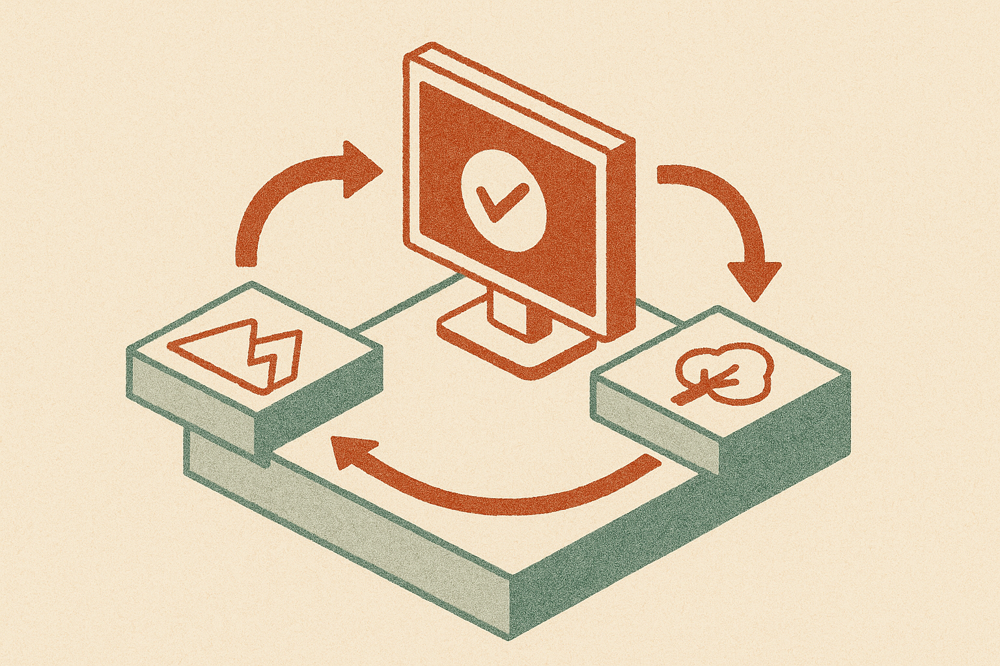

TL;DR: VBVR-Pro’s useful idea is not “better vision models,” it is a closed-loop way to train and verify models that reason by creating visual states.

## What is native visual reasoning?

Most multimodal work still treats images like evidence. The model looks at an image, turns it into tokens or features, then answers in language. Or it writes a prompt and renders a final image. The reasoning mostly happens somewhere else.

The arXiv paper **“VBVR-Pro: A Scalable and Verifiable Suite for Native Visual Reasoning”** frames a different setup: images and videos become the workspace. A model reasons by generating intermediate visual states, not just by describing them. That sounds abstract, but the target is concrete. Think of tasks where the model must track position, motion, occlusion, counting, transformation, or spatial change over time. Language can describe those operations, but the visual state is the thing being manipulated.

VBVR-Pro turns that idea into a controlled suite of 300 procedurally generated tasks. That matters. If you handcraft a small eval, models can overfit the vibe. If you only grade final answers, you miss whether the model got lucky. Procedural generation gives the benchmark room to scale, vary, and test generalization.

The VBVR-Pro paper reports that models trained on the suite transferred to seven external visual reasoning benchmarks, including RISE-Video, MME-CoF-Pro, and BabyVision. I would not read that as “solved visual reasoning.” I would read it as evidence that training on generated visual-state tasks may teach something more portable than benchmark-specific tricks.

## Why do verifiable rewards matter?

The most practical part of VBVR-Pro is the reward design. The paper argues that the common VLM-as-a-judge pattern has recurring failure modes. That tracks with what many builders see in production evals: a model judge can be useful for fuzzier judgments, but it is a shaky referee when the task has a right answer grounded in geometry, state, or rules.

VBVR-Pro instead uses deterministic, task-specific reward scorers. The paper says these scorers align with human judgments at a fine-grained level and can serve as reward signals for large-scale multi-task reinforcement learning. That is the operator-relevant bit. If you want a model to improve through RL, the feedback loop cannot just sound intelligent. It has to be checkable.

This is where the work cuts against some hype. “Multimodal agents” often means a model that can look at screenshots and click buttons. Useful, yes. But for richer visual work, inspection is not enough. The model may need to maintain a visual scratchpad, test a hypothesis by generating a state, then compare that state against deterministic rules.

That is closer to simulation than chat.

## Which generation substrate works best?

VBVR-Pro also compares more than 30 image, video, and interleaved generators. The headline is intuitive: video generation remains strongest for tasks requiring persistent spatiotemporal state tracking. If the task depends on what changed from one moment to the next, video has the native structure.

But the paper also reports that interleaved generation can be a compute-efficient alternative. That is interesting because pure video generation is expensive and awkward for many workflows. Interleaving, mixing images, steps, or modalities across a reasoning process, may give builders a cheaper approximation of visual state tracking without rendering full video for every thought.

The strongest claim in the paper is also the one I would watch most carefully: ablations and probing suggest “vision-native trajectories” are crucial to visual reasoning. In plain English, the path through generated visual states may contain reasoning that is not reducible to text. That is plausible. It is also hard to prove cleanly. Still, VBVR-Pro gives researchers a better lab for testing the claim because the tasks, rewards, and generator types are controlled.

Practitioner’s take: if you are building agents for visual QA, robotics simulation, UI automation, CAD-like workflows, education, or video understanding, don’t start by asking whether your model “sees.” Ask what visual state it must maintain, how that state changes, and what deterministic checker can grade the step. Try small procedural tasks first. The catch most teams miss: a prettier generated image is not the same thing as a more reliable reasoning trace.
