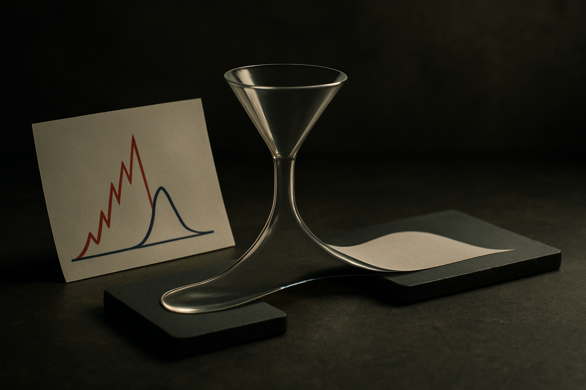

TL;DR: Picking a LoRA rank has been trial and error, but "How Much Rank Does LoRA Need? Rank-Error Bounds for Transformer Attention" shows the rank you need depends on the tail energy of your task's target update, and that softmax saturation can let a small rank match the attention you actually care about even when the logits would demand more.

Every team fine-tuning with LoRA runs the same little ritual. Try rank 8. Loss looks okay. Try rank 16. Slightly better. Try 32. No change, or worse. Pick one, ship it, move on. Nobody can tell you why 16 was enough for one task and 4 was plenty for another. The choice is empirical, which is a polite word for guessing with a validation set.

The paper "How Much Rank Does LoRA Need? Rank-Error Bounds for Transformer Attention," posted across arXiv's cs.AI, cs.CL, and cs.LG feeds, is an attempt to replace the guessing with a theory. It fixes a pretrained attention head, a target attention function, and a distribution over inputs from your downstream task, then bounds the smallest expected error a rank-r query LoRA update can achieve. That framing matters: the answer is task-dependent, not a universal number. There is no "rank 16 is correct" here. There is only "rank r gets you this close, given what your task actually asks the attention to do."

## Why does the "right" LoRA rank change from task to task?

The central object in the analysis is what the authors call the downstream-weighted tail energy of the target update, written $T_r$. Strip the notation and the idea is intuitive. Take the change you want to make to attention, decompose it by its spectrum, and ask how much of that change lives in the directions a rank-r update cannot capture. That leftover is the tail. The paper bounds the best achievable rank-r error between an explicit multiple of $\psi(\sqrt\{T_r\})$ and $\min\\{T_r/4, \sqrt\{2 T_r\}\\}$, where $\psi(t) = \min\\{t^2, t\\}$.

The practical reading: if your task's target update is concentrated in a few dominant directions, the tail collapses fast and low rank suffices. If the update is spread across many directions, the tail stays fat and you pay for more rank. This is why one adapter is fine at rank 4 and another needs 32. It was never about the model size or a rule of thumb. It was about the spectral shape of the specific change your task demands.

That $\psi$ function is doing quiet work too. It behaves like $t^2$ when the score gap is small and like $t$ when the gap is large. So the error does not scale the way you would naively assume across the whole range. Small mismatches are cheap in a quadratic sense; large ones stop compounding and grow only linearly. If you have ever seen a LoRA run improve sharply at first and then crawl, this is the mathematical texture behind that curve.

## What is the softmax saturation result, and why should a builder care?

This is the finding I would frame and put on the wall. The authors construct explicit families where softmax saturation makes the rank required to match the attention function strictly smaller than the rank required to match the finite logits.

Here is what that means in plain terms. Attention scores go through a softmax before they do anything. Softmax saturates: once one token's score is far enough above the others, pushing it higher changes the output distribution almost not at all. So two very different sets of logits can produce nearly identical attention. If your target attention is already in a saturated regime, you do not need to reproduce the exact logits. You only need to reproduce the distribution they induce, and that can take much less rank.

Most intuition about LoRA rank is implicitly about matching weights or matching raw scores. This says: match the thing that actually flows downstream, the attention distribution, and you may get away with far less. The paper is careful to note these are finite-score approximation bounds first, and then it shows the saturation gap on top. So it is not hand-waving. It is a constructed separation between logit-matching rank and attention-matching rank.

The catch, and the paper states it, is the condition where the lower bound bites: when target attention probabilities are bounded away from zero, error is bounded below proportional to $\psi(\|d\|_2)$, where $d$ is the difference between candidate and target scores. In other words, saturation helps you when the distribution is peaky, and the floor on achievable error rises when the distribution is spread out and every token matters. Diffuse attention is the expensive case. Peaky attention is the cheap one.

## Does this survive contact with real multi-head attention?

A theory that only covers a single isolated query update would be a curiosity. The paper extends to fused multi-head LoRA and to joint query/key updates, and this is where it exposes constraints practitioners half-know but rarely quantify.

Rank sharing across heads is not free. When you fuse an adapter across multiple heads, the heads compete for the same rank budget, and the tail energy that matters is now the shared one, not per-head. Query/key factorization adds its own constraint: updating query and key jointly is not the same as the sum of two independent low-rank updates, because the interaction is bilinear in the scores. The paper's target-Fisher bounds cover the regime where candidate scores stay within a fixed range of the target, which is the realistic case for a well-initialized adapter that is not trying to move attention across the room.

None of this hands you a calculator. The bounds depend on quantities like $T_r$ that you would have to estimate from your pretrained head and your task distribution, and the paper works in KL error on attention, not end-task accuracy. There is a gap between "attention distribution is well approximated" and "the model does the job," and this work lives on the first side of that gap. Treat the results as structure, not as a lookup table.

The honest state of things: this is a single arXiv paper, mirrored across three subject feeds, not a battle-tested finding replicated across labs. The proofs are the contribution. Whether the spectral picture predicts the rank you should actually pick on a messy real task is an empirical question the paper frames but does not close.

Practitioner's take: stop treating LoRA rank as a hyperparameter you sweep blind and start treating it as a question about your task's attention. Two concrete moves. First, before you sweep, look at whether your task needs peaky or diffuse attention changes; peaky, saturated targets are the cheap-rank regime, so start low and only climb if the tail is genuinely fat. Second, when you fuse adapters across heads, remember the rank budget is shared and competing, so a fused rank-16 adapter is not two independent rank-8 ones, and diffuse multi-head tasks will punish you for assuming otherwise. The trap most readers will fall into is reading "less rank than the logits require" as "less rank always." The result is conditional on saturation and on your distribution being peaky. Diffuse attention still costs you, and this paper is honest enough to say exactly when.
