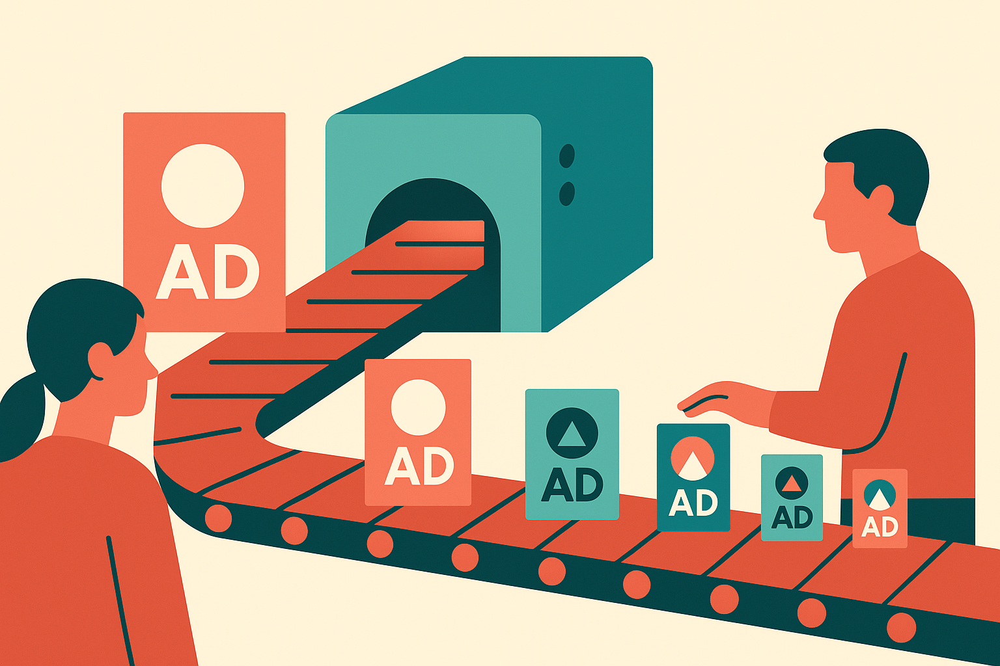

TL;DR: If AI can change approved marketing assets, teams need a named owner for post-approval behavior, not just a better prompt or another review meeting.

## Who owns the ad after AI touches it?

Greg Jarboe’s Search Engine Journal piece, “AI Isn’t Killing Marketing Accountability, It’s Exposing Who Never Had It,” points at a useful fault line: according to Jarboe, Meta’s ad AI altered approved creative without warning, and that exposed how few marketing teams define who owns AI mistakes after sign-off.

That is the real issue.

The narrow story is about ad creative. The broader story is about production systems that keep acting after humans think the decision is done. A campaign gets briefed, written, reviewed, approved, trafficked, and measured. In the old workflow, approval meant the asset was mostly frozen. In the AI workflow, approval may only mean the system now has permission to generate variants, resize, rewrite, remix, or optimize against platform goals.

That is not automatically bad. Dynamic creative can help teams test more ideas and reduce manual production work. But it changes the accountability surface. The mistake may not happen in the copy doc. It may happen after upload, inside a vendor system, under settings the brand team barely understands.

If nobody owns that layer, the team does not have AI governance. It has vibes.

## What should sign-off mean now?

Marketing approval used to answer a simple question: is this asset okay to run?

AI makes that too weak. Now sign-off needs to answer a different question: what is the system allowed to change after we approve this?

Those are not the same. A legal reviewer may approve a headline but not approve a platform-generated rewrite. A brand lead may approve one product claim but not an inferred benefit. A performance marketer may accept automated cropping but not automated copy expansion. A client may approve human-made creative and still reject machine-generated variants that did not pass review.

This is where teams get sloppy. They treat AI settings as media-buying mechanics, not creative decisions. They bury them in platform defaults. Then, when something weird ships, everyone can plausibly say they did their part.

The agency says the client approved the campaign. The client says it never approved that version. The media buyer says the platform optimized automatically. The platform says the advertiser enabled the feature. Legal asks why nobody escalated.

That chain is predictable. Which means it is preventable.

## Where does accountability get written down?

The practical fix is not a 40-page AI policy that nobody reads. It is a campaign-level operating agreement.

For each platform and campaign type, teams should document what AI is allowed to modify: copy, images, layout, calls to action, product claims, audiences, landing-page matching, budget allocation. Then they should name the approver for each category. Not a department. A person or role.

They also need a stop rule. If the platform generates an off-brand asset, a regulated claim, or a misleading product depiction, who can pause the campaign? Who notifies the client? Who screenshots the variant? Who contacts the vendor? Who decides whether the incident is a one-off or a workflow failure?

This sounds boring because accountability work is boring. So are QA checklists, access logs, and release notes. But boring is what keeps “the AI did it” from becoming a professional shrug.

Jarboe’s point lands because AI is not creating the accountability gap from scratch. It is making the old gap visible. Many teams already had fuzzy ownership between creative, media, analytics, legal, and client services. AI just adds more actions in the middle, at higher speed, with less obvious human intent.

Practitioner’s take: before turning on automated creative features, run one campaign as a controlled test. Capture every AI-related setting, define what the system may change, assign an owner for post-approval output, and review live variants daily for the first week. The catch most teams miss: the approval artifact is no longer just the ad. It is the ad plus the machine behavior that will keep editing it.
