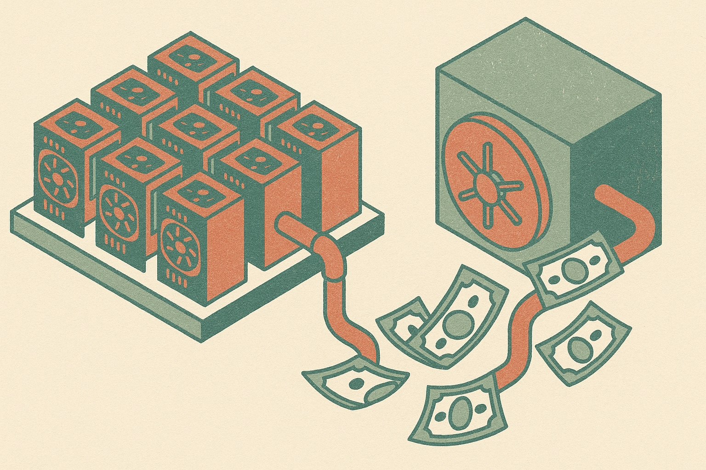

TL;DR: The useful signal is not “AI plus crypto,” it is that GPUs are being treated as financeable infrastructure, with all the messy collateral, utilization, and depreciation questions that come with that.

## What was actually reported?

The primary source available here is The Defiant’s report, “Bullish Provides USD.AI $100 Million Facility for GPU-Backed Loans.” CoinDesk and CoinTelegraph also reported the same basic deal: Bullish is providing, or extending, a $100 million stablecoin debt facility to USD.AI to support lending backed by GPUs and other AI compute infrastructure.

That wording matters. I have not seen the companies’ own announcement or docs in the provided materials, so I would not treat the fine print as settled. The reports say the facility is meant to add liquidity for loans to AI infrastructure operators. They do not give underwriting criteria, loan-to-value ratios, eligible hardware, default handling, custody mechanics, geographic limits, or pricing.

Those are not footnotes. They are the product.

Still, the shape is interesting. A crypto-native institution is reportedly providing stablecoin liquidity to a lender focused on AI compute assets. The collateral is not a house, a receivable, or bitcoin. It is the metal and silicon sitting under AI workloads, mainly GPUs.

That is a different kind of bridge between crypto and AI than most of the token noise. No “agent economy” hand-waving required. Just capital, hardware, and demand for compute.

## Why would anyone borrow against GPUs?

AI infrastructure has a working-capital problem. GPUs are expensive upfront, but revenue arrives over time through rentals, inference contracts, training jobs, reserved capacity, or managed services. If an operator owns, leases, or controls hardware, borrowing against it can help fund expansion before cash flows fully catch up.

Traditional lenders can finance data centers and equipment, but they do not always move quickly on newer compute operators, especially smaller ones without long operating histories. Crypto lenders, meanwhile, are comfortable with collateralized lending, automated treasury flows, and stablecoin settlement. That does not make them better underwriters. It just means the rails fit a certain kind of asset-backed credit product.

The key question is whether GPUs behave like good collateral. They are liquid in the sense that many people want them. They are illiquid in the sense that value depends on model demand, chip generation, availability, hosting contracts, power, networking, and whether the machines are actually where someone says they are.

A GPU in a productive cluster is not the same asset as a GPU in a warehouse. Utilization is part of the value.

## The catch is depreciation, not just default

The clean story is simple: GPUs back loans, loans fund more GPUs, more GPUs feed AI demand. The real story is uglier.

GPU values can move fast. A new chip generation can change resale assumptions. Supply shocks can help or hurt. Hyperscaler behavior matters. So do export controls, energy costs, and whether a borrower has customers paying for the compute. If collateral value falls faster than the lender expects, liquidation may not save the loan book.

There is also a custody problem. With crypto collateral, the lender can often monitor wallets directly. With AI hardware, someone has to verify serial numbers, location, liens, uptime, insurance, workload status, and whether the same hardware has been pledged somewhere else. That is operationally boring. It is also where this product either works or breaks.

For builders, the signal is that financing is becoming part of the AI stack. Not just model APIs, orchestration frameworks, vector stores, and eval tools. Capital structure. If you run compute, you may soon see more lenders asking for telemetry, utilization history, customer contracts, hardware manifests, and resale assumptions. If you buy compute, you may not care who financed the cluster, until a lender dispute affects availability.

Practitioner's take: if you operate AI infrastructure, start treating your hardware data like financial reporting, not just DevOps telemetry. Track utilization, maintenance, customer concentration, chip inventory, power costs, and resale assumptions in a way a lender could audit. The catch most teams miss is that “GPU-backed” does not mean the GPU alone carries the loan. The business wrapped around the GPU does.
