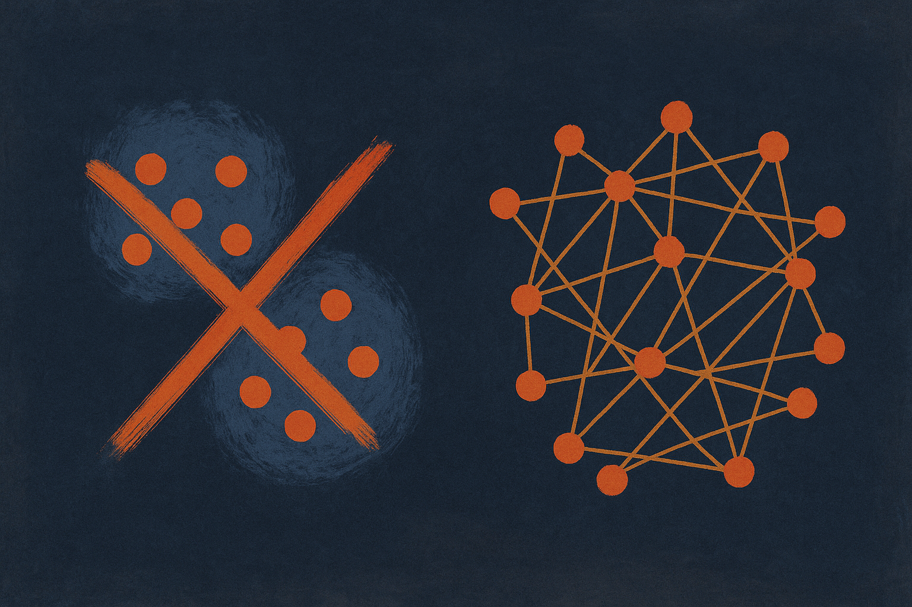

TL;DR: Inside open-weight language models, moral concepts do not collapse into one "is this bad?" switch and they do not float around as unrelated features either. They live as distinct directions that share a common thread, and on hard dilemmas the model encodes the conflict, not a resolved answer.

The paper is "How Language Models Organize and Structure Moral Knowledge," posted to arXiv across cs.AI, cs.CL, and cs.LG. It asks a narrow, testable question: when a model reads morally loaded text, does it just flag "moral content here," or does it actually separate the kinds of moral concern and lay them out in some structured way? The answer matters because a lot of alignment work quietly assumes the second thing is true without checking.

## What did the probes actually measure?

The method is old-school interpretability and better for it. The authors take Moral Foundations Theory, which splits moral intuition into six axes (care/harm, fair/cheat, liberty/oppression, loyalty/betrayal, authority/subversion, sanctity/degradation), and they train six independent linear probes on open-weight models, one per axis. A linear probe is just a direction in the model's representation space that best predicts whether a given input is about, say, fairness. If a concept is linearly readable, that is decent evidence the model represents it as a real feature rather than reconstructing it on the fly.

Detection alone is a low bar, and the authors say so directly. Any model that has read the internet knows "murder" is a moral topic. The interesting question is geometry: how do those six directions sit relative to each other?

Two boring outcomes were possible. One, all six probes point the same way, meaning the model has a single "moral valence" detector wearing six costumes. Two, all six point in completely unrelated directions, meaning the model treats fairness and sanctity as having nothing in common. Neither happened.

## So how are moral concepts arranged inside the model?

The directions span close to the maximum number of independent dimensions available to six probes, so they are genuinely distinct. But they also share a positive common component: on average they lean the same way a little. The number the authors give is a mean pairwise cosine similarity of 0.26 among the moral directions.

That 0.26 is meaningless without a control, and here is the part I like. They built a matched battery of non-moral concepts using the identical procedure, and those directions came in at 0.013. So the shared lean among moral concepts is roughly twenty times what you get from arbitrary concepts built the same way. The authors call this shared component "the signature of integration," and they argue it is moral-specific, not an artifact of how probes get trained.

Read plainly: the model has learned that fairness, harm, loyalty, and sanctity are different things that nonetheless belong to a common family. That is a nontrivial abstraction to fall out of next-token prediction on raw text.

Two more findings are worth holding onto. The structure is consistent across architectures and model scale, which is what you want before you believe a result like this generalizes. And the integration regime shows up early in pre-training, before probe accuracy even saturates. The relational structure locks in before the model gets good at the individual detections. That ordering is a hint about how these abstractions form, and it is the kind of thing that would be easy to miss if you only looked at final checkpoints.

## Does the model back up Moral Foundations Theory?

No, and the authors are honest about the limits of the test. MFT predicts a specific split: three "individualizing" foundations (care, fairness, liberty) versus three "binding" ones (loyalty, authority, sanctity). If the model had internalized that theory, you would expect the six directions to cluster into those two camps.

They do not. The observed structure reflects corpus statistics, how these concepts co-occur in text, rather than the individualizing/binding partition psychologists predict. But the authors flag this as an underpowered test: with six items there are only 20 candidate ways to partition them, so failing to find one specific split is weak evidence against MFT. This is the right way to report a null. Do not oversell it, do not bury it. The model organizes moral concepts, but it organizes them the way the internet talks about morality, not the way a theory says humans feel it.

## Why should a builder care that models encode "tension"?

Here is the finding with the most practical bite. The authors extend the analysis to moral dilemmas, cases where foundations pull against each other. Each dilemma's direction partially composes from its component foundations, at 2.7 times a mismatched-pair baseline. So a trolley-style problem that pits care against fairness does partly decompose into the care direction plus the fairness direction. Compositionality is real.

But the majority of the variance in a dilemma direction is not that composition. Most of it encodes conflict-specific structure. In the authors' phrasing, "the model represents moral tension itself, not a pre-resolved judgment." The representation of "care versus fairness" is not just care plus fairness. It carries something extra about the clash.

That distinction changes how you should think about steering and safety. If a model only ever stored resolved verdicts, you could try to nudge outputs by pushing on a single "morality" vector. But if the representation of a hard case is mostly conflict-specific structure, then a crude one-direction intervention will flatten exactly the part that matters. You would be overwriting the model's representation of the tradeoff with a thumb on the scale, and you would not see it in a simple probe readout.

## Practitioner's take

If you do interpretability or run red-team and steering pipelines, this is a concrete argument against treating "moral content" as one feature you can detect and dial. Train per-axis probes instead of a single classifier, and check the pairwise geometry against a matched non-moral control before you claim you found anything: the 0.26 versus 0.013 gap is the whole point, and a probe similarity number in isolation tells you nothing. The catch most readers will miss is the dilemma result. When you build guardrails on genuinely contested cases, you are not detecting a known-bad answer, you are operating on a representation whose bulk is the conflict itself. Steering there is not adjusting a verdict, it is choosing a side inside a tension the model is carrying live, and any evaluation that only measures the final label will hide that from you. Probe the tension, not just the topic.
