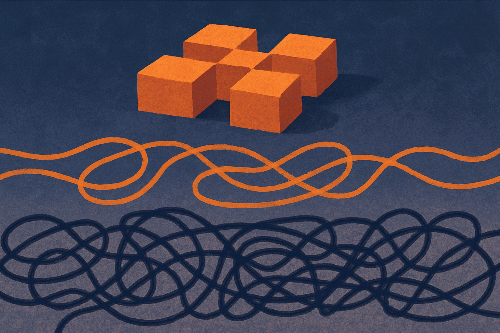

TL;DR: WikiSkill shows that agents improve most not by remembering what they did but by consolidating why it worked into a persistent knowledge base, and those distilled skills transfer well enough that a small model with good skills can beat a bigger model without them.

Most agent frameworks treat memory like a junk drawer. Every run dumps its logs, traces, and half-useful notes into a growing pile, and the next run either ignores the pile or drowns in it. The paper I want to walk through, **WikiSkill: Compiling Agent Experience into Persistent Knowledge for Skill Evolution** (posted to arXiv under both cs.AI and cs.CL), argues the fix is structural. Stop mixing three different things that we keep calling "memory."

## What does WikiSkill actually separate?

The core idea is a clean split between three layers that most systems blur together.

There is raw execution experience: the literal trace of what the agent tried, what tools it called, what came back. There is accumulated knowledge: the distilled insight about what tends to work, stored in a persistent wiki. And there are executable skills: the reusable packaged workflows the agent actually runs.

The teams' claim is that keeping these apart matters because the useful signal in agent runs is not the runs themselves. It is the pattern across runs. When you leave that pattern scattered across optimization histories, as the authors put it, every new skill update has to re-derive lessons that earlier iterations already learned. WikiSkill continuously consolidates experience into the wiki, and subsequent skill updates build on the wiki rather than on the raw logs.

If you have built any kind of agent loop, the failure mode this targets is familiar. You add a "reflection" step, the agent writes notes to itself, and those notes either balloon into an unreadable context dump or get overwritten each cycle. The wiki is the middle layer that was always missing: a place where insight persists and compounds instead of evaporating or piling up as noise.

## Does an agent's memory really need to be a wiki?

The word "wiki" is doing real work here, and it is worth being precise about what the authors claim versus what is intuition.

What they claim, and back with ablations, is that persistent knowledge accumulation is critical. When they remove the wiki and let skills evolve directly from raw experience, performance drops. The consolidation step is not decoration. It is the mechanism.

That lands as a specific, testable finding rather than a vibe. The interesting part is the ordering it implies. Raw experience is high-volume and low-density. Skills are low-volume and high-density but brittle if you build them straight from noise. The wiki sits in between as a compression stage that turns messy history into stable, referenceable knowledge, and only then do you compile skills on top of it.

I would push back on one thing, gently. "Wiki" implies human-readable, editable, structured knowledge, and the abstract does not give us the format details or how large the wiki grows over long horizons. Whether this stays coherent after thousands of tasks, or whether the wiki itself becomes a junk drawer at a higher level of abstraction, is exactly the question the abstract cannot answer. The ablation tells us the wiki helps versus nothing. It does not tell us the wiki stays healthy indefinitely. Treat the long-run durability as open.

## Why does a small model with skills beat a bigger model without them?

This is the result operators should sit with. The authors report that skill evolution complements model scaling: larger models generally benefit more from evolved skills, but smaller models equipped with skills can outperform substantially larger models that have none.

That is a different shape of claim than "bigger is better." It says capability is partly portable. Some of what we pay for in a frontier model can be recovered by giving a cheaper model good accumulated skills for a specific task family.

Read that carefully before you get excited. "Can outperform" is not "always outperforms," and this holds on the benchmarks tested, not universally. A skill compiled from experience on a benchmark is, almost by definition, well-fitted to that benchmark's task distribution. The honest framing is that skills let a small model punch above its weight inside the domain the skills came from. That is still valuable. Most production agents live in a narrow domain. But it is not a general claim that skills erase the gap between model sizes.

The even more useful finding: evolved skills transfer across models and model families, and skills evolved by one model can outperform skills a model evolved for itself. That breaks an assumption a lot of us hold, that an agent's learned artifacts are tied to the model that produced them. If skills are portable, they become an asset you build once and reuse across whatever model you run next quarter. And the fact that another model's skills can beat your own suggests skill quality is not purely a function of who wrote them, which opens the door to shared or purchased skill libraries.

## How does this compare to the "just fine-tune it" answer?

The obvious alternative to accumulating skills is to bake the knowledge into weights through fine-tuning. WikiSkill's approach is deliberately not that. Everything lives outside the model, in the wiki and the skill set.

That has clear tradeoffs. Fine-tuning is heavy, slow, and locks knowledge to one model. External skills are cheap to update, inspectable, and, per the transfer result, portable. The cost is that they consume context and depend on retrieval doing its job at run time. You are trading weight-level permanence for a knowledge layer you can actually read and edit.

The abstract does not report token overhead, latency, or how skill retrieval is done at inference, and those are the numbers that decide whether this is practical at scale. A skill library that adds significant context cost per call can eat the savings from running a smaller model. I would want to see that accounting before treating the small-model-wins result as a free lunch. It is not stated in the paper as summarized here, so I am not going to assume it.

The direction, though, is right. We have spent two years scaling models and comparatively little effort on the memory architecture around them. WikiSkill is a concrete argument that the second thing has real leverage.

Here is how I would actually use this. If you run an agent on a repetitive domain, invoices, support triage, code review in one repo, stop dumping full run traces into context and instead build the middle layer: after each batch of runs, distill what worked into a compact, human-readable knowledge doc, and compile your prompts or skills from that doc rather than from raw logs. Version it. Test whether a cheaper model plus your accumulated skills matches your current expensive model on your own tasks, because if the transfer result holds for you, that is a direct cost cut. The catch most readers will miss: the whole thing lives or dies on the distillation step staying clean. A wiki that grows without curation just moves the junk drawer up one level, and none of the benchmark wins protect you from that.
