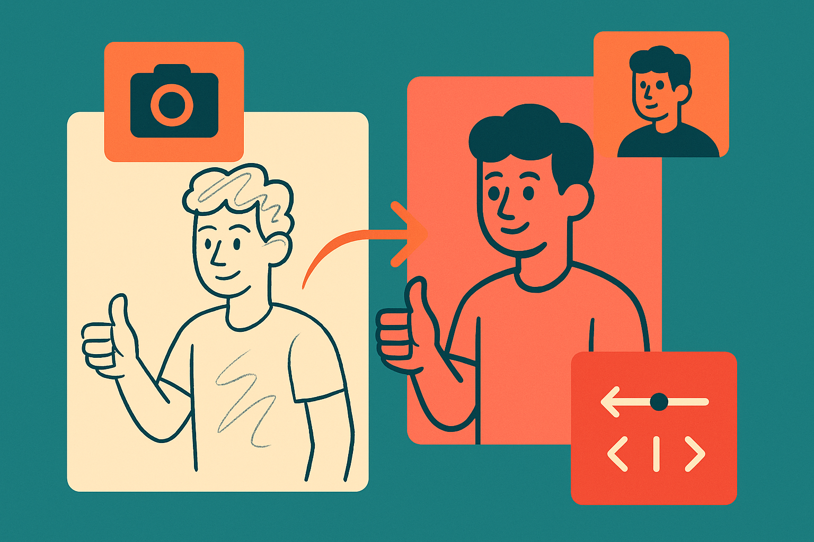

TL;DR: Treat OpenAI’s "Magic Manga Girl (:30)" as a taste sample, not evidence that AI video is ready to replace a repeatable creative pipeline.

## What can we actually learn from a 30-second AI clip?

OpenAI published a YouTube upload titled "Magic Manga Girl (:30)." That is the primary source here, and the title tells us almost as much as the available material does: short duration, manga styling, character-focused fantasy framing, and a demo format.

That matters because short-form AI video demos are usually optimized for impression, not inspection. Thirty seconds can show mood. It can show motion. It can show whether a style direction feels coherent enough to land with a casual viewer. It cannot prove much about iteration speed, shot control, continuity across scenes, rights posture, editability, cost, or whether a creative team can get the same character doing ten specific things across a campaign.

I do not mean that as a knock. Demos are allowed to be demos. A clip like this can still be useful if you watch it with the right question in mind: not “is this the future of animation?” but “what part of the production stack is this trying to compress?”

For a manga-styled spot, the likely compression target is obvious. Concept art, motion tests, mood boards, animatics, pitch visuals, social promos. Those are areas where a near-finished look is valuable even if the output is not the final asset. If a creative director can get ten style directions in an afternoon, that changes the front of the funnel. If a studio needs precise continuity, legal clearance, layered files, and frame-level fixes, the bar is much higher.

## Why do these demos feel bigger than they are?

AI video clips hit differently because motion hides and reveals at the same time.

A still image lets you inspect anatomy, lighting, texture, and composition. A moving clip gives you more signal, but also more distraction. Your eye follows the face, the hair, the camera move, the magical effect. Small artifacts can pass because the scene keeps moving. That is great for a demo. It is dangerous for procurement.

The right operator question is not “does it look good?” Plenty of AI-generated work looks good for a few seconds. The better question is “what happens on revision three?”

Can the same character return from a different angle? Can the hand action be changed without wrecking the shot? Can the style be locked to a brand guide? Can the output fit into Premiere, After Effects, Blender, or a studio review process without becoming a flattened artifact? Can the team explain what training, licensing, or indemnity assumptions sit underneath the work?

OpenAI’s "Magic Manga Girl (:30)" does not answer those questions in the material provided. It is fair to say it is a polished public-facing creative sample. It is not fair to infer pricing, availability, model name, usage rights, or release timing from that alone.

That restraint is boring. It is also how you avoid building a plan around a trailer.

## Where does this fit for builders right now?

The practical read is that AI video is becoming more credible as a pre-production and marketing acceleration layer before it becomes a clean replacement for animation departments.

For indie builders, that is already enough to matter. A founder testing a game concept, creator IP, educational character, or commerce campaign does not always need studio-grade continuity. They need fast taste formation. They need to find the version of the idea that makes people stop scrolling, click, comment, or ask for more.

For larger teams, the opportunity is narrower but still real. AI clips can support internal pitches, brand exploration, storyboard variants, and localization prototypes. They can help non-design stakeholders react to something closer to finished motion instead of a static deck. That speeds decisions, if the team labels the asset honestly.

The catch is that “looks like production” is not the same as “is production.” The more a workflow depends on brand safety, character consistency, rights clearance, editability, and approvals, the less you should judge it by a single rendered clip.

Practitioner’s take: if you are building around AI video, run a small test that mirrors your real workflow. Pick one character, one style, and three required revisions. Ask for continuity, not just beauty. Measure how many tries it takes to get usable output, what has to be fixed manually, and where the asset breaks when handed to an editor. The demo tells you taste is moving fast. Your revision loop tells you whether the tool is ready for your work.
