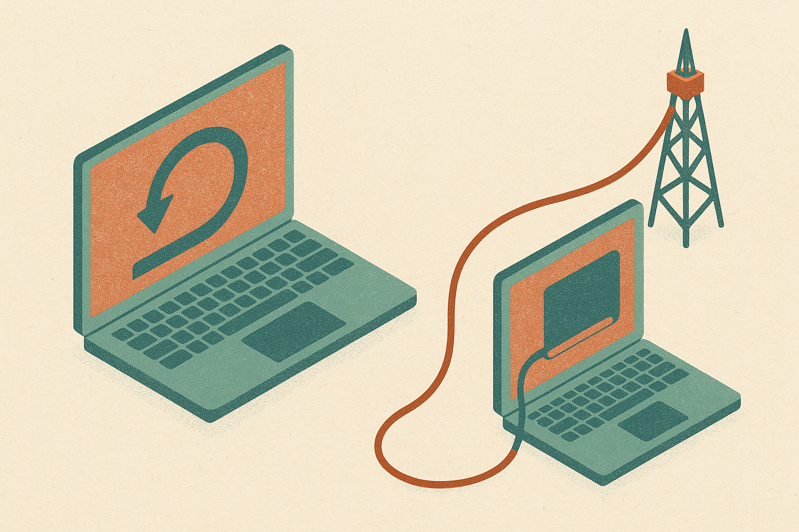

TL;DR: StemDeck is a free, open-source stem separator that runs locally, and the interesting part is not that it separates audio well, it is that it removes the cloud from a workflow that used to need one.

The single source I have here is thin: a Hacker News post titled "StemDeck, a free, open-source and local AI stem separator." That is the whole headline. I have not run it, I cannot verify its accuracy against the paid tools, and I will not pretend the post told me things it did not. So this is not a review. What I can do is treat StemDeck as a specific example of a pattern that keeps showing up in 2026: capable AI moving off the API and onto the laptop, and what that actually changes for someone who works.

## What is stem separation and why does it matter?

Stem separation takes a finished mix, a single stereo track, and pulls it apart into its parts: vocals, drums, bass, other instruments. It is the reverse of mixing. For decades it was close to impossible to do cleanly, because once sounds are summed into a mix they overlap in frequency and time in ways no simple filter can undo.

Machine learning changed that. Models trained on paired data (isolated stems plus their mixdowns) learned to estimate what each source probably sounded like before it was combined. The results are not perfect. You get artifacts, smearing, phantom bleed between stems. But they are good enough that DJs, producers, remixers, transcribers, and karaoke makers use them daily.

The catch has usually been where the work happens. Most people reach for a hosted service: upload your track, wait, download the stems. That works until it does not. Unreleased material you would rather not upload. A rights situation where sending a client's master to a third party is a problem. Rate limits. Subscription creep. A model that quietly changes or a service that shuts down and takes your workflow with it.

## What does running it locally actually change?

This is the real story, and it is bigger than one tool.

When the model lives on your machine, three things flip. First, privacy: nothing leaves the device. For anyone handling unreleased tracks or client work under NDA, that is not a nice-to-have, it is the difference between being able to use the tool and not. Second, cost structure: no per-track fee, no monthly subscription, no metered usage. You pay once in compute and disk, and then the marginal cost of the ten-thousandth track is zero. Third, permanence: an open-source tool you have a copy of cannot be sunset out from under you. The version you have keeps working.

Those are the same three reasons local AI keeps winning specific niches even while the frontier stays in the cloud. It is not that the local model is better. It usually is not. It is that "runs on my machine, for free, forever, without phoning home" is a feature the best cloud model literally cannot offer.

Stem separation is an unusually good fit for this. The models are small enough to run on consumer hardware. The task is well-defined and does not need frontier-scale reasoning. And the privacy pressure is real because the input is often something you legally should not be uploading anywhere. When those three line up, local wins. When they do not, the cloud usually still wins on quality and convenience.

## Is a free local tool as good as the paid services?

Almost certainly not on raw separation quality, and I want to be honest that I cannot benchmark this from a one-line source. The paid leaders have spent years and real money on training data and model tuning, and it shows in cleaner high frequencies and fewer artifacts on hard material.

But "as good" is the wrong test. The right test is "good enough for what I am doing, at a cost and privacy profile I can live with." For a producer pulling an a cappella to build a remix, small artifacts get buried under new production anyway. For a music teacher isolating a bassline to transcribe it, a little bleed does not matter. For a DJ prepping tracks for live mashups, throughput and not paying per track matter more than studio-grade cleanliness.

The pattern to watch: open-source stem models tend to lag the commercial best by a generation, then close the gap as the underlying research (Demucs and its descendants, the various open separation architectures) gets published and adopted. A free local tool riding a strong open model can land surprisingly close to paid quality for common cases while being wildly behind on the hard ones. Where StemDeck actually sits on that curve, I do not know from this source, and neither does anyone quoting the headline.

## Where does this fit in the bigger local-AI shift?

StemDeck is one data point in a trend I keep flagging: 2026 is the year "local" stopped meaning "worse and clunky" for a growing list of narrow tasks. Transcription runs locally now. Image generation runs locally. Small language models run locally. And audio separation joins the list because the model size and the task difficulty both sit inside what a laptop can handle.

The through line is that the frontier and the edge are diverging on purpose. The frontier chases the hardest reasoning, the biggest context, the newest capabilities, and that lives in a data center. The edge picks up the settled, well-scoped tasks where privacy, cost, and control beat raw quality. Stem separation is settled enough to have fallen to the edge. That is the actual signal here, more than any one app.

Practitioner's take: if you separate stems even occasionally, download a local tool like this and A/B it against whatever paid service you use, on your own real tracks, not a demo file. Run three or four representative songs through both and listen on good headphones for the specific failures that hurt your work: vocal bleed if you remix, drum smearing if you sample, bass phantoms if you transcribe. If the local output survives your actual use, you have just removed a subscription, an upload step, and a legal exposure in one move. The catch most people miss: local is not free, it costs you setup time, disk space, and CPU or GPU cycles, and if you only separate a track a month, a hosted service is the smarter tool. Local wins on volume, sensitivity, and permanence, not on convenience. Match the tool to how often and how privately you actually work, and do not adopt local just because it sounds cooler.
