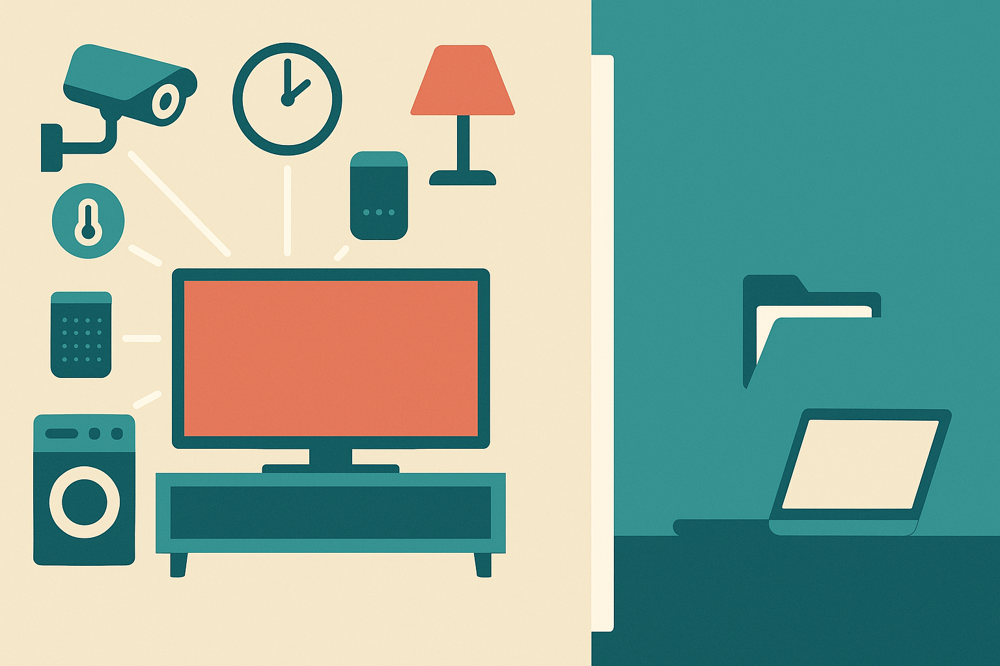

TL;DR: The useful move is not to make your smart TV smarter, it is to reduce its privileges and treat it like an untrusted device on your network.

## What is the actual risk with a smart TV?

Hacker News surfaced a thread titled “Stopping the smart TV from being used against you.” That phrasing is better than the usual privacy panic because it points at agency. Not “is my TV spying on me?” but “what can this device do from inside my house, with my accounts, on my network, while I ignore it?”

That is the right operator question.

A smart TV is not just a display. It is a networked computer with apps, credentials, update channels, sensors in some models, and access to the most trusted room in many homes. It may sit on the same Wi-Fi as laptops, phones, NAS boxes, printers, cameras, and work machines. It may stay powered for years. It may get replaced less often than a phone, but receive less attention than one.

The AI angle is not that your TV suddenly becomes Skynet. The AI angle is that interfaces are getting more conversational, more personalized, and more connected to accounts. Voice search, recommendations, camera-based features, assistant integrations, shopping flows, and smart-home controls all increase the number of things a compromised or badly designed device can ask for, infer, or trigger.

That does not require a dramatic exploit. Sometimes the issue is simpler: too much default access, too many cloud dependencies, too many apps you installed once, and a device category people do not patch, audit, or isolate.

## What should a builder or power user do first?

Start by reducing what the TV is allowed to do.

The cleanest pattern is to treat the TV as a screen and move the smarts to a device you control better. That might mean an external streaming box, a game console, or a small computer. Not because those are magically safe. Because they are usually easier to replace, reset, update, and separate from the display hardware.

Next, isolate it. Put the TV and entertainment devices on a guest network or an IoT VLAN if your router supports it. The goal is boring: the TV can reach the internet, but it cannot freely browse your laptop, dev machine, file server, or office printer. If that breaks casting, decide whether casting is worth the extra trust. Convenience is a permission slip. Treat it that way.

Then prune accounts and apps. Do not sign into services you do not use. Remove apps you forgot about. Turn off features you never asked for. If the TV has voice control and you do not use it, disable it. If it has a camera and you do not use it, cover it or disable it. If it offers personalized ads, tracking, content recognition, or device-linking settings, review them with the same skepticism you would bring to a browser extension.

The trick is not paranoia. It is scope control.

## Why does this matter more as AI moves into the home?

AI assistants make weak endpoints more valuable.

A dumb endpoint can show ads, run apps, and leak some usage data. A connected assistant endpoint can potentially interpret intent, call services, control devices, summarize context, and act across accounts. That is exactly why the industry wants ambient assistants in the living room. It is also why builders should stop thinking of “home AI” as only a UX problem.

The risk model changes when a device can move from observing to acting.

For product teams, this means local permissions matter. Clear kill switches matter. Account separation matters. Logs matter. So do boring admin surfaces that show what a device can access and what it recently did. If your product connects to TVs, speakers, cameras, or home hubs, assume those devices are shared, semi-managed, and rarely audited.

For users, the practical standard is simple: if you would not give a random tablet full access to your work network, do not give that access to your TV.

Practitioner’s take: Put your TV on an isolated network this weekend, remove unused apps, disable unused sensors and voice features, and route “smart” features through a device you can reset and replace easily. If you build AI products for the home, design for least privilege from day one. The catch most people miss is that the living room device is not low-risk because it feels casual. It is high-risk because nobody treats it like infrastructure.
