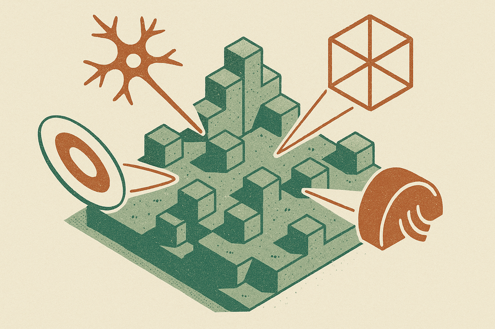

TL;DR: If a coding model nails a familiar demo, do not grade the demo, perturb the spec until memorized patterns stop helping.

## Was the model coding, or replaying Minecraft-shaped code?

The primary source here is /u/liright’s r/LocalLLaMA post, titled “Some people said the Minecraft clone I fully vibecoded with Qwen3.8-27B Q4 is not that impressive because Minecraft is in the training data, so I had the model add 4 things that are probably not.”

That title is doing a lot of work.

On one side, the setup is genuinely interesting: a local, quantized model identified as Qwen3.8-27B Q4 being used to “fully vibecode” a Minecraft-like project. That is the kind of thing that would have sounded absurdly expensive or brittle not long ago. A 27B-class model running locally is not the same as a giant hosted coding agent with a full cloud toolchain. If it can produce an interactive clone from natural-language direction, that matters for builders.

On the other side, the criticism is fair. Minecraft is everywhere. Code examples, tutorials, voxel engines, Three.js experiments, Unity clones, terrain generation snippets, block inventory systems. If a model produces a plausible Minecraft clone, it may be solving the task. It may also be assembling a very well-rehearsed pattern.

That does not make the demo fake. It makes the demo incomplete.

The useful move in /u/liright’s post is the follow-up: add four things that are “probably not” in the training data. The supplied material does not include what those four things were, so I would not treat this as proof that Qwen3.8-27B Q4 can generalize to arbitrary game design. But the evaluation instinct is right. A known app clone tests retrieval, pattern matching, and glue code. A weird modification tests instruction following, architecture flexibility, and whether the generated code can absorb new constraints without collapsing.

## What makes a better vibe-coding test?

The best test is not “build me X.” It is “build me X, then make it behave unlike X in one precise way.”

For coding agents, I like perturbations because they are cheap and revealing. Ask for a common project first, then change the rules. Make gravity radial instead of downward. Make inventory items decay unless combined. Make terrain grow around player behavior. Make the UI work without icons. The exact feature matters less than the shape of the request: it should be specific, uncommon, and hard to satisfy with a copied tutorial path.

This is where a lot of AI demos still get graded too generously. People look at the first run. The model creates a playable surface, a login screen, a dashboard, a chatbot, a CRUD app. Nice. But production work is mostly the second through fiftieth request. “Actually, this needs to work with our auth.” “That state model is wrong.” “The customer can edit this while another user is viewing it.” “We need rollback.” “No, do not rewrite the whole app.”

A familiar clone can hide fragility. Perturbed requirements expose it.

## What should builders take from this?

The practical lesson is not “local models are now game studios.” It is also not “all demos are contamination.” Both takes are too lazy.

The better read: local coding models are useful enough that we need better taste in testing them. If Qwen3.8-27B Q4 can help someone iterate on a Minecraft-like app, great. The next question is whether it can preserve structure while adding unfamiliar mechanics, debugging regressions, and explaining why a change broke something. That is closer to real work.

I would test coding agents in three passes. First, ask for a known baseline so you can see whether the model can produce working scaffolding. Second, ask for one strange feature that cuts against the default implementation. Third, ask for a refactor or bug fix after that feature lands. The catch most readers miss: the weird feature is not the finish line. The real signal is whether the project remains editable after the weird feature is added.
