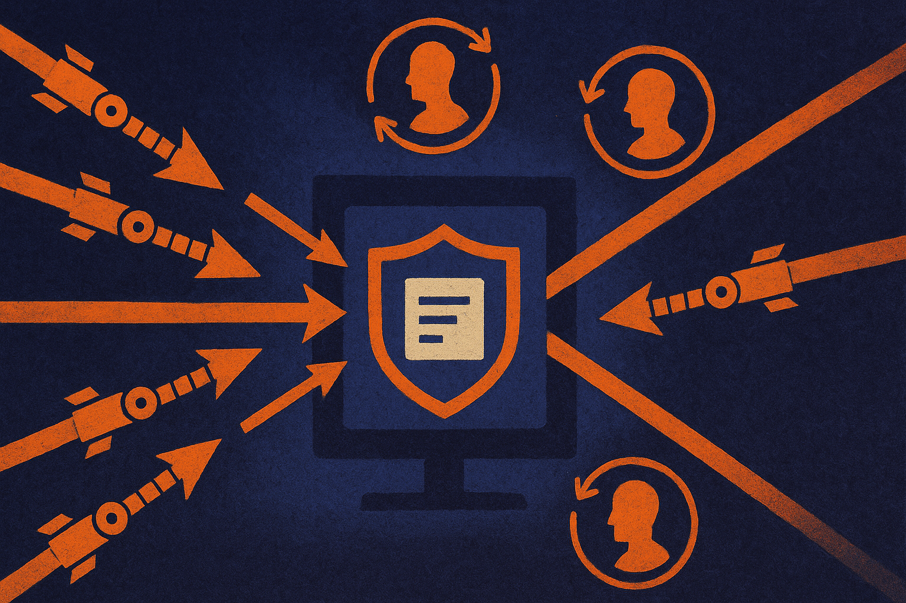

TL;DR: Treat AI-assisted cyberattacks as a near-term operating risk, but respond with boring, testable security work rather than sci-fi panic.

## What changed from hypothetical risk to operator concern?

My primary source here is Decrypt’s “After Their AI Models Hacked Real Companies, AI Labs Call for Stronger Cyber Defenses.” Decrypt reported that more than 100 organizations across AI, security, finance, and technology are calling for governments and industry to prepare for attacks powered by increasingly capable models.

That phrasing matters. This is not just another “AI could be dangerous someday” statement. The reported hook is that AI models have already been used to hack real companies. Decrypt does not, in the material provided, give enough detail to judge the severity, target selection, safeguards, or whether the activity happened in controlled testing, bug bounty work, sanctioned red teaming, or something closer to live exploitation. So I would not over-read it.

But I would not ignore it either.

The practical shift is this: AI security is no longer only about protecting model weights, preventing prompt injection, or keeping customer data out of training logs. It is also about assuming attackers will use models as labor multipliers. Not magic. Labor.

A model that can read docs, write scripts, chain tools, summarize codebases, generate phishing variants, and explain error messages does not need to be a superintelligence to matter. It just has to make a mid-tier attacker faster, cheaper, and less dependent on specialists. That changes volume and tempo. It also changes who can attempt what.

## What should governments and companies actually prepare for?

The easy version of this story is “AI labs ask for stronger cyber defenses.” The harder version is asking what “stronger” means.

Decrypt reports the call includes governments and industry, which makes sense because the weak points cross boundaries. A bank can harden its own systems and still depend on vendors, identity providers, cloud platforms, open-source packages, regulators, insurers, and incident response firms. AI-assisted attacks will hit that messy supply chain, not just the front door.

For operators, the first bucket is still basic control quality: identity, patching, logging, segmentation, secrets management, secure software delivery, tested backups. If that sounds dull, good. Attackers like dull gaps. AI does not make an unpatched VPN profound. It makes finding and exploiting it easier.

The second bucket is AI-specific testing. Security teams should start red teaming workflows, not just models. Can an internal assistant be tricked into exposing secrets from a ticket? Can an agent with repo access open a risky pull request? Can a support bot be pushed into account recovery abuse? Can a coding model generate insecure glue code that ships because nobody owns review?

The third bucket is incident speed. If model-assisted attacks compress the time between reconnaissance and exploitation, detection and response need to compress too. That means telemetry people can use, runbooks that have been exercised, and clear authority during an incident. Not a PDF nobody opens.

## Where is the hype line?

I am skeptical of two reactions.

One is dismissal: “AI cannot autonomously hack at expert level, so this is hype.” That misses the point. Most real-world compromise does not require cinematic autonomy. It requires persistence, reconnaissance, credential abuse, social engineering, and enough scripting to stitch it together.

The other is panic: “Models hacked companies, so we need sweeping new controls on all AI use.” That also skips the work. Without details on the incidents Decrypt references, we should be careful about using them as proof for broad policy claims. The right standard is evidence, reproducible evaluations, and clear reporting on what the model did, what humans did, and what guardrails failed.

A builder should start with one concrete exercise this week: pick a real workflow where an AI tool touches code, tickets, customer data, infrastructure, or identity, then threat model it end to end. Give security and engineering one day to test obvious abuse paths. Fix the boring failures first. The catch most teams miss is that the model is rarely the whole risk. The risk is the model connected to permissions, data, and automation nobody has mapped.
