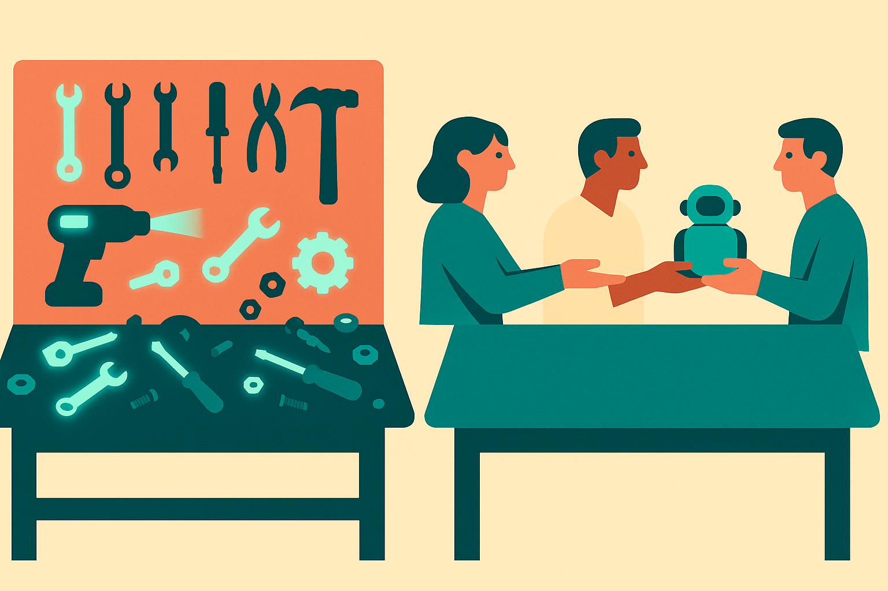

TL;DR: AI helps teams move faster only when the team already has trust, clear ownership, good review habits, and a shared definition of done.

## What does culture change that AI cannot?

The primary source here is thin by design: the Hacker News item titled “Good Culture Is the Biggest Productivity Hack, Not AI.” That title is not evidence. It is a useful provocation.

I think it is mostly right.

AI improves pieces of work. Culture improves the system that turns pieces into outcomes.

That distinction matters. A model can draft a spec, summarize a customer call, generate test cases, refactor a function, or give a decent first pass at a launch email. Good. Useful. I use that stuff daily.

But AI does not decide whether the spec is the right spec. It does not make a product manager ask the uncomfortable question before engineering starts. It does not fix a team where nobody wants to review code because every review turns political. It does not create psychological safety. It does not make priorities stable. It does not stop a VP from dropping a surprise “quick ask” into a sprint with no tradeoff.

A weak culture turns AI into acceleration without steering. More drafts. More pull requests. More Slack summaries. More artifacts that look like progress. The queue gets fatter.

A strong culture gives AI somewhere useful to plug in. People know who owns the decision. They know what “good” means. They can say no. They can critique work without making it personal. They can use AI output as a sketch, not as a proxy for thinking.

## Where does AI actually help?

The honest answer: anywhere the work has enough context, feedback, and tolerance for revision.

AI is good at first passes. It is good at compression. It is good at variation. It is good at turning vague raw material into something a person can edit. That makes it valuable for teams with strong taste and fast review loops.

The catch is that these are multiplier effects. If the team has no taste, AI creates generic output. If the team has slow reviews, AI creates faster backlog. If nobody owns quality, AI creates plausible mediocrity. If leaders reward visible busyness, AI becomes a factory for documents nobody reads.

This is why “AI productivity” is often measured at the wrong layer. The interesting question is not whether one person can write a memo faster. They can. The better question is whether the team makes a better decision sooner because that memo exists.

That is harder to measure. It is also the thing operators should care about.

I would rather see a team use AI in three boring places and ship more reliably than announce an ambitious agent strategy that nobody trusts enough to put near real work. Boring wins. Meeting notes that become clear owners. Support tickets that become better product signals. Engineering docs that stay current because updating them takes five minutes instead of thirty.

## What should teams fix before buying more tools?

Start with the workflow, not the vendor list.

Pick one repeated process where work gets stuck. Customer feedback triage. Incident review. Sales handoff. Pull request review. Weekly planning. Then ask where AI can remove drag without removing accountability.

Do not ask, “Can we automate this?” Ask, “What decision or handoff is slower than it should be?” That framing keeps humans responsible for judgment while letting software handle drafting, sorting, formatting, and recall.

The other move is cultural: make AI output reviewable. If someone uses a model to draft a strategy note, they should say what context they gave it, what they changed, and what they still do not trust. That normalizes AI as a workbench, not a magic box.

Teams also need permission to reject AI-shaped busywork. A ten-page generated report is not better than a one-page human decision. A bot that comments on every ticket is not better than one clear owner. More artifacts are not the goal.

Practitioner's Take: Pick one team ritual this week and add AI only where the next human step gets clearer. For example, have AI turn raw customer notes into themes, then make a person choose the top three and assign owners. The catch most teams miss: the gain does not come from the summary. It comes from the cleaner handoff after the summary.
