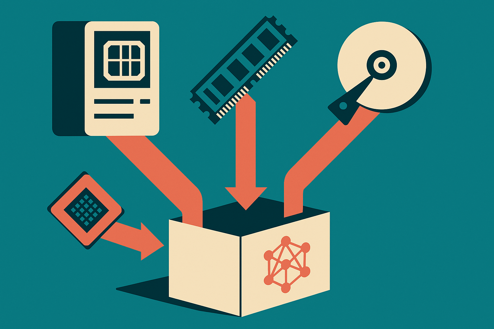

TL;DR: Local LLM performance may improve through dozens of small llama.cpp CPU, RAM, disk, and hybrid inference changes, but treat big DDR5-versus-VRAM claims as hypotheses until benchmarked.

## What is actually in the llama.cpp queue?

The primary source here is the r/LocalLLaMA post titled “llama.cpp Open PRs list - CPU/RAM/Disk/Hybrid Related - Better for CPU-only & Hybrid inference.” It is not an official llama.cpp roadmap. It is a community roundup of open and ongoing pull requests, plus discussions, aimed squarely at the “Poor GPU Club.”

That matters because the list is not about one magic optimization. It is a pile of unglamorous work: CPU kernels, quantization paths, NUMA behavior, MoE expert caching, disk streaming, RAM pressure during model load, prompt prefill, token generation, and server-side KV cache tricks.

A few examples show the shape of it. The list includes “ggml-cpu: tiled mul_mat for k-quants,” “ggml-cpu: add AVX-512 and VNNI paths for Q5_K/Q6_K dot products,” and a PR titled “ggml-cpu: add x86 VNNI Q2_0 dot product -- 3x speed improvement for VNNI-compatible CPUs.” It also includes ARM NEON, RISC-V vector, wasm SIMD, AVX2, AVX-512, AMX, and NUMA-related work.

That is the real story. Local AI is not only a model story. It is a memory movement story.

## Why does CPU inference still matter?

Because most people do not have a 24GB or 48GB GPU sitting idle. They have a laptop, a mini PC, a workstation with more system RAM than VRAM, or a GPU that is just big enough to be annoying.

The r/LocalLLaMA roundup points toward a future where llama.cpp gets better at using the whole machine, not just the GPU. That includes “llama-hot-experts: pin hottest MoE experts in RAM via --pin-hot-experts,” “llama : add --lazy-experts for MoE models larger than RAM,” and “llama : stream MoE routed experts from disk.” There is also an RFC for “MoE expert cache, VRAM caching of hot CPU-resident experts with hybrid hit/miss execution.”

This is especially relevant for mixture-of-experts models. MoE models do not use every expert for every token. In theory, that makes them a good fit for caching and streaming. Keep the active or frequently used experts close. Leave the cold ones in slower storage. Move less data. Waste less memory.

In practice, the details are brutal. Token routing, cache misses, disk latency, RAM bandwidth, quantization quality, and scheduler overhead can eat the promised gains. Still, this is the right place to look. The bottleneck for many local setups is not “can the model run?” It is “can it run fast enough that I will actually use it?”

## What should builders not overread?

The post ends with a guesstimate: after these PRs merge, dual-channel DDR5 RAM could give “~8GB VRAM’s performance.” I would not treat that as a claim. It is a community estimate, not a benchmark suite.

The catch is that CPU inference performance depends on the exact model, quantization, context length, batch size, memory channels, instruction set, thermal limits, and whether the workload is prefill-heavy or decode-heavy. A PR that helps batch prompt processing may not help single-user token streaming. A NUMA improvement may matter on a dual-socket server and mean nothing on a laptop. A disk-offload path may make a giant model possible, while still feeling too slow for daily work.

Also, open PRs are not shipped features. Some will merge. Some will change. Some may regress one workload while helping another. That is normal engineering, not failure.

Practitioner’s take: if you build local AI workflows, start tracking llama.cpp performance like you track model releases. Pick two or three representative prompts, one chat workload, one long-context workload, and one agent/tool workload. Record tokens per second, time to first token, RAM use, and whether the machine stays usable. Then test builds as these CPU and hybrid PRs land. The easy mistake is chasing the biggest model that barely runs. The better move is finding the smallest model, quant, and backend mix that is fast enough to become habit.
