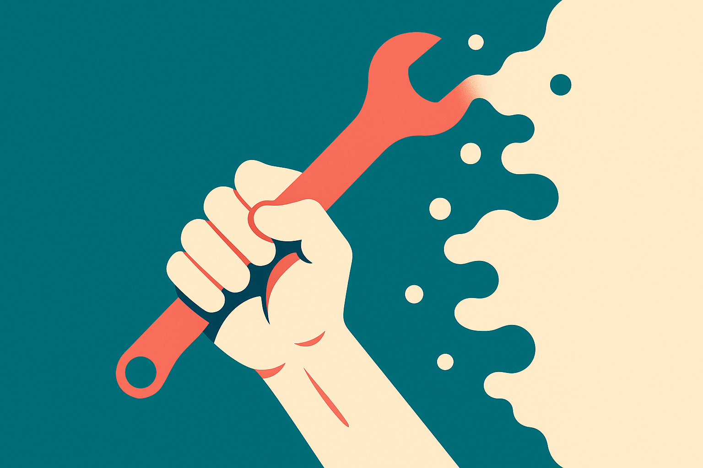
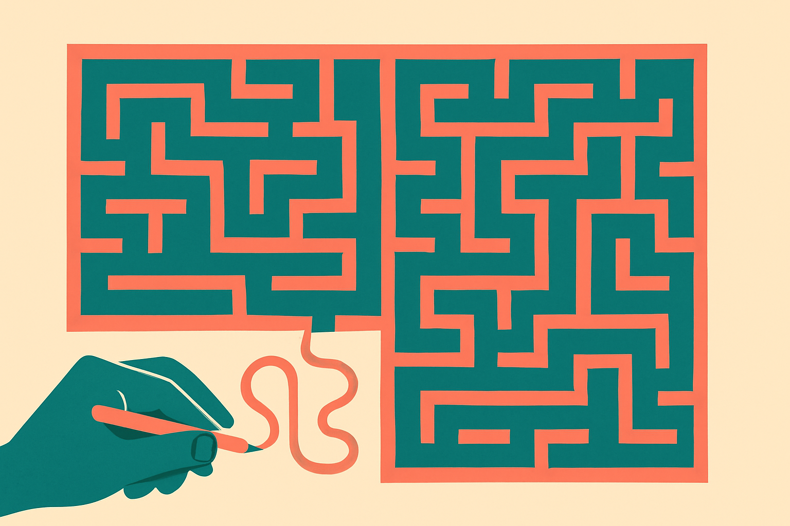
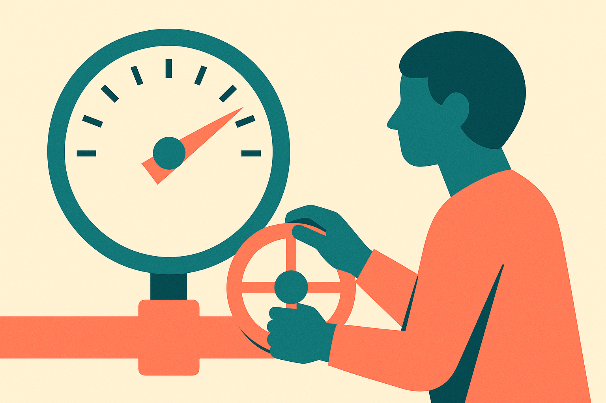

TL;DR: "No AI Fridays" is a reasonable hedge against skill atrophy, but it only works if you treat the ban as a diagnostic, not a ritual.

The idea making the rounds on Hacker News under the title "No AI Fridays" is small and easy to describe: one day a week, engineers turn off the AI assistants and write code the old way. No Copilot autocomplete, no Claude in the editor, no pasting a stack trace into a chatbot. Just you, the docs, and the compiler.

I like the instinct behind it. I also think most teams will implement it badly and learn nothing. So let me pull apart what the practice is actually trying to solve, where the reasoning holds, and where it falls apart.

## What is "No AI Fridays" actually trying to fix?

The stated worry is skill atrophy. If an assistant writes most of your code, drafts most of your tests, and explains most of your errors, the muscles that used to do that work get weaker. You stop remembering the standard library. You stop being able to read a stack trace without a translator. You lose the feel for when a design is going wrong before it goes wrong.

This is a real concern and it predates AI. Developers have worried about the same thing with IDEs, with Stack Overflow, with high-level frameworks that hide what the machine is doing. Every abstraction that makes you faster also makes you dependent on the abstraction holding up. The question is never "is there dependency" but "is this dependency the kind that leaves you helpless when it fails."

That framing matters because it tells you what a good test looks like. The failure mode you actually fear is the moment the assistant is wrong, or unavailable, or confidently hallucinating, and you can't tell. If you can still catch those moments, your skills are fine. If you can't, no amount of Friday abstinence fixes the root problem, because the problem is judgment, not typing speed.

I want to be clear about sourcing here. This is a Hacker News post titled "No AI Fridays," and what I have is the concept and the community reaction, not a controlled study or a company's published results. So treat everything downstream as reasoning about the idea, not evidence that it works. Nobody has shown me before-and-after numbers on a team that ran this for six months.

## Does turning off AI one day a week actually rebuild skills?

Probably not much, and here's why. Skill atrophy is a chronic condition, and one day out of five is a small dose. You spend Friday relearning where a function lives, get slightly reacquainted with the friction, and then Monday you're back to full assistance. The muscle gets a light stretch, not a workout.

There's also a selection problem with which work lands on Friday. If your team schedules the hard architectural decisions and the gnarly debugging for the four AI days and saves Friday for cleanup and small tickets, the ban touches only the work that needed the least skill in the first place. You'd feel productive and virtuous and learn nothing.

The version that could work is more demanding: pick genuinely hard problems, do them unassisted, and then afterward compare your solution to what the assistant would have produced. That comparison is the whole value. Not the abstinence itself, but the calibration you get from seeing where you and the model diverge, and who was right.

## Who should actually try this, and who shouldn't?

Junior engineers are the interesting case. The strongest argument for something like No AI Fridays is that people early in their careers are building the mental models the assistant is supposed to augment. If you never form those models, you have nothing to check the model against. You become a very fast conduit for output you can't evaluate. For that group, deliberate unassisted practice isn't nostalgia, it's how you get to the level where AI actually makes you dangerous in the good sense.

Senior engineers who already have deep models are a different story. Their risk isn't that they never learned to read a stack trace. Their risk is slower and quieter: the models they built in 2018 slowly go stale, and the assistant papers over the gap. For them, a blanket ban is a blunt tool. Targeted practice on new domains matters more than a scheduled offline day.

And some teams shouldn't do this at all. If you're shipping under real deadline pressure and your differentiation is velocity, kneecapping a fifth of your week on a hunch is hard to justify without evidence. The honest version of this is an experiment with a hypothesis and a way to measure it, not a policy you adopt because it sounds disciplined.

## How would you run this so it actually tells you something?

Treat it as a diagnostic first, a habit second. The signal you want is simple: on unassisted days, how often do people get genuinely stuck on things they should know? That's your atrophy meter. If seniors are fine and juniors are drowning, you've learned where to invest in training. If everyone is fine, congratulations, you can stop and keep your Fridays.

Then narrow it. Instead of banning all AI for a whole day, ban it for one category of work where you most fear dependency: debugging without pasting the error into a chatbot, or writing a function from the standard library from memory before checking. Small, specific, repeatable. That gives you a cleaner read than a broad blackout where everyone quietly routes around the rule.

And keep the comparison step. The most useful outcome isn't "we can code without AI," it's "here is where our unassisted judgment and the model's output disagree, and here is who was right." That's the thing that actually keeps you sharp, because it trains the one skill that doesn't atrophy from using AI: knowing when to trust it.

If you're a team lead tempted by this, don't roll it out as a mandate next Friday. Run it for four weeks with one team, pick real problems, log where people get stuck, and compare unassisted work to the assisted version afterward. The catch most people miss: the goal isn't to prove you can live without the tools, it's to find out whether you can still tell when the tools are wrong. That's the skill worth protecting, and a scheduled day off won't build it unless you use that day to actually check your own judgment against the machine's.
