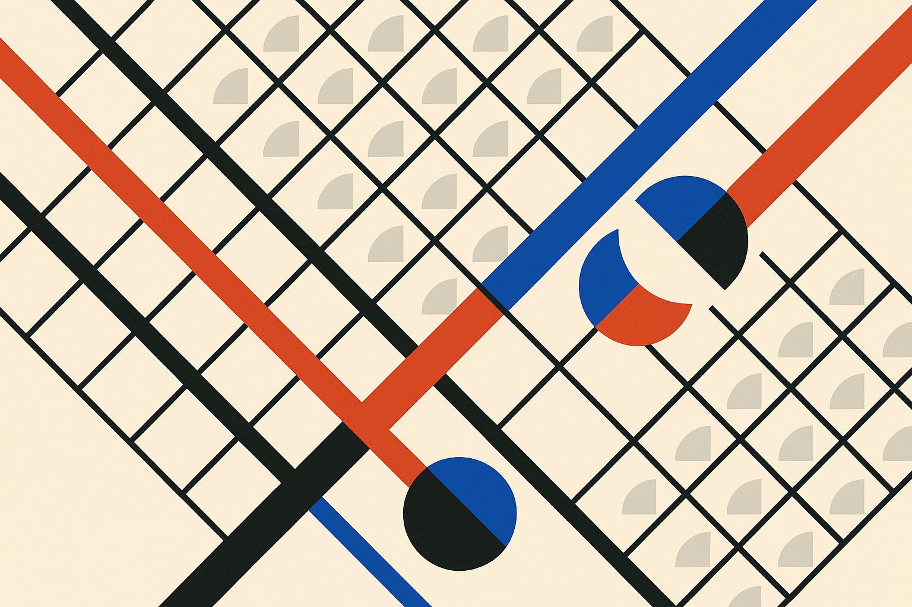
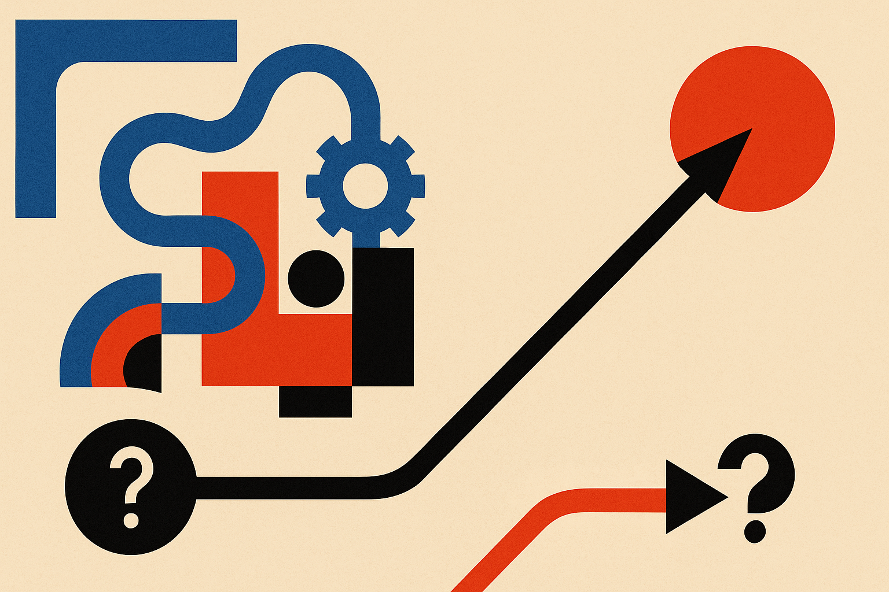

TL;DR: The longest-straight-line problem only sounds simple, and the work of turning it into something a machine can chew on, not the raw compute, is what determines whether it takes an afternoon or a supercomputer.

The primary source here is a Hacker News thread pointing to the 2018 write-up "Longest Straight Line Paths on Water or Land on the Earth." I want to use it as a worked example, not a news item, because it captures something I see constantly in AI and data work: the distance between "state the problem in English" and "state the problem so a computer can solve it well."

## What is the longest straight line problem actually asking?

The setup is deceptively clean. What is the longest straight line you can travel on the ocean without hitting land? And the inverse: what is the longest straight line over land without crossing a major body of water?

"Straight line" on a sphere does not mean a straight line on a map. It means a great circle, the path a taut string would follow across a globe. A great-circle route looks bent and dramatic on the flattened Mercator maps we all grew up with. That single fact is where the problem stops being trivial. You cannot eyeball it on a wall map. The projection lies to you.

So already, before any computation, the problem has been reframed twice. First from casual language ("straight line") into a precise mathematical object (a geodesic on a sphere). Second from the mental image most people carry (a flat map) into the actual geometry (curved paths on a curved surface). Neither reframing produces a single new number. Both are pure setup. And both are the entire game.

## Why is the brute-force version so expensive?

Here is the naive approach. A great circle is defined by a starting point and a bearing. Sample every possible starting point on the planet's surface. For each one, sample every possible bearing, zero to 360 degrees. For each of those paths, walk along it and check, step by step, whether you are over water or land, until the path type flips. Record the longest unbroken run.

That is three nested loops over a continuous surface, discretized into a grid. The cost explodes fast. If you sample starting points on a fine grid, and bearings finely, and step along each path finely, you are multiplying three large numbers together and then doing a land-or-water lookup at every single step. The original 2018 write-up frames it as exactly this kind of search, and the honest version of the story is that a straightforward brute force is genuinely slow.

This is the shape of a huge number of real AI and data problems. The specification is a sentence. The naive implementation is a combinatorial explosion. And the temptation is to answer the explosion by throwing hardware at it.

I think that instinct is usually the wrong first move. More compute is the answer you reach for after you have exhausted the cheaper wins, not before.

## Where do the real speedups come from?

The interesting part is that most of the acceleration on a problem like this does not come from a bigger machine. It comes from noticing structure.

You do not actually need to check every point along a candidate path at full resolution. If a great circle hits land early, you can abandon it immediately and never evaluate the rest. That is early termination, and it kills most of your candidates almost instantly. You do not need to test every start-and-bearing pair independently, because paths that begin near each other and point in similar directions behave similarly, so a coarse pass can prune whole regions before you ever look at them finely. And the land-or-water check itself can be made cheap with the right spatial index instead of a naive lookup.

None of that is exotic. It is the ordinary craft of turning an O(everything) problem into something tractable: prune early, exploit continuity, index your lookups, run a coarse-to-fine search so you only spend fine-grained effort where it can matter. The winning move is almost never "same algorithm, more cores." It is "different algorithm, then maybe more cores."

I want to be careful about attribution here. The specific runtimes, the exact winning routes, and the precise numbers belong to the 2018 write-up, and I am pointing at its method rather than restating figures I would be guessing at. The reason I am cautious is the same reason I am writing this: it is easy to make a geometry problem sound authoritative with a fabricated benchmark, and the whole point is the reasoning, not a number I did not verify.

## What does this teach about scoping AI work?

The pattern generalizes to almost every "can we build this?" conversation I have.

Someone describes a goal in a sentence. Find the longest straight sea route. Cluster our support tickets. Match every product to its closest competitor. The sentence is the easy part. Then you write the naive version and it is a triple loop over the whole world, and the estimate balloons, and the reflex is to ask for GPUs.

The people who ship on time are the ones who spend their first hours on framing, not hardware. They ask: what is the mathematical object underneath the English? Where can I terminate early? What structure lets me skip work instead of doing it faster? A retrieval problem framed as "compare every pair" is quadratic and miserable. Framed as "index once, look up in log time," it is boring and fast. Same goal. Wildly different bill.

The catch most people miss is that the reframing work is invisible in the final artifact. When you see the answer, you see a clean route on a globe, and it looks obvious in hindsight. You do not see the geodesic math, the pruning strategy, the spatial index, the coarse-to-fine passes. So estimates get anchored on the visible output and never budget for the framing, which is where the actual time goes.

Practitioner's take: next time you scope an AI or data task, write down two things before you request any compute. First, the precise mathematical object under the plain-English ask (is "similar" cosine distance, is "straight" a geodesic, is "best match" an argmax over what set). Second, the three cheapest ways to not do work: early termination, a spatial or vector index, and coarse-to-fine search. Try the framed version on a tiny slice of data first. If it is still hopeless after that, then talk about hardware. Most of the time you will find the afternoon-versus-supercomputer gap was never about the machine. It was about how you stated the question.
