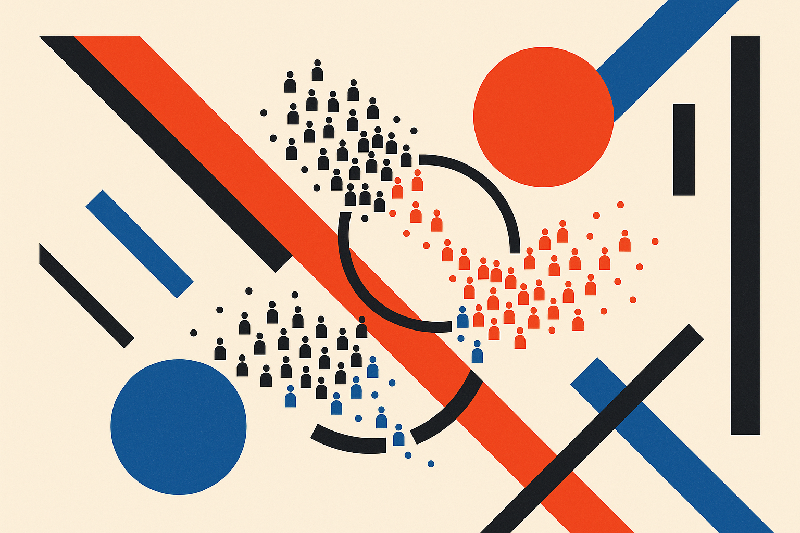

TL;DR: Agent civilization simulations are fun to watch and genuinely useful for stress-testing multi-agent coordination, but the "emergent society" framing oversells what's happening, and the failures teach you more than the successes.

The story making the rounds this week is "The Rise and Fall of Agent Civilizations," which surfaced on Hacker News and pulled the usual mix of wonder and eye-rolling. I want to be honest up front about the sourcing here: what I have is the Hacker News thread and its title, not a full paper or a first-party writeup with methodology. So I am not going to pretend I know the exact model, the token budget, or the scoring rubric. What I can do is talk about what these agent-society experiments actually show, what they don't, and how a builder should read them.

## What is an "agent civilization" experiment, really?

Strip away the framing and it's a loop. You spin up a bunch of LLM-backed agents, give each one a persona or role, drop them into a shared environment with some resources and rules, and let them talk, trade, form groups, and make decisions over many turns. Then you watch what patterns show up. Do factions form? Does cooperation beat defection? Does some agent accumulate influence and become a de facto leader? The "rise and fall" part is the arc people love: a group organizes, thrives for a while, then collapses under conflict, resource scarcity, or its own accumulated bad decisions.

This lineage goes back a few years now. Stanford's "generative agents" work in 2023 put 25 agents in a small town and got believable social behavior: they planned a party, spread the word, showed up. Since then the pattern has been copied and scaled in dozens of directions, from economic simulations to full-on Minecraft-style sandboxes. The agent civilization framing is the maximalist version of that idea, and the Hacker News reaction tells you where the community sits: real interest in the mechanics, real fatigue with the "we simulated society" headlines.

## Is this emergence or just good prompting?

Here's the part worth being clear-eyed about. When an agent society "develops norms" or "forms a government," the interesting question is where that behavior came from. In most of these setups, a lot of the structure is baked in. If you tell agents they're citizens with roles, resources, and an incentive to cooperate, cooperation showing up is not a shock. That's the prompt doing the work, not spontaneous social physics.

Genuine emergence would be behavior nobody scripted and nobody could easily predict from the individual rules. Some of that does happen: agents inventing side deals, developing communication shortcuts, exploiting rules in ways the designer didn't anticipate. Those are the moments worth studying. But the marketing tends to blur the line between "we built a system where cooperation was the obvious equilibrium and cooperation happened" and "society emerged from nothing." Those are very different claims, and without a methods writeup you can't tell which one you're looking at.

The tell is reproducibility. Run the same setup with different seeds. If you get wildly different civilizations each time, you're seeing high variance dressed up as narrative. If you get the same broad arc every time, the arc was probably determined by the design, not discovered. Good versions of this work report both. Viral versions report the single run that made the best story.

## What do the failures actually teach a builder?

This is where I get genuinely interested, because the "fall" half of the arc is the useful half. When an agent civilization collapses, you're watching a multi-agent system fail in slow motion, and the failure modes rhyme with the ones you hit building real agent products.

Context drift: over enough turns, agents lose the plot. Early decisions get forgotten, personas soften into a generic helpful-assistant mush, and the "culture" flattens. That's the same context-window and memory problem that wrecks long-running agent workflows in production.

Error cascades: one agent hallucinates a fact, another treats it as ground truth, a third builds a plan on top of it, and now the whole group is coordinating around something false. In a civilization sim this looks like a war over an imaginary resource. In your customer-support swarm it looks like three agents confidently escalating a ticket based on a policy that doesn't exist.

Reward hacking and runaway loops: agents find the cheapest path to whatever they're optimizing, which often means gaming each other instead of doing the intended task. The civilization framing makes this look like political intrigue. In a real deployment it's your agents burning tokens in a negotiation loop that never terminates.

So the value isn't "look, they built a society." The value is a cheap, legible sandbox for watching coordination break. If you're shipping anything with more than two agents talking to each other, these simulations are a decent intuition pump for what's going to go wrong at turn 40.

## Should you actually build one?

For most product work, no, not a full civilization. That's a research and demo artifact, and the gap between a fun sandbox and a system that does reliable work is enormous. But a scaled-down version is worth your time.

Build the smallest multi-agent loop that reproduces your actual coordination problem. Three agents, a shared scratchpad, a task that requires them to agree on something. Then deliberately break it: inject a false fact, cut the context, add a conflicting incentive. Watch how it degrades. You'll learn more about your architecture in an afternoon of that than in a week of reading emergence threads.

Practitioner's take: treat agent civilization demos as failure atlases, not blueprints. The headline you'll see is "agents formed a society," and that's the part to ignore. Go find the collapse: how many turns until context drift set in, what false belief cascaded, which incentive got hacked. Then check whether your own multi-agent setup has the same weak points, because it almost certainly does. And demand the methods before you believe the magic. If a civilization experiment won't tell you its model, its turn count, its seed variance, and whether the reported run was cherry-picked, you're reading a story, not a result. The builders who get value from this stuff are the ones who ask "what broke and why," not the ones who retweet the rise and skip the fall.
