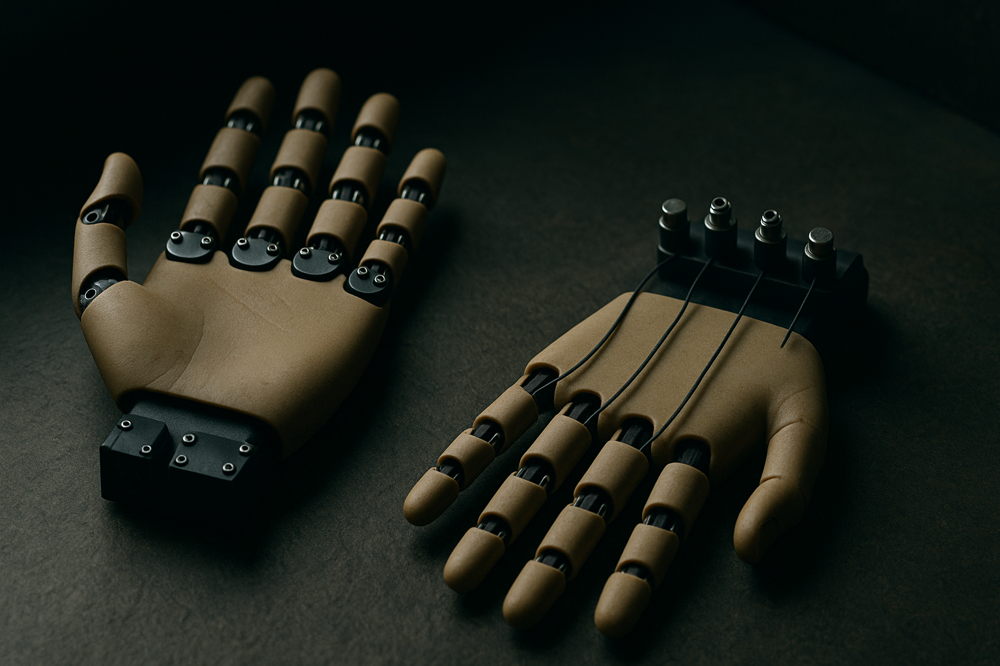

TL;DR: Aero Hand Open is an open-source tendon-driven robot hand released with a simulator that models the cable transmission, a two-way motor mapping, and an RL training stack, so a policy can be trained entirely in simulation and deployed on the hardware with no fine-tuning and no state estimation.

The interesting thing here is not that someone built another humanoid hand. It is that they took the property that makes tendon-driven hands cheap, and turned it from a liability for learning into something a simulator can actually reproduce. That is the whole story, and it is a bigger deal than the modest release note suggests.

The primary source is a paper titled "Aero Hand Open: A Simulation-Ready Tendon-Driven Hand for Dexterous Manipulation Learning," posted to arXiv under both cs.AI and cs.LG. The two listings carry identical abstracts, so treat this as one release with a foot in both the robotics and machine-learning communities.

## Why are tendon-driven hands cheap but hard to learn on?

Start with the mechanics, because the whole contribution flows from them.

A direct-drive hand puts a motor at each joint. That is simple to control and simple to simulate: you command a joint, a motor moves it, done. But motors that fit inside a finger joint and are strong enough to be useful are expensive, and you need a lot of them.

A tendon-driven hand moves the motors off the joints and pulls the joints with cables, the way the muscles in your forearm pull the tendons in your fingers. The paper spells out the two savings this buys. First, a motor no longer has to fit inside the joint it drives, so you can use smaller, cheaper motors. Second, one motor can drive several joints through a single cable, so you need fewer motors overall. Both effects push the cost down. This is the reason anthropomorphic hands with a lot of fingers and knuckles can be built affordably at all.

Here is the catch, and it is the part most coverage of dexterous hands skips. That cost saving comes from underactuation. When one cable drives several joints, those joints are not independently commandable. You cannot tell knuckle two to bend while knuckle three stays still if a single tendon runs through both. The system's degrees of freedom are coupled by the routing of the cable. That coupling is exactly what makes the hand hard to control and, worse, hard to simulate. A naive simulator treats each joint as free. A tendon-driven hand's joints are not free, and if your sim gets that wrong, a policy trained in sim will behave differently on the real hand. That is the sim-to-real gap in its most literal form.

## What does Aero Hand Open actually ship?

Three things, per the paper, and each one targets a specific failure point.

A simulation model that reproduces the cable transmission itself. Not an approximation of the resulting joint motion, but the transmission. This is the part that matters. If the sim models the coupling the way the physical cables produce it, then a policy learning in that sim is learning against the real constraint, not a fiction.

An identified actuation map that connects the simulation to the motor commands in both directions. "Identified" means they measured the real hand and fit the mapping to it, rather than assuming an idealized relationship. Both directions matters too: you need to go from motor command to joint state to run the sim, and from desired joint state back to motor command to drive the hardware. The paper calls out the thumb specifically, where three motors couple together, which is the ugliest case and the one most likely to break a clean mapping.

A reinforcement learning package that trains policies for the hand. So you are not handed a robot and a simulator and left to wire up your own training loop. The environment ships.

The claim that ties it together: a policy can be trained entirely in simulation and run on the hand with no fine-tuning and no state estimation. Read that carefully. No fine-tuning means you do not need real-world data collection to close the gap after training. No state estimation means the deployed policy does not need to sense the true joint angles at runtime, which on an underactuated hand would be a genuine pain to instrument. Both of those are strong claims, and they are the paper's own claims about its own release, so weigh them as such until people outside the group reproduce them.

## Why does modeling the transmission beat wrapping the whole hand in a sim?

Because the alternative approaches usually paper over the coupling instead of representing it, and then pay for it at deployment.

The common pattern in sim-to-real for tricky hardware is to train in a rough sim, then collect real-world data and fine-tune, or add a state estimator that guesses the real joint configuration and feeds corrections in. Both are ways of buying back the accuracy your simulator threw away. They work, but they add a data-collection pipeline and a runtime sensing burden, and each is a place the system can fail.

Aero Hand Open's bet is that if you model the actual transmission and identify the actual mapping, you do not need those crutches. The coupling stops being noise the policy has to be robust against and becomes structure the policy learns inside. That is a cleaner factoring of the problem. Whether it holds up across tasks harder than the ones in the paper is the open question, and the abstract does not enumerate the tasks, so I would want to see the task suite before calling the sim-to-real gap closed for tendon hands in general.

The broader signal is where this fits. Dexterous manipulation has been gated on two things at once: hardware you can afford to break, and a way to train on it that does not require a fleet of real robots grinding through data. A hand that is cheap by construction and simulation-ready by design attacks both at the same time. That combination is rarer than either half alone.

## What does this mean if you build robots?

Practitioner's take: if you have wanted to work on dexterous manipulation but the entry cost was a five- or six-figure research hand plus a custom sim you had to validate yourself, this changes your starting line. The move is to pull the full release, which the paper says includes the mechanical design, the simulation model, the identified mapping, the training environment, and the deployment stack, and reproduce the headline claim on a task you care about before you trust it: train a policy in sim, deploy with no fine-tuning, and measure the drop. The gap between sim success and hardware success is your real number, and it is the one the abstract does not give you. The catch most readers will miss is that "no state estimation at deployment" is a property of these specific tasks and this specific identified mapping. Your hand will need its own identification if you build or modify one, and a mapping that drifts as cables stretch and wear is the failure mode to watch. Tendons are cheap because they are compliant. Compliant things change over time. Plan to re-identify.
