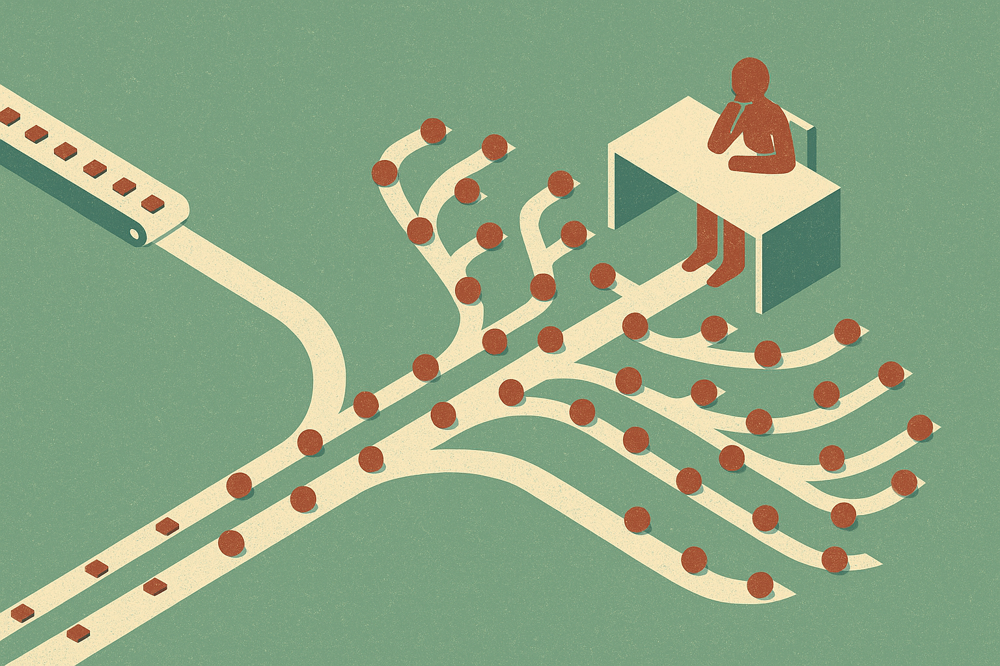

TL;DR: The best AI workflow is not the one that shaves minutes off a task, it is the one that makes a valuable new operating habit cheap enough to repeat.

## Are you automating old work or designing new work?

Marketing AI Institute’s “Using AI-Powered Workflows to Do Work That Wasn't Possible Before” frames the problem cleanly through Liza Adams: most marketing teams are using AI to do the same work faster, but the bigger opportunity is doing different work.

That sounds simple. It is not.

Most teams reach for AI at the task level. Write this email faster. Summarize this call. Turn this blog post into social posts. Fine. Useful. I do it too.

But that is mostly compression. Same workflow, fewer minutes.

The better question is: what would we do every week if the cost dropped close to zero?

That changes the design space. A team might not have had time to review every lost deal call, cluster objections, compare them against landing page copy, and generate testable messaging changes. With AI, that can become a recurring workflow. Not a one-off insight project. A habit.

Same with customer research. Most teams say they are customer-led, then read three anecdotes and one quarterly survey. AI makes it practical to process support tickets, sales notes, reviews, community posts, and interview transcripts into patterns humans can inspect. The point is not to let the model “decide strategy.” The point is to widen the intake and shorten the loop.

## What makes an AI workflow different from a prompt?

A prompt is a request. A workflow is a repeatable system with inputs, steps, checks, outputs, and owners.

That distinction matters because a lot of AI adoption stalls at clever prompting. Someone makes a good prompt. It lives in a doc. A few people try it. Then normal work swallows it.

A real workflow has a trigger. A new batch of customer calls lands. A campaign ends. A competitor changes a page. A product release ships. Something starts the loop.

It also has a review point. This is where the hype tends to hide. If the model summarizes 200 support tickets, who checks the clusters? If it drafts 12 ad concepts, what makes one worth testing? If it scores leads or flags churn risk, what action follows?

Without that, AI creates more artifacts. More summaries. More drafts. More dashboards no one reads.

The useful workflow does fewer vague things and more specific things. “Improve content” is not a workflow. “Each Friday, compare the top five sales objections from call transcripts against active homepage claims, then propose copy tests for the next sprint” is closer.

That is not magic. It is operations.

## Where does the human still matter?

Adams’ point works because “doing things differently” does not mean handing the business to a model. It means using the model to make better human judgment possible more often.

The human still chooses the question. The human still decides what evidence counts. The human still rejects patterns that are technically present but commercially irrelevant. The human still owns taste, timing, risk, and accountability.

This is also where many teams overrate AI maturity. Buying tools is easy. Changing the shape of work is the hard part. If the team’s calendar, incentives, and approval paths stay the same, AI becomes a faster content machine bolted onto an old process.

The better move is to pick one workflow where the old way was too expensive or slow to do regularly. Customer insight is a strong candidate. So is competitive monitoring. So is post-campaign analysis. So is sales enablement that adapts to actual objections instead of quarterly guesses.

Start with the recurring decision, not the tool.

Practitioner’s Take: Pick one weekly decision your team makes with weak evidence. Map the inputs you wish you had, the analysis you skip because it takes too long, and the human review needed before action. Then build the smallest AI workflow around that loop. The catch most teams miss: if nobody is assigned to act on the output, it is not a workflow. It is content debris.
