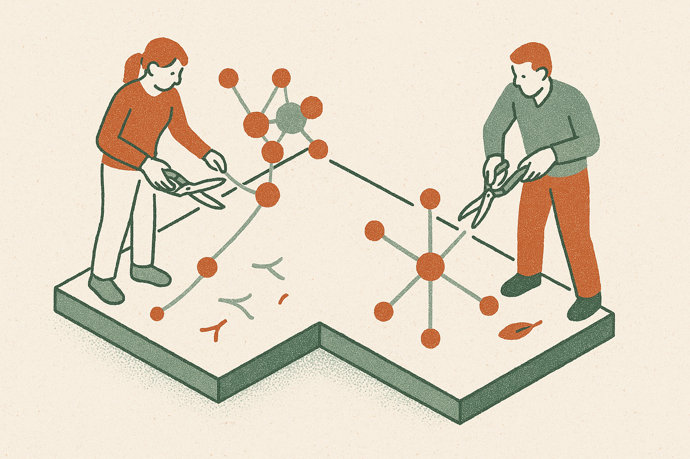

TL;DR: A new paper says the simplest fix for quadratic attention cost, sliding window attention with sinks, matches or beats post-trained linear attention models on long-context reasoning, which means a lot of expensive retrofitting may have been benchmarked against nothing.

The paper is "Sliding-window beats linear attention" by Alexia Jolicoeur-Martineau, Rhea Sanjay Sukthanker, Pashmina Cameron and Emy Gervais, posted to arXiv (2608.28444, cross-listed in cs.CL and cs.LG). The claim is narrow and useful: the whole cottage industry of converting existing LLMs into linear-attention variants has mostly been compared to full quadratic attention, not to the cheapest reasonable alternative. When you add that alternative back into the comparison, the linear-attention advantage shrinks or disappears.

That is a methodology complaint dressed up as a benchmark result, and it is the good kind of complaint. Not "your numbers are wrong," but "you measured the wrong gap."

## Why does attention cost so much in the first place?

Standard transformer attention is quadratic. Every new token attends to every previous token, so the keys and values for the whole sequence sit in memory and each additional token costs more than the last. On long inputs this is the memory and energy problem everyone is trying to route around. The KV cache grows without bound, and at inference time that cache is often what actually limits how long a context you can serve and how many requests you can batch.

There are two broad families of fixes. One rewrites the attention math so cost grows linearly with sequence length: linear attention, state-space-flavored variants, the whole line of work that promises "the same quality, cheaper." The catch is that most base models were not trained this way, so you retrofit them, which means post-training compute to teach the model to work under the new mechanism.

The other family just throws away distant tokens. Sliding window attention keeps a fixed window of recent tokens and drops the rest, which caps the KV cache at the window size no matter how long the input gets. Attention sinks are the small patch that makes this actually work: you keep a handful of the earliest tokens permanently, because models lean on those first positions as an anchor, and dropping them wrecks quality. SWA with sinks is old, simple, and requires no retraining.

## What did the paper actually find?

The headline is that SWA with sinks "performs as well or better than post-trained Linear Attention models," observed across multiple LLMs on various downstream tasks. On the long-context reasoning benchmarks they single out, Needle-in-a-Haystack and BABILong, they report SWA scoring 2 to 10 times higher than linear attention.

Sit with that range for a second. Needle-in-a-Haystack asks a model to find a specific planted fact buried in a long context. BABILong stretches reasoning tasks across long distractor text. These are exactly the tasks where you would expect a window that discards distant tokens to fail, because the needle might be outside the window. That SWA still wins by a wide margin is the surprising part, and it is a real strike against the linear-attention retrofit story. If the retrofitted models cannot beat a method that literally throws away most of the context, the retrofitting is not buying the long-range recall it was supposed to buy.

The authors are blunt about the takeaway: "we strongly recommend switching to SWA instead of post-training linear models." And they leave a door open for linear attention, which I think is the honest part. They concede it "may have shown some promise, but they likely require to be trained from scratch or extensive post-training in order to even match SWA." In other words, the problem may be the retrofit, not the idea. Train linear attention into a model from the ground up and the comparison could look different. Bolt it on afterward and you have spent compute to lose to a baseline.

## Should I take the "2 to 10x" number at face value?

Not yet, and here is where I want to be careful. Everything above comes from the abstract as reported, plus the r/MachineLearning post by user Justgototheeffinmoon that surfaced it. I have the claim, the author list, and the two named benchmarks. I do not have, from these sources, the specific models tested, the window sizes used, the exact linear-attention baselines, or the per-benchmark tables behind "2 to 10 times." A range that wide usually means it swings hard by task and configuration, and the interesting engineering lives in exactly those details the abstract compresses away.

A few things I would want to check before rewiring anything in production. Which linear-attention methods were in the comparison, and were they strong recent ones or convenient older ones. What window size SWA used, because a large enough window on a "long" benchmark can quietly turn into near-full attention. Whether the tasks favor local retrieval in ways that flatter windowed methods. None of this makes the result wrong. It makes it a claim to verify against your own workload rather than a law.

## What does this change for someone shipping inference today?

If you were about to spend real budget post-training a model into linear attention purely to cut KV cache cost, this paper is a reason to pause and run the cheap baseline first. SWA with sinks needs no post-training, runs fast, and holds memory flat, and mature implementations already exist in the serving stack (StreamingLLM popularized the sink trick, and windowed attention ships in several open models). The downside risk of trying it is close to zero: it is a config change, not a training run.

The real lesson is broader than attention. This is a "did anyone check the boring baseline" paper, and those keep landing because the field rewards novel mechanisms over careful comparisons. A method that beats full quadratic attention on cost is not impressive if it loses to the obvious cheaper thing. The value of this work is not that linear attention is dead. It is that the comparison table most people trusted was missing a column.

Practitioner's take: before you commit compute to converting a model to linear attention, benchmark plain sliding window attention with sinks on your own long-context tasks first, because that is the column this paper says everyone skipped. Match the window size to where your relevant tokens actually live, and measure recall on your real documents, not just Needle-in-a-Haystack. The catch most readers will miss is the paper's own concession: this is an argument against the retrofit, not against linear attention trained from scratch. If your plan was always to pretrain the mechanism in, this result does not settle your question, it just tells you the cheap post-hoc shortcut is a bad trade. Run the baseline. Let the numbers on your workload decide.
