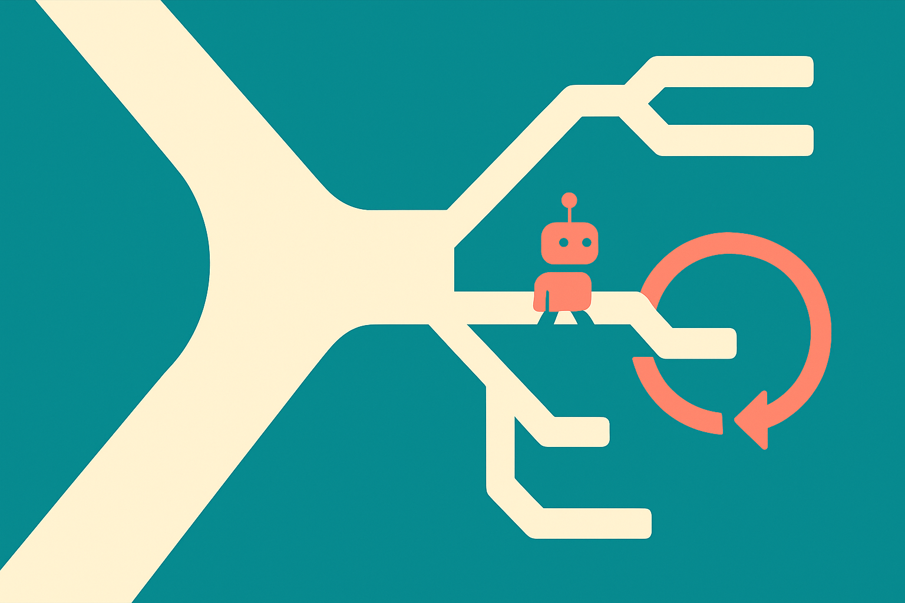

TL;DR: For small agentic models, broad supervised fine-tuning gets most of the lift, but targeted repair works best only when failures are mechanically detectable and close to the training task.

## What does a dialogue game expose that static benchmarks miss?

The primary source here is the arXiv paper “Acquire, Repair, Preserve: A Diagnosis-Guided Post-Training Recipe for Small-Model Dialogue Game Agents.” It looks at the LM Playschool Challenge using a 2B open-weight model, and the setup is useful because it tests something many leaderboard tasks flatten away: whether a model can keep track of state across turns, absorb feedback, and pick legal actions as constraints change.

That sounds simple until you watch agents fail.

The paper reports failures that are not just “the model does not know enough.” Many are local and mechanical: repeating guesses, producing malformed actions, or ignoring feedback from the previous turn. Those are different failure modes from weak world knowledge. They are closer to a product bug. The model was told something, then immediately acted as if it had not heard it.

That distinction matters. If a model lacks broad capability, you probably need broader training data or a better base model. If it keeps making invalid moves in a constrained environment, you may be able to fix that with targeted examples and preference pairs. Not because the model has become generally smarter, but because the failure is visible, frequent, and easy to score.

## What did “Acquire, Repair, Preserve” actually improve?

The recipe in “Acquire, Repair, Preserve” has three steps.

First, acquire broad game participation through supervised fine-tuning. Second, repair specific failures in one dialogue-game family using turn-local preference pairs. Third, preserve general capabilities beyond the games.

The numbers are strong, with an important catch. The submission improved public clemscore from 10.67 to 38.92. Closed in-domain score rose from 13.41 to 41.17. Aggregate static performance was approximately preserved, at 44.14 versus 44.24 for the baseline.

That is the good news. The model got much better at the target setting without apparently paying a broad static-benchmark tax.

The catch is transfer. Out-of-domain clemscore stayed low at 7.88. The largest gains were concentrated in unseen variants of the targeted family. So the repair process did not magically create a generally competent game-playing agent. It made the model better where the diagnostics matched the training intervention.

I like this result because it is practical and unglamorous. It says: find the failure, make it observable, train against it, measure whether you broke anything else. That is closer to software QA than frontier-model mythology.

It also puts a limit on the dream that post-training tricks can cheaply generalize everywhere. The paper’s own result points the other way. Broad SFT produced most of the overall capability improvement. Turn-local supervision helped when the target failure could be precisely detected. Transfer was mostly within-family.

## What should builders take from this?

If you are building with small models, this paper is a vote for instrumented environments. Do not only collect thumbs-up and thumbs-down feedback after a whole session. Log the local error: invalid tool call, repeated answer, ignored constraint, state mismatch, malformed JSON, unsafe retry, wrong slot value.

Then ask whether that failure can be checked mechanically. If yes, you have a candidate for targeted repair. If no, you may be drifting into vague preference training where the signal is noisy and the gains are harder to trust.

The preserve step is also underappreciated. Small models are easy to overfit. If you repair one behavior, you need a regression suite for the behaviors you still care about. The paper reports static aggregate performance staying roughly flat, which is exactly the kind of receipt a builder should demand after task-specific tuning.

Practitioner’s Take: I would use this pattern for narrow agents first: support triage, form filling, scheduling, internal workflow bots, or tool-using assistants with strict action formats. Start with broad SFT if the model cannot play the game at all. Add targeted repair only for failures you can automatically detect. The catch most teams miss: if your repair signal is tied to one workflow family, expect the gains to stay there. That is fine, as long as you ship it with eyes open.
