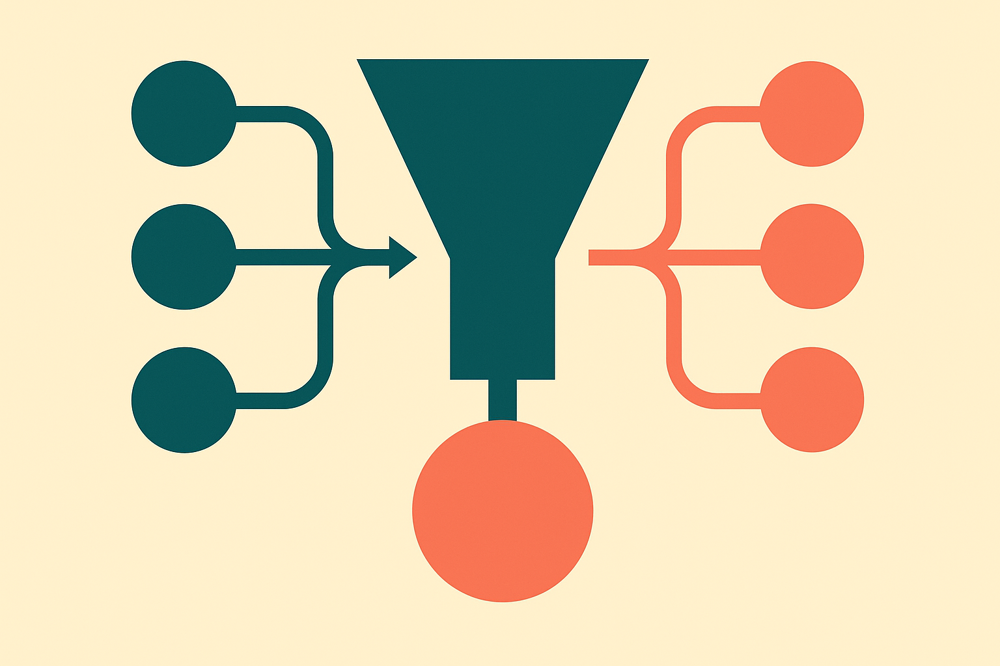

TL;DR: Synthetic data can make scarce real-world measurements more useful, but only when you cap how much synthetic data you add and how much authority each synthetic sample gets.

## What problem is this actually solving?

Most synthetic data talk is about training bigger models. This is different.

The arXiv paper "Learning a Size-Weight Frontier for Synthetic-Augmented Inference" looks at statistical inference, meaning the work of estimating something about the world with uncertainty attached. Think surveys, small samples, task-level estimates, confidence intervals. Places where the answer is not just “predict better,” but “say how sure you are.”

That distinction matters. If you use an LLM to generate more survey-like answers, you might shrink your confidence intervals. Great. But if those synthetic answers are biased in a way your model does not catch, your interval can become confidently wrong. That is worse than being uncertain.

The paper’s core move is to stop asking whether synthetic data is “good” in the abstract. It asks two more useful questions: how many synthetic observations should be added, and how much weight should each one get relative to real data?

That is operator-friendly. Synthetic data is not a replacement for measurement. It is a supplement with a dosage problem.

## What is a size-weight frontier?

"Learning a Size-Weight Frontier for Synthetic-Augmented Inference" defines synthetic augmentation using two knobs: synthetic sample size and synthetic sample weight. More synthetic samples can reduce variance. More weight gives those samples more influence. Both can help, until they do not.

The paper introduces a size-weight frontier. For each possible weight, the frontier specifies the largest synthetic sample size that still meets a target coverage level across related tasks. In plain English: given how much trust you place in synthetic data, here is how much of it you can safely add before your uncertainty claims stop being reliable.

The interesting part is that the frontier is learned from historical tasks. If you have a population of related problems, the procedure estimates where synthetic augmentation has stayed within the desired coverage target before. The paper reports a finite-sample coverage guarantee for all size-weight configurations on or below the estimated frontier.

That last phrase is doing real work. The point is not to find one magic synthetic dataset size. It is to map a safe operating region. A builder can choose a smaller synthetic boost with higher weight, or a larger synthetic boost with lower weight, as long as the pair stays inside the frontier.

In experiments using LLM responses to augment opinion survey data, the paper reports that the procedure hit the target coverage and substantially narrowed confidence intervals. That is the kind of claim I like: not “LLMs replace surveys,” but “under these constraints, generated responses can tighten inference without breaking coverage.”

## Where would this matter in practice?

The most obvious use case is any product team or research group with many small, repeated measurement problems. Customer research across segments. Policy polling across localities. Evaluation tasks across categories. Marketplace quality checks across regions. Places where each individual sample is expensive, slow, or sparse, but past related tasks exist.

The catch is that this needs history. The frontier is estimated from prior tasks, not vibes. If you are launching a totally new measurement domain with no comparable tasks, you do not get to pretend the frontier exists. You can still experiment, but your synthetic data should be treated as exploratory, not as coverage-preserving evidence.

I would also separate this from synthetic data for model fine-tuning. In training, a bad synthetic example may be diluted across many updates. In inference, a biased synthetic sample can move the estimate and make the error bar look cleaner than it deserves. That is the danger zone.

For builders, the move is simple: keep real and synthetic observations separate in your pipeline, assign synthetic data an explicit weight, and evaluate coverage on historical tasks before using synthetic augmentation in production reports. Try a small grid of sample sizes and weights, then only operate inside the learned safe region. The catch most teams will miss is governance: the synthetic generator can change, the population can drift, and the frontier has to be re-estimated when either one moves.
