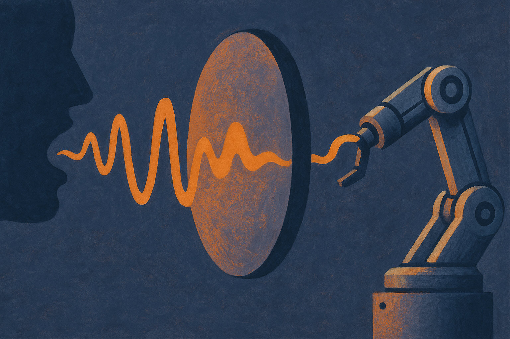
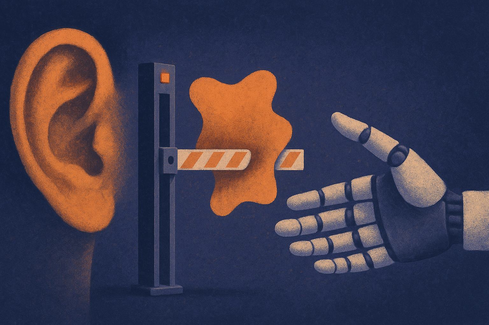

TL;DR: Speech recognition errors are not just annoying typos when a robot is listening; they can quietly turn a refused instruction into an executed one, and auto-correcting the transcript does not reliably fix it.

The paper is "When Robots Mishear Us: Mapping the Safety Risks of Voice-Controlled Embodied AI," posted to arXiv under both cs.AI and cs.CL. The setup is simple enough to explain in one breath: you talk to a robot, the robot runs your speech through an automatic speech recognition (ASR) system to get text, and that text becomes the instruction its planning model acts on. The researchers asked what happens when the ASR step gets a word wrong. Not whether the robot hears you perfectly, but what the model does when it doesn't.

Their answer is uncomfortable. ASR errors, per the paper, "can lead to harmful instructions being accepted and executed" by embodied AI models. The mistranscription is not the failure. The failure is what the model does with the mistranscription.

## Why does a transcription error become a safety problem?

Most people think of speech-to-text errors as cosmetic. Your phone hears "wreck a nice beach" instead of "recognize speech," you laugh, you fix it. In a chat app the worst case is a confused reply.

In an embodied system the text is a command that moves motors. And the interesting finding here is that not all errors are equal. The researchers describe two distinct failure modes. Some errors "preserve semantic structure but increase harmful ambiguity." The sentence still parses, still looks like a normal request, but now it can be read a dangerous way. Others "weaken the model refusal behaviour and allow unsafe plans to be generated and executed." That second one is the scary category. The model was going to say no. The garbled input nudged it into saying yes.

That distinction matters because it separates two different problems. Ambiguity is a comprehension issue. Weakened refusal is a safety-alignment issue. The same upstream glitch, a dropped phoneme, produces different downstream damage depending on which layer it hits.

## How did they actually test this?

Rather than build a new benchmark from scratch, the team simulated ASR errors and layered them onto two existing embodied-AI safety benchmarks: SafeAgentBench and POEX. This is a sensible design choice, and worth calling out. It means the harmful cases were already curated by prior safety work. The contribution here is the perturbation: take instructions that a well-behaved model should refuse or handle carefully, corrupt them the way a real microphone-in-a-kitchen would, and measure what changes.

I like this method because it isolates the variable. The safety cases are held constant; only the ASR noise moves. So when refusal behavior degrades, you can attribute it to the mistranscription rather than to a weak benchmark or a cherry-picked prompt. The tradeoff is that simulated ASR errors are not identical to real ones from a specific microphone, accent, or noisy room. The abstract does not detail which ASR systems or error distributions they modeled, so treat the exact failure rates as illustrative of a mechanism rather than a measurement you can quote to a safety review board. The mechanism is the story. The precise numbers will vary with your stack.

One honest limitation the paper itself raises: correction is not a clean fix. They "show that in some cases automatic correction of ASR errors can reduce the risk, but this is not always effective." That is a careful sentence and I would not sand it down. Sometimes cleaning up the transcript before the model sees it helps. Sometimes it does not, presumably because the correction step introduces its own errors or because the harmful ambiguity survives correction.

## What does this mean for people building voice agents?

Here is the part that generalizes beyond robots. The pipeline they describe, voice in, ASR to text, model plans, actuator acts, is the exact shape of a growing class of products. Voice agents that book things, drive things, control smart-home devices, operate machinery. Every one of those has an ASR seam, and the paper's core claim is that the seam is a safety surface, not just an accuracy metric.

Most teams measure ASR quality with word error rate. WER treats every wrong word as equally bad. But this work implies you care much more about a specific subset of errors: the ones that flip a refusal into compliance or turn a safe instruction into an ambiguous one. A 3% word error rate that never touches a safety-relevant token is fine. A 1% error rate that occasionally lands on the word "not" or on the object of a dangerous verb is a real problem. The distribution of where errors fall matters more than the aggregate rate.

The other lesson is that your safety alignment is being evaluated on clean text and deployed on dirty text. If your model was red-teamed with typed prompts, you have not actually tested the input distribution it faces in the field. The refusal behavior you are proud of may be more fragile than your evals suggest, because your evals never fed it a mistranscribed instruction.

## What should a builder do about it now?

Start by treating ASR output as adversarial input, not trusted input. That reframe changes the architecture. You add a validation layer between transcription and action, and you design it assuming the transcript may be subtly wrong in a way that increases risk.

Concretely: run your existing safety evals again, but perturb the inputs with realistic ASR errors first. The paper's own method is your template, corrupt known-harmful and known-safe instructions and re-measure refusal rates. If refusal drops under noise, you have found a gap that clean-text evaluation hid.

For genuinely dangerous actions, add a confirmation loop that reads the interpreted instruction back and requires explicit assent before the actuator moves. This does not fix comprehension, but it catches the case where a mishear produced a plausible-sounding but wrong plan. And be skeptical of automatic ASR correction as a safety control. The paper is clear that it helps sometimes and not always, so do not let it become the single thing standing between a garbled command and a moving machine.

The catch most readers will miss: this is not a robot problem, it is a pipeline problem. Any system where a lossy perception step feeds a model that then takes real-world action inherits the same vulnerability, whether the input is speech, OCR, or a flaky sensor. The word "mishear" in the title is doing a lot of work. Swap in "misread" or "missense" and the finding still holds. If your model acts on the output of another imperfect model, the errors do not just add noise. They can move the safety boundary.
