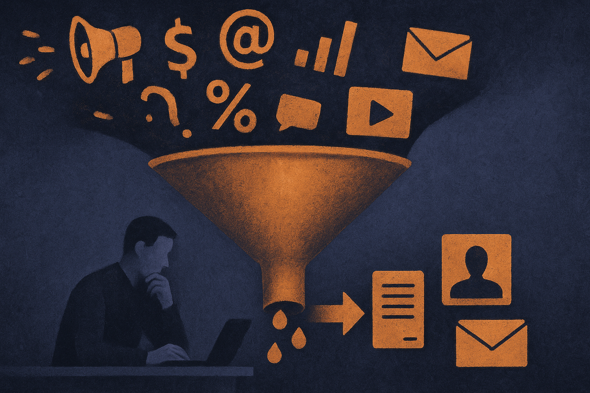

TL;DR: Free AI education for marketers is useful only if it helps teams redesign real work, not collect prompts, tool demos, and vague confidence.

## What is Marketing AI Month actually signaling?

Marketing AI Institute’s announcement, “Marketing AI Month 2026: Free AI Education for Marketers,” is short on the details I would want before judging the program itself. The clear first-party claim is simple: Marketing AI Institute is positioning Marketing AI Month 2026 as free AI education for marketers, built around the premise that AI is changing what it means to be a marketer.

That premise is true enough. Also incomplete.

The practical change is not that every marketer now needs to become a prompt engineer. That framing already feels dated. The real shift is that marketing work is getting split into smaller pieces: research, positioning, audience segmentation, brief writing, variant generation, QA, campaign ops, reporting, and revision loops. AI can touch nearly every one of those pieces. But it does not improve all of them equally.

Some tasks get faster. Some get noisier. Some expose that the team never had a clear strategy in the first place.

That is the useful lens for any education push. If a course teaches people how to make more LinkedIn posts, fine. But if it does not teach them how to judge whether those posts are on-message, legally safe, differentiated, and tied to pipeline or retention, it is mostly content inflation with a nicer interface.

## What should marketers learn before chasing tools?

The first layer is vocabulary. Marketers need to know what models are good at, what they are bad at, and where hallucination, data leakage, copyright, brand safety, and measurement errors enter the workflow. Not in abstract policy language. In the daily places where teams paste customer notes, competitor copy, sales calls, media plans, and campaign results into systems they barely understand.

The second layer is workflow design. A marketer who knows one chatbot trick is less valuable than a marketer who can map a campaign process and say, “This step needs generation, this one needs retrieval, this one needs human approval, and this one should not use AI at all.”

That skill compounds.

The third layer is taste. AI makes average work cheap. It does not make judgment cheap. If anything, it raises the value of people who can spot generic claims, weak audience insight, off-brand phrasing, bad source use, and fake precision.

This is where a lot of AI education misses. It trains activity. It does not train discrimination.

## Where does AI actually change the marketing job?

The biggest change is probably in the middle of the funnel of work, not the top or bottom.

At the top, humans still need to decide what matters: the audience, the offer, the market pressure, the positioning, the constraint. At the bottom, humans still need accountability: what shipped, what worked, what damaged trust, what should stop.

The middle is where AI eats hours. Draft the brief. Summarize the research. Turn interview notes into message territories. Generate landing page variants. Compare claims against source material. Build first-pass campaign assets. Rewrite for channel fit. Find inconsistencies in a launch plan.

That is real. It is not magic.

The catch is that most marketing teams are not bottlenecked by copy volume alone. They are bottlenecked by unclear strategy, slow approvals, fragmented customer data, under-instrumented campaigns, and too many stakeholders with veto power. AI education that ignores those bottlenecks will produce faster drafts into the same old swamp.

Practitioner’s take: if you are a marketing leader looking at Marketing AI Month 2026, do not send your team in hoping they come back “AI-ready.” Pick one workflow first, like campaign brief to landing page to email sequence. Have the team document the current steps, time sinks, approval points, source materials, and quality checks. Then use the education to improve that one workflow. The catch most readers miss: the winning move is not more AI usage. It is fewer unclear handoffs.
