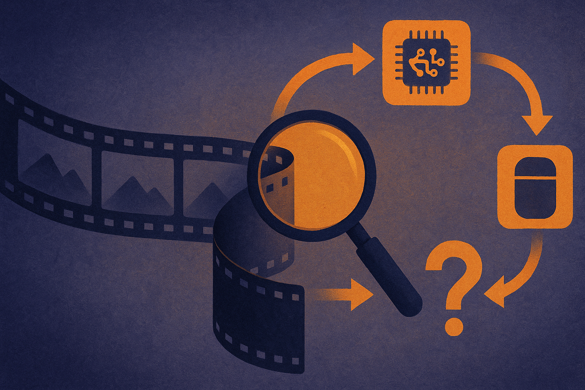

TL;DR: Treat agentic video understanding as a verification loop, not a bigger captioning model.

## What does “agentic video understanding” actually imply?

The primary source here is Google DeepMind’s announcement titled “Introducing agentic video understanding with Gemini.” Based on the supplied material, that title is the hard claim we can safely work from. No pricing, launch scope, benchmarks, limits, or API mechanics were provided, so I’m not going to pretend those details are settled.

The interesting part is the phrase “agentic video understanding.” Not video understanding. Agentic video understanding.

A normal video model answers from a clip. It watches, compresses, and responds. That is useful for search, summaries, scene descriptions, safety review, and basic extraction. But video is messy. Important details are often small, brief, partially occluded, offscreen, or only meaningful when tied to audio, text, timing, and prior events.

An agentic system should do something different. It should form a plan. Inspect the relevant parts. Rewind. Compare frames. Check a transcript. Track an object across time. Ask whether a conclusion depends on one blurry moment. Then answer with some sense of evidence.

That is the shift I care about. Not “the model can watch longer videos,” although context length matters. The bigger product move is from single-pass interpretation to iterative inspection.

## Where would this matter first?

The obvious use cases are not Hollywood-grade video generation or flashy demos. They are boring review workflows with expensive human attention.

Think field service footage. A technician records a machine, and the system has to identify the likely fault, point to the visual evidence, and ask for another angle if the clip is inconclusive. Or retail operations, where a manager wants to know why a shelf audit failed, not just get a caption saying “aisle with products.” Or security review, where a useful assistant needs to distinguish “person entered room” from “person carried a red bag into the room, left without it, then returned.”

In all of these cases, the model’s first answer is less valuable than its ability to check itself. Video has too many traps for confident one-shot summaries. Timing matters. Camera movement matters. The same object can look different across frames. Text on signs or screens can change the meaning of a scene. Audio can contradict the visual story.

That is why I think the “agentic” label is only meaningful if it maps to observable behavior: decomposition, targeted inspection, tool use, evidence collection, and uncertainty. If it just means “a chatbot can answer questions about a video,” that is old wine in a new prompt.

## What should builders test before trusting it?

The tests should be adversarial, but practical.

Ask for answers that require counting, temporal order, identity persistence, and cross-modal grounding. Did the person pick up the cup before or after opening the drawer? Was the warning light already on when the operator arrived? Did the same vehicle appear at both entrances, or were there two similar vehicles? What visible evidence supports the answer?

Then inspect whether the system can say “I can’t tell.” This is the catch. For many production workflows, a calibrated refusal is more valuable than a fluent guess. A video agent that flags low confidence and requests a better clip can save time. A video agent that invents certainty creates new review work.

The interface matters too. Builders should not only ask for a paragraph response. They should ask for timestamps, cited moments, frame references, and follow-up questions. If the model cannot expose its evidence trail in a way a human reviewer can audit, it may still be useful for rough triage, but it is not ready to own decisions.

For builders, I’d start with a narrow internal workflow: 50 to 100 real clips, one clear job, and a human gold standard. Measure not just accuracy, but review time saved, false confidence, and how often the system asks for more evidence. The missed catch is that “agentic” video is not mainly about autonomy. It is about disciplined attention. The best version does less guessing and more checking.
