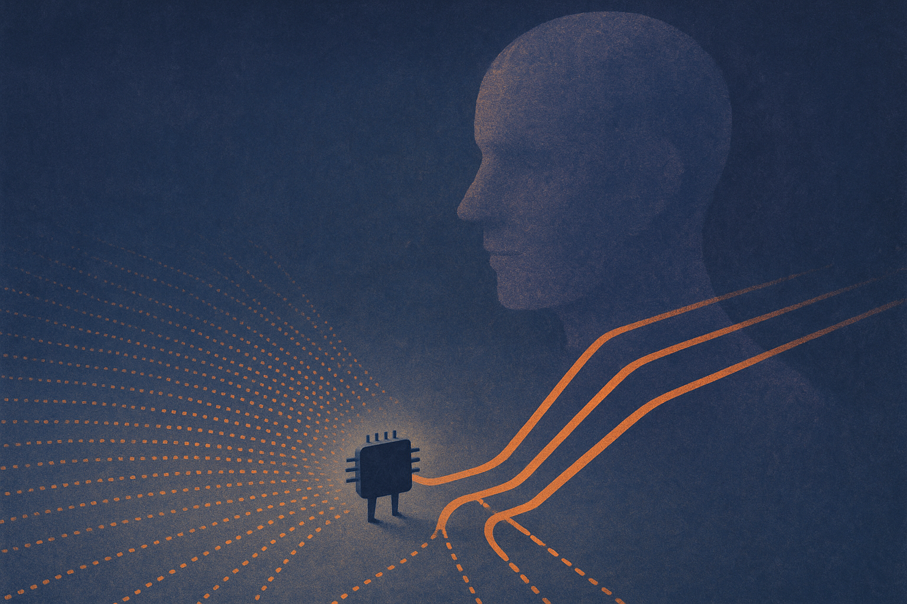

TL;DR: On-policy distillation’s gains may come less from teacher judgment and more from a simpler effect: pushing probability away from low-confidence tail tokens during student-generated training.

## Does on-policy distillation actually need the teacher?

The primary source here is the arXiv paper “Does On-Policy Distillation Really Distill? From Noisy Teacher to Self-Improvement.” It asks a useful, slightly uncomfortable question for current post-training work: when a larger teacher scores trajectories generated by a smaller student, is the student really learning the teacher’s knowledge?

The paper’s answer is: maybe not in the way people assume.

On-policy distillation, or OPD, is attractive because it gives dense token-level supervision. That is a cleaner training signal than reinforcement learning with verifiable rewards, where the model may only get a sparse outcome-level signal after a whole answer succeeds or fails. For math and coding style tasks, dense feedback sounds great.

The catch is policy mismatch. The student generates the trajectory. The teacher scores it. But that trajectory is off-policy for the teacher, meaning it may contain states and token paths the teacher would not naturally choose. The arXiv paper reports substantial noise in that teacher supervision, and says the noise becomes more common as teacher scale increases.

That last part is counterintuitive. Bigger teacher, noisier supervision. At least in this setup.

Even stranger: the student did not seem to care much. The paper reports that keeping or removing noisy supervision led to comparable performance. That is the part builders should pay attention to. If the expensive teacher signal can be noisy, and the student still improves when that noise is filtered out, then the training recipe may be getting credit for something else.

## What is really driving the gains?

The paper’s core finding is that OPD learning concentrates on low log-probability tokens. In plain English: the model is mostly changing behavior around tokens it was already unlikely to produce.

The arXiv paper reports that using a single fixed negative advantage can match teacher-provided advantages. That is a big claim because it cuts against the standard story. If a fixed penalty works about as well as the teacher’s token-by-token scoring, the teacher may not be injecting rich knowledge. It may just be helping suppress bad tail behavior.

This reframes OPD as a kind of self-cleaning process. The model samples from itself, finds uncertain or messy regions, and pushes down low-probability tokens. The interesting part is not “teacher knows best.” It is “the model can improve by reducing its own tail-risky choices.”

That does not make teachers useless. It does make the cost-benefit question sharper. A large teacher is expensive to run. If its marginal value is mostly approximated by a fixed negative advantage, you should not blindly pay for it.

## Why OPSA is the practical twist

The paper proposes On-Policy Self-Adaptation, or OPSA, as the no-teacher version of this idea. Instead of relying on teacher scores, OPSA uses entropy-adaptive negative advantages. It assigns stronger learning signals at high-entropy positions, suppresses tail tokens, and redistributes probability mass among head tokens.

The reported numbers are not tiny. Compared with base `Qwen3-1.7B`, the paper says OPSA improves Avg@32 by 35.41 points on AIME24, a 263% relative gain, and more than doubles Pass@32 across all three benchmarks. It also reports that OPSA beats OPD by 16.77 points in Avg@32 on AIME24.

Those are strong results, especially because the method removes the teacher. But I would still read this as a training-mechanics paper, not a universal recipe yet. The abstract points to experiments across model families and tasks, but the headline numbers are still benchmark numbers. The real question is whether this kind of tail suppression transfers to messy agent traces, long tool-use runs, retrieval-heavy workflows, and domains where “unlikely token” is not always “bad token.”

For a practitioner, the useful move is not to throw out distillation. It is to instrument it. If you are paying for teacher scoring, measure how much of your gain comes from teacher-specific advantages versus generic suppression of low-probability or high-entropy positions. Try a cheap fixed-penalty baseline. Try entropy-weighted penalties. Compare against OPD before adding another large model to the training loop. The catch most teams miss: a teacher can look valuable because the pipeline improves, while the actual improvement may be coming from a simpler regularization effect hiding inside the pipeline.
